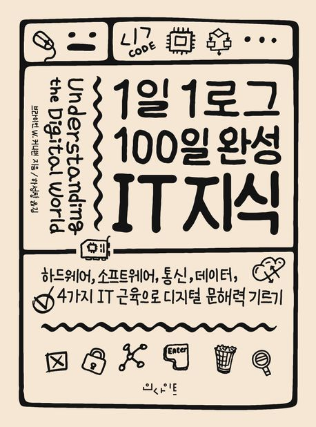

# [1일 1로그 100일 완성 IT 지식](https://product.kyobobook.co.kr/detail/S000001033125)

---

1일 1로그 100일 완성 IT 지식 도서를 읽으면서 알게된 내용을 정리했다. 
책 내용 뿐만 아니라 추가로 궁금한 점이 있으면 찾아가며 노트를 했다.

---
### 도서 소개

**복잡한 IT 세상을 선명하게 읽는 디지털 문해력 기르기 챌린지**

IT 지식은 분명 복잡하지만 인생처럼 혼잡하지는 않다. 필요한 지식을 습득하면 막연한 불안감에서 벗어나 디지털 지구가 제시하는 도전과 기회에 적극적으로 대처할 수 있다. 네이버, 카카오, 쿠팡, 배달의 민족, 당근마켓, 토스··· 순식간에 우리 일상에 스며든 IT 기업들은 클라우드 컴퓨팅, 머신러닝, 데이터 마이닝과 같은 기술을 바탕으로 매분 매초 혁신과 성장을 거듭하고 있다. 그 가운데 인터넷, 스마트폰에 이어 2025년 글로벌 300조 시장이 예측되는 메타버스 시대가 열렸다.

다행히도 논리적 구조와 물리적 구현으로 이뤄진 디지털 시스템의 기본 아이디어는 무게가 30톤에 달하던 초기 컴퓨터부터 MS 홀로렌즈로 접속하는 메타버스까지 동일하다. 컴퓨팅의 4가지 핵심 분야인 하드웨어, 소프트웨어, 통신, 데이터를 이해하면 어떤 복잡한 디지털 시스템이라도 잘게 쪼개 비즈니스 구조와 흐름을 파악하는 디지털 문해력을 기를 수 있다.

호기심 세포는 있는데, 실천 세포는 없다면, 이 책이 딱이다. ‘1일 1로그 100일 완성 IT 지식 챌린지’에, 각 꼭지를 언제 읽을 것인지, 퀘스트 날짜를 적어 보자. 계획한 날짜에 읽었다면 퀘스트 성공! 하루하루 성공 기록을 쌓다 보면 한번 배워 평생 써먹는 IT 근육을 갖게 될 것이다.

---

### 노트 목차

#### 하드웨어
1. [컴퓨터의 논리와 구조](note/001_%5B하드웨어%5D%20컴퓨터의%20논리와%20구조)
2. [프로세서 속도와 심장 박동수](note/002_%5B하드웨어%5D%20프로세서%20속도와%20심장%20박동수)
3. [HDD와 SDD의 차이](note/003_%5B하드웨어%5D%20HDD와%20SDD의%20차이)
4. [가로세로 1cm 프로세서 칩](note/004_%5B하드웨어%5D%20가로세로%201cm%20프로세서%20칩)
5. [50년 넘게 유지된 무어의 법칙](note/005_%5B하드웨어%5D%2050년%20넘게%20유지된%20무어의%20법칙)
6. [요약](note/006_%5B하드웨어%5D%20001~005%20요약)

7. [연속과 불연속](note/007_%5B하드웨어%5D%20연속과%20불연속)
8. [아날로그 정보를 디지털로 바꾸기](note/008_%5B하드웨어%5D%20아날로그%20정보를%20디지털로%20바꾸기)
9. [0과 1의 세계](note/009_%5B하드웨어%5D%200과%201의%20세계)
10. [비트 모아 데이터](note/010_%5B하드웨어%5D%20비트%20모아%20데이터)
11. [요약](note/011_%5B하드웨어%5D%20007~010%20요약)

12. [프로세서와 계산기의 다른점](note/012_%5B하드웨어%5D%20프로세서와%20계산기의%20다른점)
13. [모형 컴퓨터로 더하기 프로그램 만들기](note/013_%5B하드웨어%5D%20모형%20컴퓨터로%20더하기%20프로그램%20만들기)
14. [프로세서는 무조건 빠른 게 좋을까](note/014_%5B하드웨어%5D%20프로세서는%20무조건%20빠른%20게%20좋을까)
15. [캐시가 뭔가요](note/015_%5B하드웨어%5D%20캐시가%20뭔가요)
16. [슈퍼컴퓨터부터 사물인터넷까지](note/016_%5B하드웨어%5D%20슈퍼컴퓨터부터%20사물인터넷까지)
17. [요약](note/017_%5B하드웨어%5D%20012~016%20요약)

#### 소프트웨어
18. [알고리즘과 초콜릿 케이크 레시피](note/018_%5B소프트웨어%5D%20알고리즘과%20초콜릿%20케이크%20레시피)
19. [반에서 가장 키 큰 사람 찾기 - 선형 알고리즘](note/019_%5B소프트웨어%5D%20반에서%20가장%20키%20큰%20사람%20찾기%20-%20선형%20알고리즘)
20. [10억 개 전화번호에서 이름 찾기 - 이진 검색](note/020_%5B소프트웨어%5D%2010억%20개%20전화번호에서%20이름%20찾기%20-%20이진%20검색)
21. [검색을 쉽게 만드는 정렬 - 선택 정렬 vs 퀵 정렬](note/021_%5B소프트웨어%5D%20검색을%20쉽게%20만드는%20정렬%20-%20선택%20정렬%20vs%20퀵%20정렬)
22. [10개 도시를 최단거리로 여행하는 법](note/022_%5B소프트웨어%5D%2010개%20도시를%20최단거리로%20여행하는%20법)
23. [요약](note/023_%5B소프트웨어%5D%20018~022%20요약)

24. [알고리즘은 이상, 프로그램은 현실](note/024_%5B소프트웨어%5D%20알고리즘은%20이상,%20프로그램은%20현실)
25. [다른 프로그램을 처리하기 위한 프로그램](note/025_%5B소프트웨어%5D%20다른%20프로그램을%20처리하기%20위한%20프로그램)
26. [고수준 언어에서 프로그램 실행까지](note/026_%5B소프트웨어%5D%20고수준%20언어에서%20프로그램%20실행까지)
27. [작문과 비슷한 프로그래밍](note/027_%5B소프트웨어%5D%20작문과%20비슷한%20프로그래밍)
28. [구글 같은 서비스는 어떻게 개발할까](note/028_%5B소프트웨어%5D%20구글%20같은%20서비스는%20어떻게%20개발할까)
29. [구글과 오라클의 저작권 소송](note/029_%5B소프트웨어%5D%20구글과%20오라클의%20저작권%20소송)
30. [기술 표준의 중요성](note/030_%5B소프트웨어%5D%20기술%20표준의%20중요성)
31. [자유로운 소프트웨어, 오픈소스](note/031_%5B소프트웨어%5D%20자유로운%20소프트웨어,%20오픈소스)
32. [요약](note/032_%5B소프트웨어%5D%20024~031%20요약)

33. [컴퓨터를 작동하게 만드는 운영체제](note/033_%5B소프트웨어%5D%20컴퓨터를%20작동하게%20만드는%20운영체제)
34. [가상 운영체제와 가상 머신](note/034_%5B소프트웨어%5D%20가상%20운영체제와%20가상%20머신)
35. [운영 체제가 일하는 법](note/035_%5B소프트웨어%5D%20운영%20체제가%20일하는%20법)
36. [파일 시스템과 블록](note/036_%5B소프트웨어%5D%20파일%20시스템과%20블록)
37. [파일을 휴지통에 넣을 때 일어나는 일](note/037_%5B소프트웨어%5D%20파일을%20휴지통에%20넣을%20때%20일어나는%20일)
38. [여러 작업을 수행하는 애플리케이션](note/038_%5B소프트웨어%5D%20여러%20작업을%20수행하는%20애플리케이션)
39. [소프트웨어의 계층 구조](note/039_%5B소프트웨어%5D%20소프트웨어의%20계층%20구조)
40. [요약](note/040_%5B소프트웨어%5D%20033~039%20요약)

41. [자바스크립트와 파이썬](note/041_%5B소프트웨어%5D%20자바스크립트와%20파이썬)
42. [프로그래밍 언어의 주요 개념](note/042_%5B소프트웨어%5D%20프로그래밍%20언어의%20주요%20개념)
43. [자바스크립트로 Hello World 출력하기](note/043_%5B소프트웨어%5D%20자바스크립트로%20Hello%20World%20출력하기)
44. [사용자 이름 받아 출력하기](note/044_%5B소프트웨어%5D%20사용자%20이름%20받아%20출력하기)
45. [루프와 조건문](note/045_%5B소프트웨어%5D%20루프와%20조건문)
46. [자바스크립트로 구글 지도에 위치 표시하기](note/046_%5B소프트웨어%5D%20자바스크립트로%20구글%20지도에%20위치%20표시하기)
47. [자바스크립트는 어떻게 작동할까](note/047_%5B소프트웨어%5D%20자바스크립트는%20어떻게%20작동할까)
48. [파이썬으로 Hello World 출력하기](note/048_%5B소프트웨어%5D%20파이썬으로%20Hello%20World%20출력하기)
49. [더하기 프로그램 만들기](note/049_%5B소프트웨어%5D%20더하기%20프로그램%20만들기)
50. [파이썬으로 그래프 그리기](note/050_%5B소프트웨어%5D%20파이썬으로%20그래프%20그리기)
51. [파이썬은 어떻게 작동할까](note/051_%5B소프트웨어%5D%20파이썬은%20어떻게%20작동할까)
52. [요약](note/052_%5B소프트웨어%5D%20041~051%20요약)

#### 통신
53. [전화부터 와이파이까지 네트워크의 기본 속성](note/053_%5B통신%5D%20전화부터%20와이파이까지%20네트워크의%20기본%20속성)
54. [삐- 삐- 추억의 모뎀 소리](note/054_%5B통신%5D%20삐-%20삐-%20추억의%20모뎀%20소리)
55. [킬로바이트에서 메가바이트로](note/055_%5B통신%5D%20킬로바이트에서%20메가바이트로)
56. [학교나 회사에서 사용하는 근거리 네트워크 이더넷](note/056_%5B통신%5D%20학교나%20회사에서%20사용하는%20근거리%20네트워크%20이더넷)
57. [와이파이는 상표 이름](note/057_%5B통신%5D%20와이파이는%20상표%20이름)
58. [휴대전화가 영어로 셀룰러폰인 이유](note/058_%5B통신%5D%20휴대전화가%20영어로%20셀룰러폰인%20이유)
59. [3G, LTE, 4G, 5G](note/059_%5B통신%5D%203G,%20LTE,%204G,%205G)
60. [ZIP 파일로 압축할 때](note/060_%5B통신%5D%20ZIP%20파일로%20압축할%20때)
61. [오류를 검출하고 수정하는 알고리즘](note/061_%5B통신%5D%20오류를%20검출하고%20수정하는%20알고리즘)
62. [053~061 요약](note/062_%5B통신%5D%20053~061%20요약)

63. [표준과 프로토콜의 세계, 인터넷](note/063_%5B통신%5D%20표준과%20프로토콜의%20세계,%20인터넷)
64. [인터넷이 가능한 매커니즘](note/064_%5B통신%5D%20인터넷이%20가능한%20매커니즘)
65. [나만의 도메인이 갖고 싶다면](note/065_%5B통신%5D%20나만의%20도메인이%20갖고%20싶다면)
66. [출발지에서 목적지까지, 인터넷 경로 확인하기](note/066_%5B통신%5D%20출발지에서%20목적지까지,%20인터넷%20경로%20확인하기)
67. [데이터를 전송하는 핵심 프로토콜 TCP/IP](note/067_%5B통신%5D%20데이터를%20전송하는%20핵심%20프로토콜%20TCP,IP)
68. [최상위 프로토콜 : 메일 전송과 파일 공유](note/068_%5B통신%5D%20최상위%20프로토콜%20-%20메일%20전송과%20파일%20공유)
69. [디지털 저작권 논쟁](note/069_%5B통신%5D%20디지털%20저작권%20논쟁)
70. [보안에 취약한 IoT 기기들](note/070_%5B통신%5D%20보안에%20취약한%20IoT%20기기들)
71. [요약](note/071_%5B통신%5D%20063~070%20요약)

72. [월드 와이드 웹은 무료다](note/072_%5B통신%5D%20월드%20와이드%20웹은%20무료다)
73. [URL의 의미](note/073_%5B통신%5D%20URL의%20의미)
74. [HTML과 CSS로 간단한 웹페이지 만들기](note/074_%5B통신%5D%20HTML과%20CSS로%20간단한%20웹페이지%20만들기)
75. [쿠키를 삭제하시겠습니까](note/075_%5B통신%5D%20쿠키를%20삭제하시겠습니까)
76. [어도비 플래시는 왜 퇴출됐을까](note/076_%5B통신%5D%20어도비%20플래시는%20왜%20퇴출됐을까)
77. [이메일 첨부파일을 함부로 클릭하면 안되는 이유](note/077_%5B통신%5D%20이메일%20첨부파일을%20함부로%20클릭하면%20안되는%20이유)
78. [바이러스 전파](note/078_%5B통신%5D%20바이러스%20전파)
79. [곳곳에 도사리는 위험](note/079_%5B통신%5D%20곳곳에%20도사리는%20위험)
80. [웹에서 나를 지키는 3단계 방어책](note/080_%5B통신%5D%20웹에서%20나를%20지키는%203단계%20방어책)
81. [요약](note/081_%5B통신%5D%20072~081%20요약)

#### 데이터
82. [제타바이트 시대](note/082_%5B데이터%5D%20제타바이트%20시대)
83. [검색 엔진과 타겟 광고](note/083_%5B데이터%5D%20검색%20엔진과%20타겟%20광고)
84. [내가 인터넷을 보면 나도 인터넷을 본다](note/084_%5B데이터%5D%20내가%20인터넷을%20보면%20나도%20인터넷을%20본다)
85. [트윗을 올리기 전에](note/085_%5B데이터%5D%20트윗을%20올리기%20전에)
86. [메타데이터에 관한 불편한 진실](note/086_%5B데이터%5D%20메타데이터에%20관한%20불편한%20진실)
87. [클라우드와 프라이버시](note/087_%5B데이터%5D%20클라우드와%20프라이버시)
88. [요약](note/088_%5B데이터%5D%20082~087%20요약)

89. [인간의 영역에 들어온 컴퓨터](note/089_%5B데이터%5D%20인간의%20영역에%20들어온%20컴퓨터)
90. [인공지능의 겨울](note/090_%5B데이터%5D%20인공지능의%20겨울)
91. [머신러닝의 학습 알고리즘](note/091_%5B데이터%5D%20머신러닝의%20학습%20알고리즘)
92. [인간 뇌를 모방한 신경망과 딥 러닝](note/092_%5B데이터%5D%20인간%20뇌를%20모방한%20신경망과%20딥%20러닝)
93. [인공지능이 사람이 쓴 시를 구별할 수 있을까](note/093_%5B데이터%5D%20인공지능이%20사람이%20쓴%20시를%20구별할%20수%20있을까)
94. [요약](note/094_%5B데이터%5D%20089~093%20요약)

---