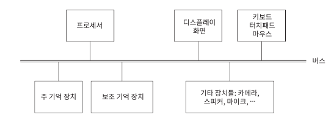

## 002 [하드웨어] 프로세서 속도와 심장 박동수

---

PC와 맥 모두 이와 같은 형태를 보인다. 
- 버스 : 멀티탭과 유사한 역할로 각 장치들의 데이터와 제어 신호를 처리하는 중앙 통신 시스템이다.
- 프로세서(CPU) : 컴퓨터의 '두뇌'에 해당한다 이진법을 읽어서 연산을 처리하는 장치이다.
- 주 기억장치(RAM) : 컴퓨터의 '뇌용량', '단기기억력' 등에 해당한다. 내부에 무수히 많은 스위치가 on/off 하며 이진법을 표현한다. (휘발성이다.)
- 보조 기억 장치(하드 디스크, HDD, SDD) : 컴퓨터의 '장기기억력', '메모장' 등에 해당한다. RAM과 마찬가지로 스위치가 on/off 하며 데이터를 이진법으로 보관하고 있다. (RAM보다 느리다, 비휘발성이다.)
- 디스플레이 화면 : 모니터 등의 보이는 화면을 출력하는 장치이다.
- 키보드, 터치패드, 마우스 : 동작에 따라 약속된 전기 신호를 보내고 CPU로 하여금 RAM의 스위치를 on/off 하여 정해진 동작을 이진법으로 표현하도록 한다.
- 기타 장치들 : 동작에 따라 약속된 전기 신호를 보내고 CPU로 하여금 RAM의 스위치를 on/off 하여 정해진 동작을 이진법으로 표현하도록 한다.

이러한 형태를 '폰노이만 아키텍처'라고 부른다.

---

#### 프로세서(CPU)
CPU 예시 제품 : 2.2GHz 듀얼 코어 인텔 Core i7
- 인텔 : CPU 제조사
- Core i7 : 제품명
- 듀얼코어 : 하나의 패키지에 독립된 처리 장치가 2개 있다는 뜻
- 2.2GHz : 초당 22억번 동작하며 일한다는 뜻
  - Hz는 1초에 딸깍하는 움직임을 측정하는 단위 '헤르츠'를 의미한다.
  - GHz는 '기가헤르츠'로 읽으며 M(메가)는 1,000,000번, G(기가)는 1,000,000,000번을 의미한다.
  - 인간은 심장 박동이 약 1Hz라고 알려져 있으며, 하루에 10만 번 정도 뛴다고 책은 소개한다.

---

#### 주 기억장치(RAM)
CPU는 RAM에 자신이 하고 있는 작업을 실시간으로 저장한다. 전기 신호로 아주 작은 트랜지스터(스위치)를 초당 최대 22억 번씩 껐다 켰다 하며 작업 내역을 2진법으로 기록한다. (앞서 소개한 제품 기준)
- RAM은 CPU가 사용하는 주판 혹은 수학 계산식 노트이다. CPU는 이전에 작업했던 내용을 RAM에서 다시 실시간으로 읽으면서, 다음 작업을 처리하는 일을 반복한다.
- 또한 RAM은 CPU가 이 다음에 무슨 일을 해야 하는지 그 명령어 또한 저장한다. CPU는 작업을 하면서 아주 빠르게 자신의 TODO LIST도 작성 중인 것이다.
  - 이와 같이 실행 중인 프로그램의 데이터와 명령어를 함께 저장하는 방식을 '프로그램 내장식'이라고 부른다.
  - 그리고 이러한 프로그램의 데이터와 명령어를 함께 저장하고 처리하는 과정은 각 프로그램마다 독립적으로 동시 처리된다.
- 임의 접근 메모리 : RAM은 'Random Access Memory'의 약자로 임의 접근 메모리로 번역된다. RAM의 어느 부분이든 같은 속도로 즉시 접근 할 수 있기 때문이다.
  - 비디오 테이프의 경우 특정 부분을 재생하기 위해서는 빨리감기, 되감기를 통해 물리적으로 테이프의 특정 지점을 읽도록 해야 한다. 그러나 RAM은 그럴 필요가 없다. 어느 지점이든 바로 읽는 것이 가능하다.
- 대부분의 RAM은 휘발성이다. 즉, 전원을 종료하면 메모리의 내용이 사라지고 초기화 된다. (모든 트랜지스터(스위치)가 off 된다.)

---

#### 이진법과 프로세스
프로세스 : 램이 기록하고 있는 상태의 프로그램의 인스턴스 '작업관리자'의 프로세스와 동일하다.
- 각 프로세스는 자신이 수행할 수 있는 동작을 2진법으로 표현된 고유한 명령어 코드로 가지고 있다. CPU는 이 2진법 명령어를 읽어 프로세스의 동작을 처리한다.
  - ex) 마우스는 X축 이동과 Y축 이동, 클릭, 휠 등 마우스가 할 수 있는 모든 동작을 고유한 2진법 데이터로 표현한다. 이 2진법 데이터는 메뉴얼처럼 약속된 사항이다.
    - CPU는 마우스가 움직일 때 발생하는 전기 신호를 해석해서 마우스의 현재 위치를 RAM에 저장하고, RAM에서 읽어 들여 다음 위치를 다시 저장하는 것을 반복한다. (이 과정에서 마우스 드라이버가 일한다.)
    - 컴퓨터를 실행했을 때 마우스가 늘 화면 정중앙에 위치하고 있는 이유는 RAM이 초기화된 상태에서 CPU가 마우스의 연결을 인식하고 가장 먼저 마우스를 화면 정중앙에 노출시키기 때문이다.
- 이러한 프로세스의 동작 처리 작업은 동시에 일어나며 독립적으로 일어난다.
  - ex) 그림판과 마우스
    - 그림판과 마우스 프로세스는 각각 동작을 2진법으로 표현된 고유한 명령어 코드로 가지고 있다.
    - 그러나 CPU는 이러한 2진법 데이터의 연계를 고려할 필요 없이 독립적으로 계산한다.

---

#### 그림판에서 그림을 그릴 때 하드웨어에서 일어나는 시나리오
1. 마우스를 움직인다
2. 마우스의 움직임이 전기 신호를 발생시킨다
3. 전기신호가 버스를 타고 CPU에 전달된다
4. CPU는 특정 전기 신호를 2진법으로 이해한다.
5. 약속된 2진법 명령을 해석해서 RAM에 기록을 한다.
6. 그러면서 CPU는 해당 명령을 모니터에게 전달하기 위해 전기신호를 발생시킨다
7. 전기신호가 버스를 타고 모니터에 전달된다.
8. 모니터가 픽셀 값을 조정해서 CPU가 전달한 내용을 화면에 반영한다.
9. 방금 이 과정이 1 프레임이다.
10. 이 과정이 아주 빠르게 반복되면서 연속된 동작을 화면에 출력할 수 있는 것이다.
11. 5번 과정에서 마우스 움직임의 2진법 데이터와 그림판의 2진법 데이터는 동시에 처리된다.

사실 이 과정에서 마우스 드라이버, 그래픽 드라이버, GPU, OS 등이 함께 일한다.

---