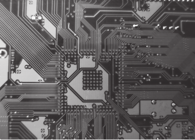

## 004 [하드웨어] 가로세로 1cm 프로세서 칩

---

- 이미지에서 보이는 선들이 회로 기판의 버스들이다.

### PCB(Printed Circuit Board) : 회로기판
전자 부품을 연결하고 지지하는 플랫폼, 전자 회로가 모여있다. 회로 기판 위에 CPU, RAM 등 다른 장치가 올라가서 서로 연결된다.
- 전자회로 : 전자 부품들을 연결하는 선 (버스도 전자회로에 속한다.)

### PCB를 구성하는 소재
회로 기판을 구성하는 소재 중 중요한 것들을 알아보자.

#### 논리게이트 : 전선과 전선 사이의 교통 정리기. 프로그래밍의 함수 처럼 하나 이상의 전기 신호를 받아서 연산 후 출력 값을 리턴한다.
- AND, OR, NOT, NAND, NOR 등의 기본적인 논리 연산을 수행
- 각 논리게이트는 고유한 '교통 규칙'을 가지고 있다.
  - ex) AND 게이트: 모든 입력이 '1'(녹색 신호)일 때만 출력이 '1'(통과)
  - ex) OR 게이트: 하나라도 입력이 '1'이면 출력이 '1'(어느 한 방향이라도 녹색이면 통과)

#### 트랜지스터 : 일종의 스위치, 전압의 제어를 받아 전류를 켜거나 끄는 장치이다.
- on/off를 Boolean 혹은 이진수로 표현할 수 있다.
- 트랜지스터를 조합해서 논리 게이트를 만든다.

#### 집적회로 : 내부에 수 많은 논리게이트와 트랜지스터를 포함하고 있는 칩 형태의 소재 (칩, 마이크로 칩으로 불리기도 한다.)
- 개별 부품을 사용할 때보다 성능, 공간 면에서 효율적이다.

프로그래밍으로 따지면 
- 트랜지스터 : '기본 연산자', '기본 명령어', 0과 1로 표현되는 기계어
- 논리게이트 : 함수
- 집적회로 : 라이브러리 혹은 모듈