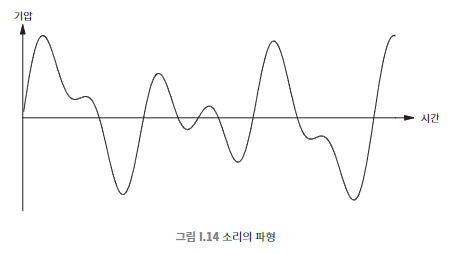
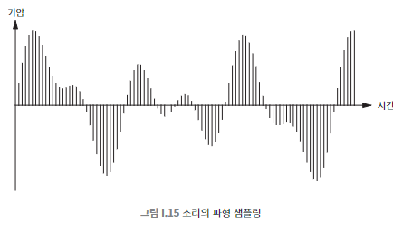
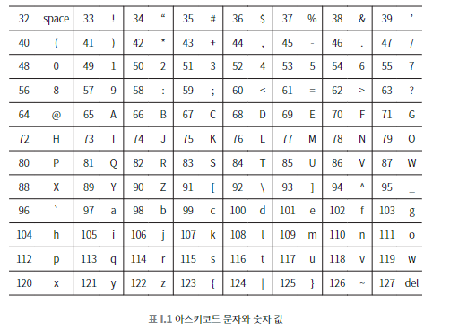

## 008 [하드웨어] 아날로그 정보를 디지털로 바꾸기

---

### 사진
- 아날로그 사진기
  - 화학 물질(염료)이 입혀진 플라스틱 필름을 사용하여 이미지를 만든다.
    - 필름의 빛을 감지하는 영역이 피사체에서 오는 빛에 노출된다. 노출된 빛에 의해 필름의 염료가 반응해 이미지를 만들어낸다.

- 디지털 사진기
  - 이미지 센서에 포함된 무수히 많은 빛 감지 센서가 피사체의 빛을 감지한다. 각 센서마다 R,G,B 중 하나의 빛을 감지한다.
    - 픽셀 : 이미지의 가장 작은 단위. 각 픽셀은 RGB 값으로 색상을 표현한다.
      - RGB : 빛의 삼원색으로 빨간색, 초록색, 파란색을 의미한다.
    - 해상도 : 이미지를 구성하는 픽셀의 총 개수. ex) 1920x1080 해상도는 가로 1920개, 세로 1080개의 픽셀로 구성된 것을 의미한다.

### 음향
소리의 정의 : 소리의 근원인 음원에서 발생한 진동이 공기의 파동을 만들어 고막에 전해지는 것을 뇌가 인지하는 현상.
- 에디슨은 '축음기'를 통해 특정 진동을 패턴으로 변환하고, 해당 패턴을 통해 진동을 재현하는 기계를 만들었다.
  - 진동을 패턴으로 변환하는 과정을 '녹음', 패턴을 진동으로 변환하는 과정을 '재생'이라고 한다.
  - 
    - 시간에 따라 진동의 변화폭을 측정해서 소리를 패턴화 할 수 있다.

디지털 변환 : 패턴화된 진동의 변화폭(파형)을 특정한 시간 기준으로 쪼개서 수치화 시키면 디지털 샘플링이 된다. 
- 
- 더 작은 시간폭으로 쪼갤 수록 더 정밀하게 표현하는 것이 가능하다. 단위는 헤르츠(Hz)이다. 즉, 48000헤르츠는 1초 동안 발생한 파형을 48000번의 동일한 간격으로 나눠 각각 수치화한 것이다.
  - 파형을 수치화 시키는 것이 아날로그에서 디지털로의 변환이다. (A/D)
  - 수치를 파형으로 재현하는 것이 디지털에서 아날로그의 변환이다. (D/A)
  - 변환 될 때마다 실제 소리에서 일부가 손실된다. (연속적인 정보를 비연속적인 정보로 변환할 때 생기는 손실)
- 비트 : 소리를 디지털화 할 때 각 헤르츠가 표현할 수 있는 진폭(진동의 세기)
  - 일반적으로 24비트를 사용하며, 이는 3바이트로 환산된다. (1바이트는 8비트이다.)
  - 24비트는 이진 숫자가 24개 있다는 의미이고, 이는 이진 숫자 24개가 구성할 수 있는 경우의 수 16,777,216개의 높낮이로 각 헤르츠가 소리를 표현할 수 있다는 의미이다.
  - 헤르츠 * (비트 / 8)이 음원 파일의 용량이며, 압축 기술을 통해 줄일 수 있다.

### 그 외의 디지털화 사례
- 영상 : 정지된 이미지를 차례대로 빠르게 보여주는 것으로 착시를 일으키는 방식
  - 프레임 : 영상을 구성하는 단일 이미지, 초당 60프레임은 초당 60개의 이미지가 빠르게 전환됨을 의미한다.
  - 디지털 방식은 음향과 이미지 요소를 시간순에 맞춰 결합하고 압축 기술을 사용해서 용량을 최적화한다.
- 텍스트 : 추가적인 변환 과정 없이 디지털로 어떻게 표현할지 합의만 하면 된다. 즉, 일종의 번역이나 암호와 비슷하다.
  - 아스키코드 : 1963년에 표준화된 알파벳을 숫자로 표현하는 표현식 
  - 
