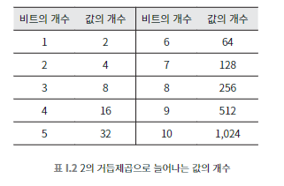

## 009 [하드웨어] 0과 1의 세계

---

### 비트(bit)
디지털 정보를 표현하는 가장 기본적인 방식, 이진 숫자를 의미하는 영단어 'binary digit'을 축약한 것이다. 즉, 하나의 이진 숫자(0혹은 1)을 의미한다.
- 두 개의 값 중 하나를 선택하는 정보라면 무엇이든 표현이 가능하다.
  - ex) 예/아니오, 참/거짓, 켜짐/꺼짐, 높음/낮음, 안/밖 등 합의(약속)만 한다면 둘 중 어떤 것을 선택한 것인지 구분하는 것이 가능하다.
- 비트를 여러 개 조합해서 더 복잡한 정보를 표현할 수 있다.
  - ex) 동쪽(00), 서쪽(01), 남쪽(10), 북쪽(11) - 비트 2개를 조합해서 4방위를 표현할 수 있다. 
    - 이 역시 일종의 약속이다. 각 값이 어떤 것을 의미하는지 약속을 통해 정하는 것이다.
  - 이때 비트의 갯수가 표현할 수 있는 값은 2의 비트 갯수를 거듭 제곱한 값이다.
    - 
  - 이러한 거듭 제곱의 관계는 10진수와도 상당히 유사하다.
    - 
  - 컴퓨터 용량과 10진수의 상관 관계 (제곱 수의 패턴에 주목하자)
    - 
