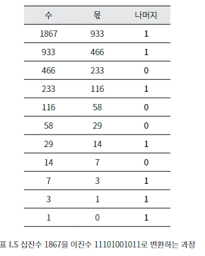
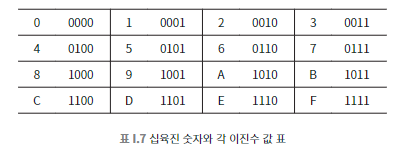

## 010 [하드웨어] 비트 모아 데이터

---

### 이진수 계산법
- `11101` = `(1 * 2^4) + (1 * 2^3) + (1 * 2^2) + (0 * 2^1) + (1 * 2^0)`
  - 16 + 8 + 4 + 0 + 1 = 29로 계산된다.

### 십진수를 이진수로 변환하기
십진수를 2로 계속해서 나누면서 0또는 1이 되는 나머지 값을 적고, 최종 값을 역순으로 나열한다.
- 

### 바이트
8비트, 컴퓨터의 데이터 처리와 메모리 구성의 기본 단위 (2^8, 256개의 구별되는 값을 표현할 수 있다)
- 2바이트는 총 16비트로 65,536개의 값을 나타낼 수 있다. ex) 유니코드 문자 중 하나를 나타낼 수 있다. = 유니코드 문자 하나는 2바이트로 구성된다.

### 16진수

- 4비트를 표현하는 방법으로 16문자로 구성된 2진수를 보다 짧고 간단하게 표현하기 위한 방법이다. (0~9까지의 숫자와 A~F까지의 문자로 16개의 값을 표현한다.)
  - 1바이트인 8비트는 16진수로 표현했을 때 2개의 문자만으로 표현할 수 있다
  - ex) 픽셀의 색상 값인 RGB 코드는 (R 256 * G 256 * B 256)의 조합으로 구성되는데 이를 16진수를 사용해서 6개의 문자만으로 조합으로 표현이 가능하다.

### 윈도우 32bit, 64bit의 의미
- 32bit : CPU가 한 번에 32비트까지 처리 가능 (RAM 4GB 까지 사용 가능)
- 64bit : CPU가 한 번에 64비트까지 처리 가능 (이 때 사용되는 RAM은 테라 단위까지 늘어난다.)

### 비트와 바이트에 대한 논의에서 기억해야 할 점
1. 비트나 바이트를 보는 것만으로는 그것이 무엇을 의미하는지 알 수 없다. 
   - ex) 숫자 0127을 봤을 때 이것이 생일을 의미하는지, 전화번호 중간 자리를 의미하는지, 비밀번호를 의미하는지 알 수 없다.
2. 어떤 프로그램의 데이터는 다른 프로그램의 명령어가 되기도 한다
   - 프로그램이나 앱을 다운로드할 때 그것은 단지 데이터로서, 무작정 복사되는 비트들일 뿐이다.
   - 하지만 프로그램을 실행할 때는 그 비트들이 CPU에 의해 처리되면서 명령어로 취급된다.
   - 각 프로그램마다 처리하는 명령어에 약속된 비트가 결정되어 있으며 이는 독립적으로 작동한다.
     - 0127이 신분증에서는 생일이고, 도어락에서는 비밀번호이듯이 같은 비트 모음도 어떤 프로그램에서 인식되느냐에 따라 다른 결과를 반환한다.