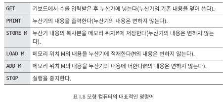
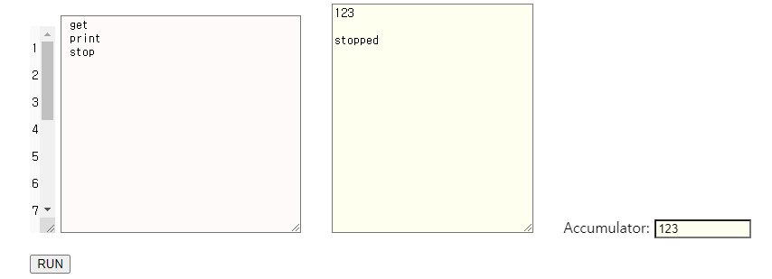
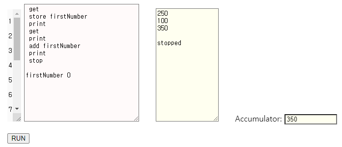
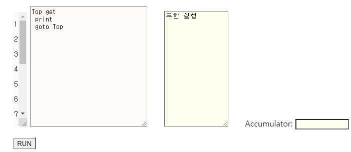
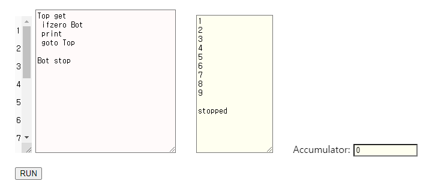
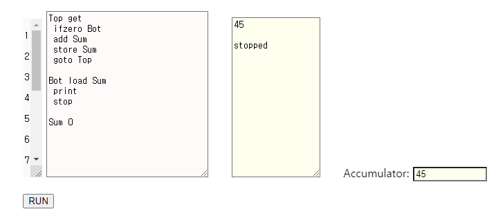
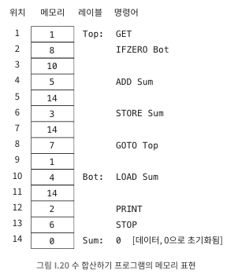
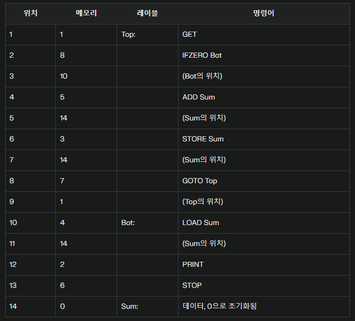

## 013 [하드웨어] 모형 컴퓨터로 더하기 프로그램 만들기

---

### 모형컴퓨터
컴퓨터를 이론적으로 모방하여 만들어진 가상 컴퓨터, 메모리와 누산기, 명령어가 있다.
- 메모리 : 명령어와 데이터를 저장
- 누산기 : 한 개의 수를 담을 만한 용량의 부가 영역
- 명령어
  - 

- 동작 원리 : 각 메모리 위치에는 하나의 숫자(데이터) 또는 명령어가 저장된다.(프로그램은 이러한 명령어와 데이터 항목들로 구성된다.) 프로세서는 첫 번째 메모리 위치에서 시작하여 다음과 같은 단순한 사이클을 반복한다.
  1. 인출 (Fetch): 메모리에서 다음 명령어를 가져온다.
  2. 해석 (Decode): 명령어가 무엇을 해야 하는지 해석한다.
  3. 실행 (Execute): 명령어를 실행한다.
  4. 반복 (Repeat): 다시 인출 단계로 돌아간다.

### [Toy Machine Simulator](https://www.cs.princeton.edu/courses/archive/fall14/cos109/toysim.html)
컴퓨터 과학 교육을 위해 설계된 간단한 가상 컴퓨터 시뮬레이터. 실제 컴퓨터의 기본적인 동작 원리를 이해하기 쉽게 모방하여 만든 모형 컴퓨터이다.
- 기본 컴퓨터 구조 시뮬레이션: 메모리, 레지스터, 누산기, 프로그램 카운터, 산술 논리 장치(ALU) 등 실제 컴퓨터의 핵심 구성 요소를 간단하게 구현
- 간단한 명령어 세트: load, store, add, sub, goto 등 기본적인 명령어를 제공하여 저수준 프로그래밍의 개념 구현
- 시각적 실행 과정: 프로그램의 실행 과정을 단계별로 볼 수 있어, 명령어가 어떻게 처리되는지 직접 확인 가능

이 시뮬레이터를 통해 사용자는 간단한 프로그램을 작성하고 실행해볼 수 있으며, 컴퓨터가 어떻게 명령어를 처리하고 데이터를 다루는지 직접 체험할 수 있다. 
- 예를 들어, 간단한 덧셈 연산도 실제 컴퓨터처럼 여러 단계를 거쳐 수행되는 과정을 관찰할 수 있어, 컴퓨터의 기본 동작 원리를 직관적으로 이해할 수 있다.

### 첫 번째 프로그램

- GET : 사용자에게 숫자를 입력하도록 요청한다. (이 때 누산기에 입력 값이 저장된다.)
- PRINT : 사용자가 입력한 수를 출력한다. (누산기에 저장한 값을 출력한다.)
- STOP : 프로그램을 중지한다.

### 보다 복잡한 프로그램

#### 두 수를 더하고, 그 합계를 출력하는 모형 컴퓨터 프로그램

- 사용자에게 숫자를 받아서 'firstNumber'이라는 메모리 위치에 저장하고, 두 번째 숫자를 받아서 저장된 firstNumber에 합산한다.
- 두 번째 숫자 값을 받을 때 누산기가 덮어 씌워진다. 그렇기에 firstNumber 이라는 이름으로 메모리에 따로 저장하는 것이다.
  - 실제로는 firstNumber가 아닌 명령어와 데이터의 순서에 맞게 위치 숫자가 지정된다.
  - 즉 firstNumber를 초기화 하는 8번째 라인을 기준으로 메모리에 위치가 결정된다.

#### 끝 없이 실행되는 데이터 출력 프로그램

- Top : Top이라는 이름의 레이블을 통해 프로그램의 특정 지점을 지정한다.
- get : 사용자로부터 입력을 받아 누산기에 저장한다.
- print : 누산기의 값을 출력한다.
- goto Top : 프로그램의 실행 흐름을 Top 레이블이 있는 곳으로 되돌린다.

#### 0이 입력되면 실행을 멈추는 데이터 출력 프로그램

- ifzero Bot : 누산기의 값이 0이면 Bot 레이블로 이동한다.
- Bot stop : 프로그램의 실행을 중지하는 명령어에 Bot 레이블을 지정한다.

#### 일련의 수를 합산하는 모형 컴퓨터 프로그램

- Top와 Bot 두 개의 레이블이 존재한다.
  - Top 레이블은 사용자에게 숫자 값을 받아서 Sum 변수에 합산하는 작업을 반복한다.
    - 사용자 입력 값이 0일 경우 Bot 레이블로 이동한다.
  - Bot 레이블은 Sum 변수 값을 불러온 후 출력하고 프로그램을 종료한다.

### 메모리 내부 표현

> GET = 1, PRINT = 2, STORE = 3, LOAD = 4, ADD = 5, STOP = 6, GOTO = 7, IFZERO = 8

메모리 표현 방식
- 각 명령어는 고유한 숫자 코드로 표현된다.
- 명령어는 하나 또는 두 개의 메모리 위치를 차지한다.
  - 단순 명령어(예: GET, PRINT)는 한 칸을 차지한다.
  - 메모리를 참조하는 명령어(예: IFZERO, ADD)는 두 칸을 차지한다.
    - 첫 번째 칸: 명령어 코드
    - 두 번째 칸: 참조하는 메모리 위치

- IFZERO, ADD, STORE 등은 참조해야 하는 다른 값을 저장하기 위한 별도 메모리 공간이 필요하다.