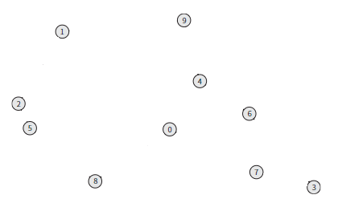
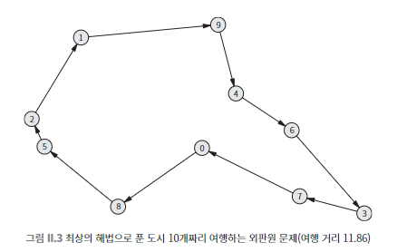
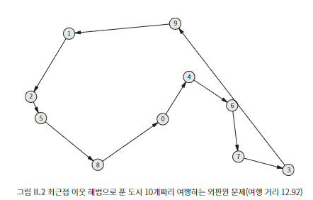

## 022 [소프트웨어] 10개 도시를 최단거리로 여행하는 법

---

### 지수 알고리즘
입력의 크기가 1 증가할 때마다 연산 횟수가 특정 상수의 거듭제곱만큼 증가하는 형태
- 2^n 형태이다.
    - 입력의 크기가 조금만 증가해도 연산 횟수가 급격히 증가한다.
    - 일반적으로 O(2^n), O(3^n) 등으로 표현됨
- 3개의 과일이 주어졌을 때, 이 과일들로 만들 수 있는 모든 가능한 조합을 찾는 문제
    - '사과', '바나나', '체리' 총 3개의 과일이 있다.
    - 가능한 조합 :
        - 1.빈 조합 (아무것도 선택하지 않음) 2.사과 3.바나나 4.체리 5.사과, 바나나 6.사과, 체리 7.바나나, 체리 8.사과, 바나나, 체리
        - 총 8개로 2^3인 것을 알 수 있다.

### P vs NP
- 다항 시간 문제 (P 문제)
  - 실행 시간이 N^2, N^3 같이 다항식으로 표현되는 문제들.
    - 다항식을 모른다면, N^2, N^3 같이 어떤 변수의 정수 거듭제곱 꼴을 생각하면 된다.
  - 다항 시간 내에 해결 가능. (효율적으로 간주됨)
- 비결정적 다항 시간 문제 (NP 문제)
  - 다항 알고리즘으로 풀 수 없는 문제 ex) 지수 알고리즘
  - 해결책을 찾기는 어렵지만, 주어진 해결책이 맞는지 확인할 수는 있는 문제이다.
    - 어떠한 해결책을 알고 있다면 그것이 맞는지는 빨리 입증할 수 있다.
  - "마법처럼 항상 올바른 선택을 할 수 있다면" 이런 문제들을 빨리 풀 수 있지만, 현실적으로 운이 필요하다.
    - ex) 외판원 문제

### 외판원 문제

n개의 도시가 있고, 각 도시를 정확히 한 번씩 방문한 후 시작 도시로 돌아오는 최단 경로를 찾는 문제

- 완전 탐색 접근법
    - 모든 가능한 경로를 탐색하여 최단 경로를 찾는다.
        - 출발점을 하나로 고정한다.
        - 출발점을 제외한 9개의 도시를 방문하는 순서를 결정한다.
            - 처음 방문할 도시의 경우의 수는 9개이다.
            - 두 번째 방문할 도시의 경우의 수는 8개이다.
            - 최종적으로 9 × 8 × 7 × 6 × 5 × 4 × 3 × 2 × 1의 식이 나온다. (9!, 9 팩토리얼)
    - 도시 수가 1 증가할 때마다 탐색해야 할 경로의 수가 n배씩 증가한다.
        - 10개에서 11개로 증가: 10배 증가하는 것이다 (10!)
    - 즉, 탐색해야 할 경로의 수는 (n-1)!로 표현할 수 있다.

### 외판원 문제 더 효율적으로 풀기

- 최근접 이웃 해법 
  - 출발점에서 시작해서 매번 아직 방문하지 않은 도시 중 가장 가까운 도시로 이동하는 방법
  - 시작하는 도시가 바뀌면 여행 경로가 바뀔 수 있다.
  - 그러나 해당 방법으로는 효과적인 경로를 찾을 수는 있어도 최상의 경로를 보장할 수는 없는다.

### NP-완전문제
NP(비결정적 다항 시간) 문제들 중 가장 어려운 부류의 문제
- 모든 NP 문제를 다항 시간 내에 NP-완전 문제로 환산할 수 있다.
- 지금까지 다항 시간 내에 해결할 수 있는 알고리즘이 발견되지 않았다.
- 대부분 지수 시간 복잡도를 가진 알고리즘으로 해결해야 하는 문제이다.
- 외판원 문제도 NP-완전문제에 해당한다.
  - 그래서 더 효율적으로 풀 수 있는 방법은 존재하지만, 완벽한 답을 얻기 위해서는 완전 탐색을 할 수 밖에 없다.

NP-완전문제는 알고리즘 문제에 있어 보스몹에 해당한다. 만약 해당 문제를 다항 시간 내에 풀어낼 수 있다면 모든 NP문제를 다항 시간 내에 풀어낼 수 있게 될 것이다.