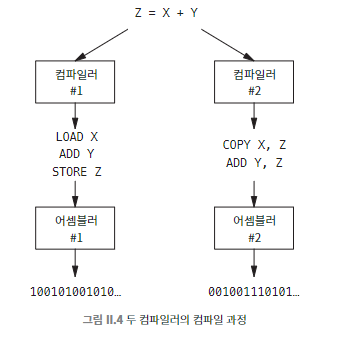

## 026 [소프트웨어] 고수준 언어에서 프로그램 실행까지

---

### 고수준 프로그래밍 언어
사람이 표현하는 방식에 가까운 언어로 계산 과정(컴퓨터의 이진수 계산 과정)을 작성할 수 있다. ex) Java, Python, JS, PHP 등
- 컴파일러를 통해 어셈블리어로 변환된다.
  - 어셈블리어는 어셈블러에 의해 비트로 변환 되어 메모리에 로드되고 실행된다.
- `Z = X + Y` 와 같은 표현 방식이 일반적인 고수준 프로그래밍 언어의 표현이다. (X와 Y를 더한 후 결과를 Z에 저장한다.)
- 프로세서의 의존적인 어셈블리어와 달리 고수준 프로그래밍 언어는 컴파일러가 프로세서에 맞게 자동으로 알맞은 어셈블리어로 변환해준다. (이식성이 높음)
  - 

고수준 프로그래밍 언어(프로그래머) -> 어셈블리어(어셈블러) -> 기계어(메모리적재) 과정이다.

### Java와 바이트코드
Java와 같은 일부 고수준 프로그래밍 언어는 중간 단계에 '바이트코드'를 사용해서 플랫폼 독립성을 높이기도 한다.
- 바이트코드 : 소스 코드를 중간 형태로 변환한 코드로, 가상 머신에서 실행될 수 있는 형태이다.
- 어셈블리어가 특정 프로세서에 종속된 언어라면, 바이트코드는 특정 고수준 언어에 종속된 언어라고 할 수 있다. 어셈블리어가 어셈블러를 통해 기계어로 번환되듯 바이트코드는 언어의 가상머신을 통해 기계어로 변환된다.
  - ex) 자바 바이트코드는 JVM(Java Virtual Machine)에서 실행된다.
    - 자바 코드를 컴파일 하면 생기는 '.class' 파일 내에 자바 바이트코드가 들어있다.
    ```
    //자바 바이트코드 예시.
    0: iconst_5
    1: istore_1
    2: iconst_3
    3: istore_2
    4: iload_1
    5: iload_2
    6: iadd
    7: istore_3
    8: getstatic #2 // Field java/lang/System.out:Ljava/io/PrintStream;
    11: iload_3
    12: invokevirtual #3 // Method java/io/PrintStream.println:(I)V
    ```
  - JVM은 각 플랫폼(운영체제와 하드웨어)에 맞게 구현되어 있어, 바이트코드를 해당 플랫폼에 맞는 기계어로 해석하거나 JIT(Just-In-Time) 컴파일을 통해 실행한다.
  - '프로그래머 -> 자바 컴파일러 -> JVM (인터프리터/JIT 컴파일러) -> (내부적 어셈블/최적화 과정) -> 메모리' 과정을 거친다.