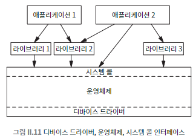

## 035 [소프트웨어] 운영 체제가 일하는 법

---

### 부팅
컴퓨터가 켜졌을 때 사용자가 컴퓨터를 사용 가능하도록 초기화 작업을 진행하는 OS의 작업 과정.
1. 프로세서는 영구 기억 장치에서 소량의 명령어를 실행하여 시작한다.
2. 플래시 메모리에서 더 많은 명령어를 읽는다. (디스크, USB, 또는 네트워크에서 추가 명령어를 로드한다.)
3. 하드웨어 점검을 진행한다.
   - 메모리와 기타 구성 요소의 정상 작동 확인
   - 연결된 외부 장치(프린터, 스캐너 등) 확인
   - 필요한 드라이버 로드

### 부팅 후 운영체제의 대표적인 작업 사이클
- 프로세스 관리:
  - 각 애플리케이션에 차례로 통제권 부여
  - 시간 조각(time slice) 할당 및 관리
- 이벤트 처리:
  - 음악 재생 완료, 메일 수신, 웹페이지 다운로드 등의 이벤트에 반응
  - 해당 이벤트를 적절한 애플리케이션에 전달
- 사용자 인터페이스 관리:
  - 화면 창 재배치 및 디스플레이 관리
  - 애플리케이션에 화면 표시 정보 제공
- 애플리케이션 종료 관리:
  - 종료 신호를 애플리케이션에 전달
  - 애플리케이션의 정리 작업 기회 제공 (예: 파일 저장 확인)
  - 사용된 자원 회수 및 화면 갱신

### 시스템 콜
운영체제가 제공하는 서비스를 애플리케이션이 요청하는 특별한 명령어, 애플리케이션과 운영체제 간의 인터페이스 역할을 수행한다.
- 하드웨어 자원에 대한 직접적인 접근을 제어하고 관리
- 애플리케이션에 표준화된 서비스 제공 방식 제공
- 주요 기능
  - 파일 데이터 저장 및 가져오기
  - 네트워크 연결 설정
  - 키보드 입력 처리
  - 마우스 움직임 및 클릭 감지
  - 디스플레이 출력 관리
- 작동 방식
  - 애플리케이션이 특정 시스템 콜을 실행하여 운영체제에 서비스 요청
  - 운영체제가 요청된 작업을 처리
  - 처리 결과와 함께 제어권을 애플리케이션에 반환
- 특징
  - 운영체제마다 고유한 시스템 콜 세트를 가짐
  - 현대 운영체제는 일반적으로 수백 개의 시스템 콜을 제공
- 중요성
  - 운영체제의 정체성을 규정하는 요소
  - 하드웨어와 소프트웨어 간의 추상화 계층 제공
  - 프로그래밍을 더 쉽고 효율적으로 만듦
- 보안 및 안정성
  - 애플리케이션의 하드웨어 직접 접근을 제한하여 시스템 보호
  - 자원 관리 및 할당을 통한 시스템 안정성 유지

시스템 콜은 애플리케이션이 운영체제의 서비스를 요청하는 인터페이스로, 하드웨어 자원에 대한 접근과 관리를 운영체제가 대신 처리하도록 하는 메커니즘이다.

### 디바이스 드라이버

운영체제와 특정 하드웨어 장치 간의 가교 역할을 하는 코드. 특정 장치의 작동 방식에 대한 상세한 정보를 포함하고 있다.
- ex) 마우스 드라이버, 그래픽 드라이버 등
- 주요 기능
  - 하드웨어 추상화: 장치의 특이한 속성을 시스템의 나머지 부분으로부터 분리해서 운영체제가 다양한 장치에 균일한 방식으로 접근할 수 있게 함
  - 요청 변환: 운영체제의 일반적인 요청을 특정 장치에 맞는 구체적인 명령으로 변환
  - 기능 지원: 장치별 고유 기능(예: 프린터의 컬러 인쇄, 양면 인쇄 등)을 운영체제에 제공
- 드라이버 관리
  - 범용 운영체제는 다양한 장치를 위한 드라이버를 미리 설치해 놓는다.
  - 장치 제조사는 새로운 또는 업데이트된 드라이버를 웹사이트를 통해 제공한다.
- 드라이버 로딩 과정
  - 부팅 시 필요한 드라이버 로드
  - 새로운 장치 연결 시 자동 인식 및 적절한 드라이버 로드
- 표준화와 호환성
  - USB 장치 등 표준화된 인터페이스를 통해 대부분의 장치가 즉시 인식 가능
  - 많은 경우 추가 드라이버 설치 없이 기본 기능 사용 가능
- 운영체제와의 통합
  - 디바이스 드라이버는 운영체제의 커널 모드에서 실행되며, 운영체제의 다른 부분과 긴밀하게 통합되어 작동
  - 하드웨어 자원 관리, 메모리 보호, 프로세스 간 통신 등 운영체제의 핵심 기능과 밀접하게 연관되어 있음
  - 운영 체제 위에서 실행되는 프로그램 개념이 아닌 운영체제의 일부로 생각해야 함