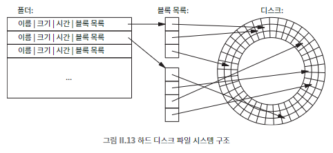

## 036 [소프트웨어] 파일 시스템과 블록

---

### 파일 시스템
운영체제에서 하드 디스크, USB, CD 등 다른 이동식 메모리 장치 같은 물리적 저장 매체를 파일과 폴더 계층 구조처럼 보이게 하는 부분
- 논리적 구성과 물리적 구현간의 분리를 보여주는 훌륭한 사례이다.
  - 파일 시스템은 다양한 종류의 장치에 정보를 조직화 하고 저장하겠지만, 운영체제는 모두 동일한 인터페이스로 표시한다.
    - HDD, SSD, USB, CD 모두 다른 물리적 방식으로 데이터를 저장하지만 사용자는 차이 없는 파일과 폴더 계층 구조를 경험할 수 있다.
- 파일 시스템의 역할
  - 파일의 모든 정보를 관리하면서 애플리케이션이나 운영체제의 나머지 부분이 정보를 읽고 쓸 수 있도록 접근 가능하게 만든다.
  - 파일에 대한 접근이 효율적으로 수행되고 서로 간섭하지 않도록 조정한다.
  - 데이터의 물리적 위치를 계속해서 파악한다.

### 보조 기억 장치 파일 시스템
- 블록 단위 저장: 예를 들어, 500GB 드라이브는 5천억 바이트를 저장할 수 있으며, 이를 1,000바이트 블록 5억 개로 나눠서 관리.
- 블록 사용: 특정 파일의 용량이 2,500 바이트라면 3개의 블럭을 사용한다.
  - 한 파일이 사용하는 바이트를 다른 파일이 사용하는 바이트와 같은 블록에 저장하지 않는다.
    - 마지막 블럭은 500 바이트가 남는다. (낭비되는 것)

### 폴더 엔트리

파일 이름, 크기, 생성 및 수정 날짜, 권한, 파일 유형 등의 정보를 포함하고 있는 파일의 메타데이터.
- 파일 탐색기나 파인더 같은 프로그램에서 확인할 수 있는 정보이다.
- 파일의 블록들이 물리적으로 인접해 있지 않아도 파일의 폴더 엔트리에 관련 정보가 포함되어 있어 파일을 문제 찾을 수 있게 해준다.
- 파일이 드라이브 어디에 저장되어 있는지, 즉 5억 개의 블록 중 어느 것이 파일의 바이트를 담고 있는지 정보를 담고 있다.
  - 파일 위치 정보를 담는 대표적인 방법
    - 블록 번호 목록을 직접 포함하는 방법
    - 블록 번호 목록을 담고 있는 블록을 참조하는 방법
    - 첫 번째 블록 번호를 포함하여 다음 블록 번호를 차례로 구하는 방법

### SSD의 파일 시스템
물리적 구현은 다르지만 기본 아이디어는 HDD와 동일하다.
- 바이트당 가격이 비싸지만, 더 작고 안정적이며 전력 소모가 적음.
- SSD는 하드 드라이브와 다른 드라이버를 사용하며, 장치 자체에 위치 정보를 기억하는 정교한 코드 포함.
- 웨어 레벨링: 각 물리적 블록이 거의 같은 횟수로 사용되도록 데이터 이동.

### 폴더
다른 폴더와 파일의 위치 정보를 담고 있는 파일.
- 어떤 관점에서는 폴더 또한 파일이다.
  - 파일 시스템이 폴더 내용을 관리하고 유지.
  - 사용자와 애플리케이션은 파일 시스템을 통해 간접적으로 폴더 내용을 변경 가능.
  - 폴더도 파일과 동일한 방식으로 저장되며, 블록 단위로 관리됨.

### 파일 검색 과정
- 계층 구조 탐색:
  - 최상위 디렉토리부터 시작하여 경로의 각 요소를 순차적으로 찾음
  - 예: /Users/bwk/book/book.txt 또는 C:\My Documents\book\book.txt
- 효율성:
  - 각 단계마다 검색 범위가 좁아져 효율적
  - 해당되지 않는 파일과 폴더는 검색 대상에서 제외됨
- 최적화 전략:
  - 현재 사용 중인 폴더 정보 유지
  - 자주 사용되는 폴더 캐싱

### 새 파일 생성 과정
1. 적절한 폴더에 새 엔트리 추가
2. 이름, 날짜 등의 정보 기록 (초기 크기는 0으로 설정)
3. 필요한 수의 미사용 블록 할당
   - 파일 시스템이 드라이브상에서 현재 사용되지 않는, 즉 어떤 파일의 일부가 아닌 모든 블록의 목록을 유지하고 있다는 것을 암시
4. 데이터를 블록에 복사
5. 폴더의 블록 목록에 새 블록 정보 추가