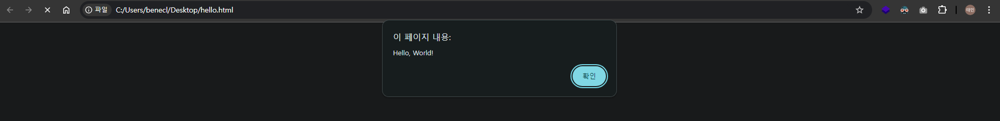
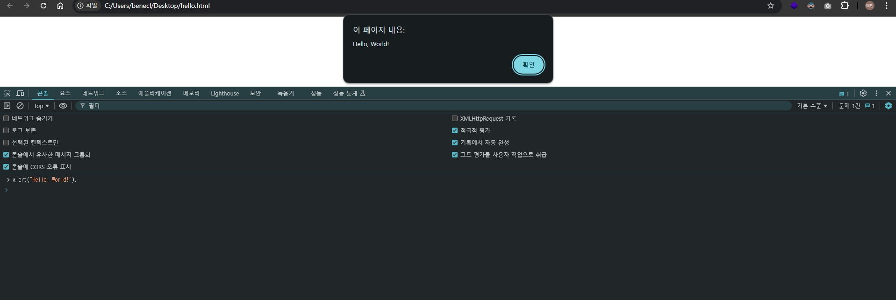

## 043 [소프트웨어] 자바스크립트로 Hello, World 출력하기

---

### 첫 번째 자바스크립트 프로그램 : Hello, World
```html
<html>
  <body>
    <script>
      alert("Hello, World!");
    </script>
  </body>
</html>
```
1. 해당 코드를 복사한 후 메모장 등의 텍스트 편집기에 붙여넣는다.
2. `hello.html` 이름으로 저장한다.
3. 저장된 파일을 실행한다.
   - 

해당 코드에서 `alert("Hello, World!");` 부분이 자바스크립트 코드에 해당한다. 

### 브라우저 개발자 도구에서 Hello World 출력

1. 브라우저를 실행한다. (크롬을 기준으로 설명)
2. `F12`를 눌러 개발자 모드 '콘솔' 탭에 진입한다..
3. `alert("Hello, World!");`를 입력한다.
- 이 경우 HTML 코드를 생략해도 되기 때문에 더 편리한 환경에서 자바스크립트 코드를 테스트할 수 있다.