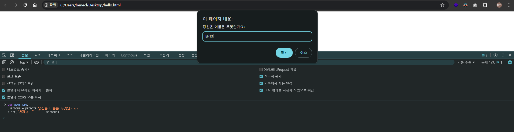
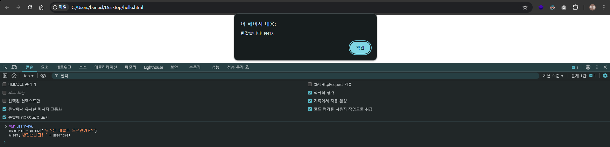

## 044 [소프트웨어] 사용자 이름 받아 출력하기

---

### 두 번째 자바스크립트 프로그램 : 사용자 이름받아 출력하기
```js
var username;
username = prompt("당신은 이름은 무엇인가요?")
alert("반갑습니다! " + username)
```


- `var username` : var는 다음에 올 단어의 이름으로 변수를 선언하는 것을 의미한다.
- `username = prompt("당신은 이름은 무엇인가요?")` : username라는 변수에 `=` 기호를 통해 오른쪽 명령어를 수행하고 그 결과값을 저장한다.
  - 모형 컴퓨터에서 누산기 값을 메모리에 저장하는 것과 같다.
- `alert("반갑습니다! " + username)` : `+` 기호는 '반갑습니다! '라는 문자열과 username 을 결합한다.
