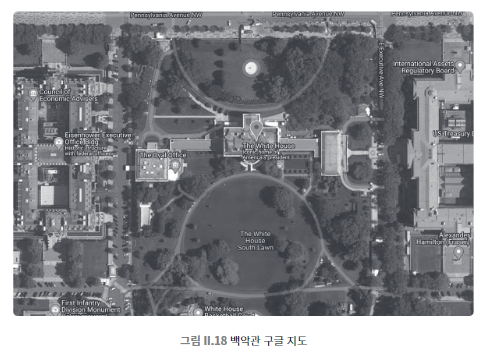

## 046 [소프트웨어] 자바스크립트로 구글 지도에 위치 표시하기

---

### 구글 지도 API
구글에서는 구글 지도 라이브러리 및 API를 제공한다.
- 누구나 자바스크립트로 구글 지도 API를 사용해서 구글 지도를 웹사이트에 구현할 수 있다.
- 보안을 위해 API 사용을 위한 권한을 부여받아야 한다. (구글에서 제공하는 인증 절차)

```js
function initMap() {
  var latlong = new google.maps.LatLng(38.89768, -77.0365);
  var opts = {
    zoom: 18,
    center: latlong,
    mapTypeId: google.maps.MapTypeId.HYBRID
  }
  var map = new google.maps.Map(document.getElementById("map"), opts);
  var marker = new google.maps.Marker({
    position: latlong,
    map: map,
  });
}
```


웹에서는 구글 지도 API 같은 프로그래밍 인터페이스를 비롯하여 자바스크립트를 점점 더 많이 사용하고 있다.
- 자바스크립트 코드는 웹에 소스코드를 공개할 수 밖에 없어 지적 재산권을 보호하기 어렵다.
  - '난독화' 등의 방법을 통해 코드를 알아보기 어렵게 하는 것은 가능하다.