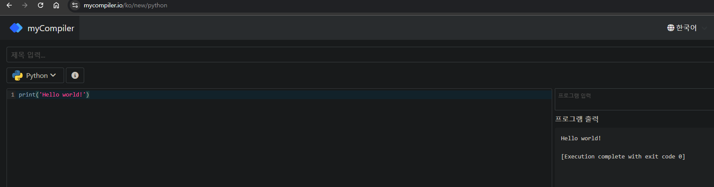

## 048 [소프트웨어] 파이썬으로 Hello, World 출력하기

---

### 파이썬 웹에서 실행하기
[MyCompiler](https://www.mycompiler.io/ko/new/python) 웹사이트에서 파이썬 실행 환경을 제공한다.
- 책에서는 구글의 '코랩'을 소개하고 있다.

### 첫 번째 파이썬 프로그램 : Hello, World
```python
print('Hello world!')
```


