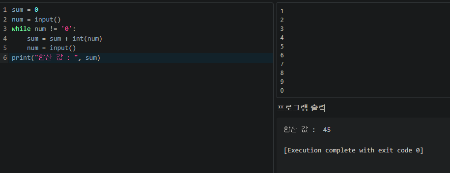

## 049 [소프트웨어] 더하기 프로그램 만들기

---

### 두 번째 파이썬 프로그램 : 수 합산하기
```python
sum = 0
num = input()
while num != '0':
    sum = sum + int(num)
    num = input()
print("합산 값 : ", sum)
```

- MyCompiler 환경에서는 인풋 값을 미리 지정해서 테스트해야 한다.
  - 프로그램 출력 상단의 인풋 필드에 인풋 값을 작성할 수 있다. (1~9, 0을 차례로 입력한 예시)