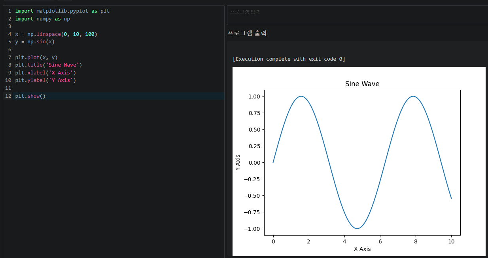

## 050 [소프트웨어] 파이썬으로 그래프 그리기

---

### 파이썬 라이브러리
파이썬의 뛰어난 장점 중 하나는 프로그래머가 사용할 수 있는 방대한 라이브러리 모음을 제공한다는 점이다.
- 어떤 응용 분야라도 그 분야의 프로그래밍을 쉽게 작성할 수 있는 파이썬 라이브러리가 존재할 확률이 아주 높다.

### matplotlib
파이썬의 데이터 시각화 라이브러리, 그래프를 쉽게 그릴 수 있다.
- 파이썬의 내장 라이브러리가 아닌 외부 라이브러리이다.

### MyCompiler에서 matplotlib 사용하기
MyCompiler가 matplotlib를 포함한 여러 유용한 파이썬 라이브러리를 미리 설치해 두었기 때문에 MyCompiler 환경에서도 실습을 하는 것이 가능하다.

### 세 번째 파이썬 프로그램 : 그래프 그리기
```python
import matplotlib.pyplot as plt
import numpy as np

x = np.linspace(0, 10, 100)
y = np.sin(x)

plt.plot(x, y)
plt.title('Sine Wave')
plt.xlabel('X Axis')
plt.ylabel('Y Axis')

plt.show()
```

- 그래프 그리기 예시
  - 실제 책에 나오는 실습 내용을 진행하지 않았다.