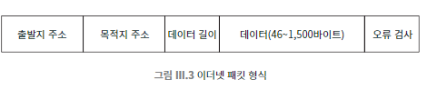

## 056 [통신] 학교나 회사에서 사용하는 근거리 네트워크, 이더넷

---

### 이더넷
로컬 환경의 컴퓨터 및 기타 장치를 네트워크에 연결하기 위해 개발된 통신 표준
- LAN이라고 불리우는 로컬 네트워크를 형성한다.
- 네트워크 공유기(라우터)를 중심으로 같은 공유기의 네트워크를 사용하는 그룹끼리가 이더넷 그룹이다.
  - 유선(LAN)선 으로 연결하면 '이더넷'
  - 무선으로 연결하면 '와이파이'
  - 둘 다 같은 로컬 네트워크 상에 있는 것이다.
    - 같은 로컬 네트워크 내에서 PC와 모바일 간의 파일 공유 등이 가능한 이유이다.
- 모든 이더넷 장치에는 고유한 이더넷 주소가 있다.
  - 이더넷 연결이 가능한 개인 PC에도 기본적으로 이더넷 주소가 할당된다. (MAC 주소)
    - 하드웨어인 '네트워크 인터페이스 카드(NIC)'에 할당된 고유한 식별자이다.
- 보안 이슈 : 무차별 모드(promiscuous mode)
  - 기본적으로 컴퓨터의 네트워크 카드는 자신에게 주소가 지정된 패킷만 수신한다.
  - 무차별 모드를 활성화 하면 네트워크 카드가 네트워크를 통해 전송되는 모든 패킷을 수신하게 만들 수 있다.
  - 패킷 스니핑 : 네트워크 상의 모든 트래픽을 보는 것을 의미하며, 트래픽을 캡처하여 분석하는 방식으로 사용할 수 있으나, 악용의 위험도 있다.
- 패킷 : 정확하게 정의된 형식으로 정보를 담고 있는 일련의 비트 또는 바이트
  - 우편 봉투에 비유할 수 있다. (발신자 작성란, 수신자 작성란, 내용을 담기 위한 구조 등을 제시한다는 점에서 유사하다.)
  - 패킷의 형식과 세부 사항은 네트워크 마다 다르다.
    - 
    - 해당 이미지는 6바이트로 된 출발지 주소와 목적지 주소, 몇 가지 기타 정보, 최대 1,500바이트의 데이터로 구성되는 패킷의 예시이다.

### 초기 이더넷
단일 동축 케이블에 연결되어 있는 모든 컴퓨터 간에 신호를 전달하는 방식 
- 단일 동축 케이블 : 고주파 신호를 전송하는 데 사용되는 케이블
- 모든 컴퓨터가 하나의 케이블에 연결되었다.
  - 네트워크의 모든 장치가 하나의 중앙 케이블(버스)에 연결되는 구조. (버스 토폴로지)
- 신호 전송 방식
  - 전압 펄스를 이용하여 신호 전달
  - 전압의 세기와 극성으로 비트 값을 인코딩
    - 양의 전압 = 1
    - 음의 전압 = 0
- 각 컴퓨터는 고유 식별 번호가 있는 장치로 이더넷에 연결한다.
- 한 컴퓨터에서 데이터를 전송 중일 때 다른 컴퓨터들은 대기해야 했다.

### 이더넷의 현대적 발전
1. 동축 케이블보다 더 발전된 케이블을 사용한다. (광섬유 케이블 등)
2. 스타 토폴로지 사용
   - 각 컴퓨터가 중앙의 스위치나 허브에 직접 연결되어, 독립적으로 데이터를 전송
   - 컴퓨터와 중앙 케이블 사이에 스위치나 허브 등을 만들어 중앙 관리를 한 번 더 하는 방식이다.
3. 더 빠른 속도 및 데이터 충돌 방지 등의 효과를 실감할 수 있다.
4. 이더넷 장치의 크기와 가격 또한 작고 저렴해졌다.