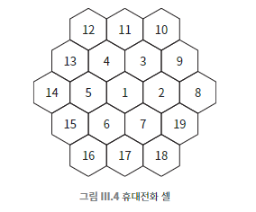

## 058 [통신] 휴대전화가 영어로 셀룰러폰인 이유

---

### 휴대전화의 셀

- 휴대전화용 스펙트럼과 전파의 범위는 모두 제한되어 있어 지리적 영역을 가상의 육각형에 가까운 셀로 나눈다. 
  - 셀은 기지국이 포괄하는 지역을 의미한다.
- 각 셀에는 기지국이 있으며, 기본적으로 휴대전화는 가장 가까운 셀과 통신한다.
- 휴대전화가 다른 셀로 이동할 때 진행 중인 통화는 이전 기지국에서 더 가까운 기지국으로 넘어간다.
  - 사용자는 이런 과정이 일어나고 있다는 것을 신경 쓸 필요가 없다.
- 수신된 신호의 세기는 거리의 제곱에 비례하여 감소한다.
- 일정 거리 이상 떨어진 셀들은 서로 간의 간섭이 적어 동일 주파수 대역 사용이 가능하다.
  - ex) 기지국 1은 기지국 2~7과 주파수 공유 불가하나, 기지국 8~19와 주파수 공유 가능하다. (간섭을 피할 만큼 충분히 떨어져 있음)
  - 이를 통해 제한된 스펙트럼을 효과적으로 활용할 수 있다.

### IMEI (국제 모바일 기기 식별코드)
- 각 휴대전화에 부여된 15자리 고유 식별 번호
  - 이더넷 주소와 유사하다.
- 휴대전화 전원이 켜지면 IMEI를 브로드캐스트하고, 가장 가까운 기지국이 이 정보를 수신한다.
  - 이 때 홈 시스템이 함께 일한다.
  - 홈 시스템 : 사용자가 가입한 통신사의 이동 통신 시스템
    - 가입자 정보를 관리하고 전화망 통신을 담당
    - 휴대전화 IMEI 유효성 검증
    - 기지국에 휴대 전화 위치 정보를 받아 위치 정보 업데이트

### 스팅레이
셀 타워를 모방하여 작동해서 근처에 있는 휴대전화가 실제 셀 타워 대신 자신과 통신하도록 하는 중간자 공격
- 처에 있는 셀 타워보다 강한 신호를 전달 할 수 있는 좁은 영역에서 효력을 발휘한다.
- 수동적 감시나 적극적인 공격을 할 수 있으며, 휴대전화에 취약한 공격이다.