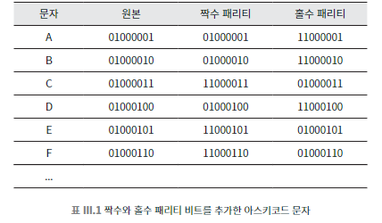

## 061 [통신] 오류를 검출하고 수정하는 알고리즘

---

### 체크섬 알고리즘
데이터의 각 부분을 더해서 만든 '검증용 숫자'를 통해 데이터를 검증하는 알고리즘 (검증용 숫자 = 체크섬)
- 데이터의 각 부분을 더하거나 특정 연산을 수행하여 결과값을 생성
- 결과값을 원본 데이터와 함께 저장하거나 전송
- 예시
  - 전화번호 "1234"를 전송한다고 가정
  - 각 숫자를 더한 합계(10)를 체크섬으로 사용한다.
  - 해당 체크섬 숫자를 데이터와 함께 전송한다.
  - 만약 "1234" 대신 실수로 "1235"가 전송되었다면 합계가 11로 체크섬이 오류를 검증할 수 있다.
- 신용카드 번호에 주로 사용된다.

### 패리티 코드

비트에 적용되는 범용 오류 검출 기법
- 짝수 패리티나 홀수 패리티를 사용하여 단일 비트 오류를 검출할 수 있다.
  - 먼저 짝수 패리티를 사용할지 홀수 패리티리를 사용할지 약속을 통해 정힌다.
  - 데이터의 끝에 0 또는 1의 '패리티 비트'를 추가
    - 짝수 패리티 사용 시: 10111 (1을 추가하여 1의 개수를 짝수로 만듦)
    - 홀수 패리티 사용 시: 10110 (0을 추가하여 1의 개수를 홀수로 유지)
  - 약속된 패리티로 모든 데이터를 언제나 짝수 혹은 홀수로 보내야 한다.
- 예시
  - 그룹 내에서 값이 1인 비트의 총 개수가 짝수가 되도록 선택
  - 단일 비트 오류가 발생하면 수신자는 1인 비트가 홀수 개인 것을 보고 무언가 손상되었음을 알 수 있다.
    - 짝수로만 보내기로 약속했는데 홀수가 들어온 건 오류가 있다는 것이다.
- 단일 비트 오류를 100% 검출할 수 있다.
- 오류의 위치는 알 수 없고, 단순히 오류의 존재 여부만 확인 가능하다.