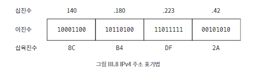

## 064 [통신] 인터넷이 가능한 매커니즘

---

### 인터넷의 역사
1960년대에 지리적으로 떨어진 컴퓨터들을 연결하려는 시도로 시작. 아파넷이라고 불렀다.
- 1969년 10월 29일, UCLA의 컴퓨터에서 스탠퍼드 연구소의 컴퓨터로 첫 번째 아파넷 메시지가 전송했고, 이 날을 인터넷의 탄생일로 간주한다.
- 처음부터 네트워크 구성 요소 중 하나에 이상이 생기더라도 견고하게 작동하고, 문제가 발생한 부분을 우회해서 트래픽을 라우팅하도록 설계됐다.
    - 라우팅 : 경로를 지정하는 것
- 대학교 컴퓨터과학부와 연구 기관을 연결할 목적으로 만들어졌다.
- 1990년대에 상업적 영역으로 퍼져 나갔고 언젠가부터 '인터넷'이라 부르게 됐다.

### 오늘 날의 인터넷
느슨하게 연결된 수백만 개의 독립적인 네트워크로 구성되어 있다.
- 주로 무선 이더넷을 통해 근거리의 컴퓨터끼리 연결된다.
- 근거리 네트워크들이 게이트웨이  또는 라우터를 통해 다른 네트워크에 연결된다.
    - 게이트 웨이, 라우터 : 한 네트워크에서 다음 네트워크로 정보 패킷을 라우팅하는데 전문화된 컴퓨터
        - 위키피디아에 따르면 게이트웨이는 더 일반적인 장치이며 라우터는 특수한 장치라고 한다.
    - 게이트웨이는 라우팅 정보를 서로 교환하여 국지 적으로라도 어떤 개체들이 연결되어 있고 접근 가능한지 파악할 수 있다.
    - 라우터는 케이블이나 DSL로 인터넷 서비스 제공 업체에 연결된다.

### 패킷
형식이 지정된 일련의 바이트. 정보를 이동할 때 패킷을 통해 이동시킨다. ex) 택배 송장과 박스에 비유할 수 있다.
- 패킷의 구성
    - 패킷이 어디서 오고 어디로 향하는지를 알려 주는 주소 정보가 들어있다.
    - 패킷의 길이 같은 패킷 자체에 대한 정보가 있다.
    - 패킷이 전달하는 정보인 페이로드가 있다.

### IP 패킷
인터넷에서 데이터가 전달될 때 사용하는 형식. IP 패킷은 모두 형식이 같다.
- 어떤 네트워크에서든 IP 패킷은 하나 이상의 물리적 패킷에 실려 전송된다.
- 큰 IP 패킷은 여러 개의 작은 이더넷 패킷으로 분할된다.
    - 이더넷 패킷의 최대 크기가 IP 패킷의 최대 크기보다 작기 때문.
- IP 패킷은 여러 게이트웨이를 통과하며, 최종 목적지에 도달할 때까지 다양한 경로를 거치며 최단 경로를 따르지 않는다.
    - 각각의 게이트웨이는 여러 회사와 기관의 게이트웨이이다.
    - 편의성과 비용에 따라 더 긴 경로를 선택하기도 함.
    - 이 과정에서 많은 패킷이 미국을 경유하기도 하며, 이 때문에 NAS가 전 세계 트래픽을 기록할 수 있었다.

### 인터넷 작동의 필수 요소 : IP 주소

인터넷상의 모든 호스트 컴퓨터는 고유한 IP 주소를 가진다. (이더넷 주소와 역할이 같다.)
- IP 주소는 하드웨어에 내장된 값이 아니라 네트워크 상의 주소이다.
    - 인터넷 공유기를 바꾸면 IP주소가 변경된다.
- IP 주소 형식
    - IPv4: 32비트(4바이트) 주소, 점으로 구분된 십진수 형식 (예: 192.168.1.1).
    - IPv6: 128비트(16바이트) 주소, 콜론으로 구분된 십육진수 형식 (예: 2620:0:1003:100c:9227:e4ff:fee9:05ec).
    - IPv4는 오랫동안 사용되었으나 주소 소진 문제로 빠르게 IPv6로 전환되는 중이다.
- 주소 할당 방식
    - 중앙 기관이 연속적인 IP 주소 블록을 네트워크 관리자에게 할당.
    - 네트워크 관리자가 호스트 컴퓨터에 개별 주소 할당.
    - 데스크톱 컴퓨터: 영구 주소.
    - 모바일 장치: 동적 주소, 인터넷 재연결 시 변경된다.

### 인터넷 작동의 필수 요소 : 이름 (도메인)
사람들이 직접 접근하려고 시도하는 호스트는 사람이 사용하기에 적합한 이름을 가져야 한다. (임의의 32비트 숫자를 기억할 사람은 거의 없다.)
- ex) `naver.com`, `github.com`
- 도메인 네임 시스템 (DNS)
  - 도메인 이름을 IP 주소로 변환하는 시스템.
  - 인터넷의 필수 인프라로, 이름과 IP 주소 간의 변환을 수행.
  - 전화번호부와 같은 역할을 하며, 사람이 기억하기 어려운 IP 주소 대신 도메인 이름 사용 가능.

### 인터넷 작동의 필수 요소 : 라우팅
각 패킷이 출발지에서 목적지까지의 경로를 찾는 메커니즘
- 게이트웨이가 이 메커니즘을 제공한다.
  - 게이트웨이는 어떤 개체가 어디에 연결되어 있는지 자기들끼리 라우팅 정보를 끊임없이 교환한다.
  - 라우팅 정보를 통해 각 수신 패킷을 최종 목적지에 더 가까운 게이트웨이 쪽으로 계속 전달한다.

### 인터넷 작동의 필수 요소 : 프로토콜
정보 전송과 상호 운용을 위한 규칙과 절차
- 정보가 한 컴퓨터에서 다른 컴퓨터로 성공적으로 복사되도록 정확하고 자세하게 설명한다.
- 핵심 프로토콜
  - IP (Internet Protocol): 균일한 전송 메커니즘과 공통 형식 정의.
  - TCP (Transmission Control Protocol): IP를 사용하여 안정적인 데이터 전송 제공.
  - 상위 레벨 프로토콜: 웹 브라우징, 메일, 파일 공유 등 다양한 인터넷 서비스 제공.
  - DHCP (Dynamic Host Configuration Protocol): IP 주소의 동적 변경 처리.

해당 개념은 OSI 7계층과 관련도가 높다.