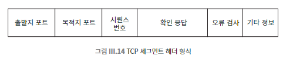

## 067 [통신] 데이터를 전송하는 핵심 프로토콜 TCP/IP

--- 

### 인터넷 프로토콜

프로토콜은 넓은 개념으로 양측이 상호작용하는 방식에 관한 규칙 정의를 의미한다. (도로 운전 방향, 악수 방식 등)
- IP (Internet Protocol)
  - 개별 패킷의 형식을 지정하고 전송 방법을 정의.
  - 게이트웨이는 IP 패킷을 라우팅하며, 네트워크 형식과 IP 형식 간 변환 수행.
- TCP (Transmission Control Protocol)
  - IP 패킷을 데이터 스트림으로 결합.
  - 안정적인 통신 제공, 패킷에 대해 사용자가 신경 쓸 필요 없음.
  - 대부분의 인터넷 서비스는 TCP를 기반으로 함.
- TCP/IP
  - IP와 TCP를 합쳐서 부르는 용어.
  - 인터넷의 기본 통신 프로토콜.

IP/TCP 프로토콜 위에는 '애플리케이션 레벨 프로토콜'이 있고, 주로 TCP를기반으로 구현된다. 
- 애플리케이션 레벨 프로토콜은 웹, 메일, 파일 전송 등의 서비스를 제공한다.

### UDP(User Datagram Protocol) : 사용자 데이터그램 프로토콜
몇 가지 제한된 기능만 제공함으로써 패킷을 효율적으로 전송할 용도로 쓰이는 프로토콜.
- TCP와 같은 레벨의 또 다른 프로토콜이다.
- 더 단순하고 효율적이다.
- 양방향 스트림이 필요하지 않은 데이터 교환에 쓰인다.
  - ex) DNS, 비디오 스트리밍, VoIP, 일부 온라인 게임.

### IP : 인터넷 프로토콜

- 특징
  - 비연결형 (Connectionless): 각 IP 패킷은 독립적이며, 다른 패킷과 관계가 없음.
  - 신뢰성 없는 (Unreliable): 패킷 전송을 보장하지 않는 '최선형' 프로토콜.
    - 패킷 분실, 손상, 순서 뒤바뀜, 중복 전송 가능성 존재할 수 있으며 이를 해결해주지는 않는다.
    - 실제로는 위와 같은 문제가 발생할 가능성이 낮다. 그러나 발생할 경우의 대비책이 존재하지 않는다.
- 패킷 구조
  - 최대 크기: 약 65KB.
  - 분할 전송: 긴 메시지는 작은 덩어리로 분할되어 전송, 수신 측에서 재조합한다.
  - IPv6: IPv4와 같으나 출발지와 목적지 주소가 각각 128비트이다.
- 타임 투 리브 (TTL)
  - 패킷의 생존 시간을 설정하는 1바이트 필드.
  - 각 게이트웨이를 지날 때마다 1씩 감소, 0이 되면 폐기.
  - 순환 상태 방지를 위한 메커니즘.
- 전송 속도 및 캐싱
  - IP는 데이터 전송 속도를 보장하지 않음.
  - 캐싱 사용: 네임 서버, 웹 브라우저, 주요 인터넷 서버에서 응답 속도 향상을 위해 사용.
  - 콘텐츠 배포 서비스: 아카마이 등은 수신자에 가까운 위치에 콘텐츠를 캐싱하여 제공.

### TCP : 전송 제어 프로토콜

- 기능: 신뢰성 있는 양방향 데이터 스트림 제공.
  - 데이터를 한쪽 끝에서 반대쪽 끝으로 전송, 전송 지연이 적고 오류 발생 확률이 낮음.
- 작동 방식:
  - TCP 연결은 특정 컴퓨터의 특정 포트와 연결됨.
  - 세그먼트: 바이트 스트림을 여러 조각으로 나누어 TCP 세그먼트에 담음.
    - 실제 데이터뿐만 아니라 제어 정보를 포함하는 헤더도 들어있다.
  - 시퀀스 번호: 각 세그먼트에 포함되어 수신자가 스트림의 어느 부분인지 식별 가능.
  - 오류 검출: 분실이 일어난 경우 어떤 세그먼트인지 알아내서 재전송한다.
    - 세그먼트에는 오류 검출 정보가 포함되어 있어, 손상된 세그먼트도 찾아낼 수 있다.
  - 각 TCP 세그먼트는 IP 패킷에 실려서 전송되며, 헤더 정보는 데이터와 함께 IP 패킷 내부에 실려서 전송됨
  - 수신자는 각 세그먼트에 대해 긍정(ACK) 또는 부정(NACK) 응답을 보냄.
    - 적절한 시간 간격 후에 긍정 응답을 받지 못하면 해당 세그먼트가 분실됐다고 추정하고 다시 보낸다.
    - 이와 비슷하게 여러분이 특정 세그먼트를 기다리고 있는데 일정 시간 이 지나도 받지 못했다면 부정 응답을 보낸다.
- 효율성
  - 발신자는 이전 패킷에 대한 응답을 기다리지 않고 전송 가능.
  - 수신자는 여러 패킷에 대해 단일 확인 응답을 보낼 수 있음.
  - 트래픽 정체 시 속도를 조절하여 복구 시도.
