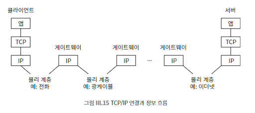

## 068 [통신] 최상위 프로토콜 : 메일 전송과 파일 공유

---

인터넷 서비스와 애플리케이션은 TCP를 전송 메커니즘으로 사용하지만, 기능별로 특정한 자신만의 프로토콜을 갖는다.

### HTTP : 하이퍼텍스트 전송 프로토콜
- 웹 브라우저와 서버 간의 통신에 사용되는 간단한 프로토콜.
- 브라우저가 서버의 80번 포트에 대해 TCP/IP 연결을 열고 페이지를 요청.
  - '브라우저'는 상단 그림에서 '클라이언트 애플리케이션'에 해당한다.
- 동작 방식
  1. 사용자가 링크를 클릭
  2. 브라우저는 서버(가령 amazon.com)의 80번 포트에 대해 TCP/IP 연결을 연다.
  3. 브라우저가 서버에 특정 페이지를 요청하는 짧은 메시지를 보낸다.
  4. 메시지는 프로토콜 체인을 따라 내려가서 최종적으로 반대쪽 끝에서 상응하는 서버 애플리케이션까지 올라간다.
  5. 아마존의 서버는 페이지를 준비하고, 약간의 추가 데이터(페이지 인코딩 방식에 대한 정보 등)와 함께 사용자에게 보낸다.
  6. 브라우저는 응답을 읽고 그 정보를 이용하여 페이지 내용을 표시한다.

### 텔넷과 SSH : 원격 로그인
- 텔넷 : 원격 컴퓨터에 로그인하여 세션을 설정하는 TCP 서비스.
  - 기본적으로 23번 포트를 사용.
  - 작동 방식
    - 클라이언트의 키 입력을 서버에 전달하고, 서버의 출력을 클라이언트로 반환.
    - 명령줄을 통해 원격 컴퓨터에 직접 연결된 것처럼 사용 가능.
  - 보안: 보안 기능이 없어 비밀번호를 포함한 데이터를 암호화하지 않음.
    - 일반적으로 텔넷 접속은 보안상의 이유로 막는 것이 권장되며, 텔넷의 기본 포트인 23번 포트를 차단하는 경우가 많다.
  - 사용 예시: HTTP 요청을 통해 웹 페이지의 원시 데이터를 확인할 수 있음.
  - 제한: 보안이 중요한 상황에서는 거의 사용되지 않음.
- SSH : 텔넷에서 파생된 보안 프로토콜로, 양방향 트래픽을 암호화하여 안전한 정보 교환 가능.
  - 22번 포트를 사용.
  - 텔넷의 보안 문제를 해결하여 널리 사용됨.

### 메일 전송 프로토콜
- SMTP : 단순 메일 전송 프로토콜
  - 인터넷상에서 메일을 교환하는 프로토콜.
  - 수신자의 메일 서버의 25번 포트로 TCP/IP 연결을 설정.
  - 작동 방식
    - 발신자와 수신자를 식별하고 메시지를 전송.
    - 텍스트 기반 프로토콜로, 메일 메시지가 아스키코드 텍스트일 것을 요구.
  - SMTP 프로토콜 자체로 메일 내용 사본을 만들 수 있음.
    - 메일 시스템은 메일 내용과 헤더 정보를 계속 파악하기 때문.
    - 메일 내용을 비공개로 유지하려면 출발지에서 암호화해야 한다.
      - 그러나 내용을 암호화 한다고 해도 발신자와 수신자의 정체가 숨겨지지는 않는다.
- MIME (다목적 인터넷 메일 확장)
  - SMTP의 제한을 보완하기 위해 개발된 표준.
  - 사진, 비디오 등 첨부 파일을 메일에 포함하는 메커니즘 제공.
  - HTTP에서도 사용됨.
- IMAP (인터넷 메시지 접근 프로토콜):
  - 메일을 서버에 남겨두어 여러 곳에서 접근 가능. (지메일, 네이버메일 등)
  - 메일을 동시에 여러 명이 읽거나 업데이트해도 일관성 유지.
  - 메시지 사본을 여러 개 만들거나 컴퓨터 간에 복사해서 옮길 필요가 없다.

### 파일 공유와 P2P 프로토콜
- P2P (Peer-to-Peer) 모델
    - 중앙 서버 없이 사용자 간 직접 파일 전송.
    - 파일은 사용자 컴퓨터에만 저장, 중앙 서버에는 저장되지 않음.
- 냅스터 (Napster)
  - 개발자: 숀 패닝(Shawn Fanning), 1999년 개발.
  - 기능: MP3 포맷 음악 파일을 쉽게 공유하는 P2P 파일 공유 플랫폼.
  - 작동 방식:
    - 중앙 디렉터리에서 파일 목록 관리, 사용자는 직접 파일을 주고받음.
    - TCP/IP 프로토콜 사용.
- 비트토렌트 (BitTorrent)
  - 개발자: 브램 코언(Bram Cohen), 2001년 개발.
  - 기능: 대용량 파일을 효율적으로 공유하는 P2P 프로토콜.
  - 작동 방식:
    - 파일 조각을 여러 사용자에게 분산하여 다운로드.
    - 트래커를 통해 파일 조각의 전송 상태 관리.
- P2P의 다른 용도
  - 비트코인(Bitcoin) 같은 디지털 통화 및 결제 시스템에서도 사용.