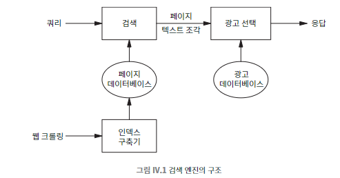

## 083 [데이터] 검색 엔진과 타겟 광고

---

### 웹 검색의 발전
- 1995년 시작, 급격한 성장
- 1997년 말 알타비스타: 하루 2천만 쿼리 처리
- 2000년 예측: 10억 이상의 웹페이지, 하루 수억 쿼리
- 2017년 추정: 하루 50억 쿼리

1998년에 설립하고, 2004년에 상장한 '구글'은 검색 산업 시장에서 2020년 시가총액 1조 달러로 평가 받을 정도로 검색 시장은 가파르게 성장했다.

### 검색 엔진

웹페이지 폼에 쿼리 입력 -> 서버에 요청 -> 쿼리 단어들을 포함하는 페이지 목록을 생성 -> 관련도 순 정렬 -> 페이지 텍스트 조각을 HTML로 감싼 후 응답

하지만 사용자 쿼리마다 웹 전체를 새로 검색하기에 웹은 너무 크다. 그래서 다양한 방법으로 최적화를 한다.
- 웹 크롤링: 페이지 정보 수집 및 저장
  - 크롤링 알고리즘: 페이지 선택, 정보 추출
- 인덱싱: 수집된 정보 구조화
  - 인덱스 구축: URL 추출, 중복 제거, 콘텐츠별 처리
- 쿼리 처리: 사용자 검색어에 대한 결과 제공
  - 쿼리 응답: 관련 URL 선택, 순위 결정

### 검색 엔진의 수익 모델
- 광고 수익
  - 광고 가격 결정 요소: 페이지뷰, 클릭, 전환
  - 실시간 키워드 경매 시스템

광고 내용에 관심이 있는 사용자에게 노출되는 기회는 분명히 가치가 있으므로 검색 데이터에 기반한 타겟 광고는 효과적이다.