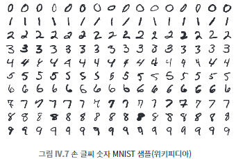
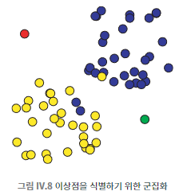

## 091 [데이터] 머신러닝의 학습 알고리즘

---

### 머신러닝의 기본 개념
- 핵심 아이디어
  - 명시적 프로그래밍 없이 알고리즘이 예제를 통해 학습
  - 대량의 데이터로 훈련하여 패턴 인식 및 예측
- 훈련 과정
  - 훈련 집합(레이블이 붙은 데이터) 사용
  - 알고리즘이 데이터의 특징을 학습하여 최적의 결과 도출

### 지도 학습

- 특징
  - 레이블이 붙은 데이터로 학습
  - 분류나 예측 작업 수행
- 예시
  - 스팸 메일 필터링
  - 손글씨 숫자 인식 (MNIST 데이터베이스)
- 한계
  - 오버피팅 문제
  - 편향 강화 가능성

### 비지도 학습

- 특징
  - 레이블 없는 데이터로 학습
  - 데이터의 패턴이나 구조 발견
- 예시
  - k-평균 군집화 알고리즘
  - 이상치 탐지
- 장단점
  - 장점: 레이블 데이터 불필요 (비용 절감)
  - 단점: 적용 범위 제한, 결과 해석의 어려움

### 머신러닝의 응용 분야
- 텍스트 분류 (스팸 탐지)
- 이미지 인식 (손글씨 인식)
- 예측 모델 (주택 가격 예측)
- 저자 식별
- 신용카드 사기 탐지

### 머신러닝의 도전 과제
- 적절한 특징 선택의 중요성
- 충분한 훈련 데이터 확보
- 알고리즘의 결정 과정 해석 어려움
- 윤리적 문제 (형사 사법 제도, 신용 평가 등에 적용 시)