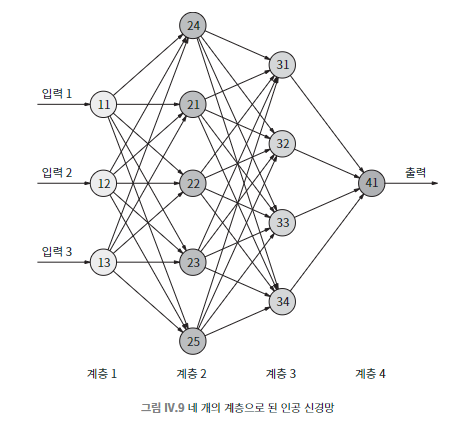

## 092 [데이터] 인간 뇌를 모방한 신경망과 딥 러닝

---

인공 신경망은 인간 뇌의 작동 방식을 모방하여 지능적인 과제를 수행하려는 시도입니다. 이 접근 방식은 인공지능 분야에서 오랫동안 추구되어 왔다.

### 신경망의 기본 구조

- 뉴런 간 연결을 단순화하여 모델링
- 입력 자극에 반응하는 인공 뉴런으로 구성
- 각 뉴런은 입력을 조합하는 규칙을 가짐
- 뉴런 간 연결(간선)에는 가중치가 적용됨

### 딥 러닝의 특징
- 여러 계층의 뉴런으로 구성 (2~3개에서 수십 개까지)
- 저수준에서 고수준으로 특징을 식별
- 순방향과 역방향으로 정보가 흐름
- 반복적인 학습을 통해 가중치를 조정하고 성능 개선
- 특징을 자동으로 찾아내는 능력이 있음

### 장단점
- 장점
  - 미리 정의된 특징 집합 없이도 학습 가능
  - 복잡한 패턴 인식에 뛰어난 성능
- 단점
  - 결과에 대한 구체적인 설명이나 근거 제공 어려움

### 응용 분야
- 컴퓨터 비전
  - 영상에서 물체 식별, 얼굴 인식 등
  - 자율주행 자동차 기술의 핵심
- 게임 AI
  - 알파고, 알파제로 등 체스와 바둑에서 인간을 능가하는 성능
- 강화 학습
  - 외부 환경의 피드백을 통해 지속적으로 성능 개선