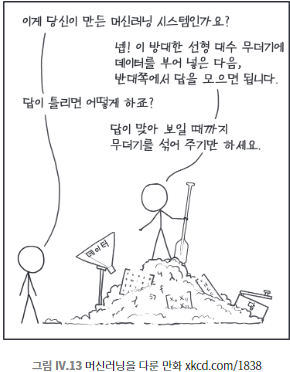

## 094 [데이터] 089~093 요약

---

- 머신러닝은 만병통치약이 아니며, 머신러닝이 얼마나 잘 작동하는지 알기 위해 풀어야 할 문제가 많이 있다.
- 특히 머신러닝이 내놓는 결과를 어떻게 설명할지에 대한 의문은 해결되지 않았다.

### 인공지능과 머신러닝의 윤리적 과제
- 데이터 편향성
  - 학습 데이터에 내재된 편향성이 결과에 반영됨
  - ex) 아마존의 채용 평가 도구가 여성 지원자에게 불리하게 작용
- 부수적 요소로 인한 오류
  - 본질과 무관한 요소로 잘못된 학습 가능성
  - ex) 탱크 인식 알고리즘이 날씨를 인식한 도시 전설
- 감시 기술의 윤리적 사용
  - 얼굴 인식 기술의 남용 우려
  - ex) 스마트 도어벨 시스템의 인종 차별 가능성
- 안전 필수 시스템에서의 사용
  - 자율주행 자동차, 군사 시스템 등에서의 신뢰성 문제
- 형사 사법 제도에서의 활용
  - 재범 가능성 예측 모델의 편향성 문제

### 주요 쟁점
- 기술의 한계 인식 : AI/ML 시스템은 입력 데이터의 한계를 넘을 수 없음
- 책임 소재 : 자동화된 의사결정의 책임 문제
- 프라이버시 : 얼굴 인식 기술 등으로 인한 개인정보 침해 우려
- 공정성 : 인종, 성별 등에 따른 차별 가능성
- 투명성과 설명 가능성 : AI 시스템의 결정 과정에 대한 이해와 설명 필요성

### 향후 과제
- 편향성 제거를 위한 데이터 처리 방법 개발
- AI 시스템의 윤리적 사용을 위한 가이드라인 수립
- AI 기술의 지속적인 모니터링과 평가 시스템 구축
- 윤리적 AI 개발을 위한 다학제적 접근 필요