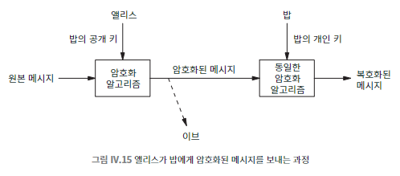

## 097 [데이터] 공개 키 암호 기법과 닫힌 자물쇠

---

### 공개 키 암호 기법

각 사용자가 공개 키와 개인 키로 구성된 키 쌍을 가지고 암호화와 복호화를 각각 다른 키로 하는 방법
- 원리
  - 공개 키: 누구나 접근 가능 (웹페이지 등에 공개)
  - 개인 키: 소유자만 알고 있는 비밀 키
  - 한 키로 암호화된 메시지는 다른 키로만 해독 가능
- 장점
  - 키 분배 문제 해결: 사전 협의 없이 비공개 대화 가능
  - 당사자 간 직접 만남 불필요
- 한계
  - 개인 키 유출 시 보안 위협
  - 키 취소의 어려움
  - 대응책 : 순방향 비밀성 기법
    - 일회용 비밀번호 사용으로 과거 메시지 보호

### HTTPS
공개 키 암호화와 대칭 키 암호화의 조합 사용하여 웹 브라우저와 웹사이트 간의 암호화된 통신을 제공하는 방법 (HTTP의 보안 강화 버전)
- 작동 원리
  - 공개 키 암호화와 대칭 키 암호화의 조합 사용
  - 초기 연결 시 공개 키 암호화로 임시 대칭 키 교환
  - 이후 통신은 빠른 대칭 키 암호화(예: AES)로 진행
- 장점
  - 데이터 기밀성 보장: 중간자 공격 방지
  - 데이터 무결성 유지: 전송 중 데이터 변조 방지
  - 웹사이트 인증: 사용자가 접속한 사이트의 신뢰성 확인

### RSA 알고리즘
공개 키 암호화 알고리즘 중 가장 자주 쓰이는 알고리즘으로 매우 큰 합성수의 인수분해가 어렵다는 점을 이용하는 방식이다.
- 큰 정수(최소 500자릿수)를 생성하는데 이 수는 큰 소수" 두 개의 곱이고, 각 소수의 자릿수는 큰 정수의 절반 정도로 되어 있다.
  - RSA는 이 값들을 공개 키와 개인 키의 기준으로 사용한다.

### 공개 키 알고리즘의 응용
- 디지털 서명
  - 속도 문제로 간접 서명 방식 사용
  - 메시지 다이제스트(암호 해시) 활용
- 암호 해시 알고리즘
  - MD5, SHA-1 (현재 사용 중지)
  - SHA-2, SHA-3 (현재 사용 중)
  - 224~512비트 다이제스트 크기 제공

### 신뢰성 확보 방안
- 인증서 (Certificate) 사용
- 인증 기관 (Certificate Authority) 필요
- 브라우저에 다수의 인증 기관 정보 내장

HTTPS의 방식이다.