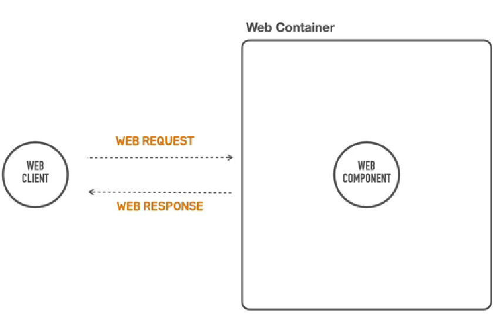
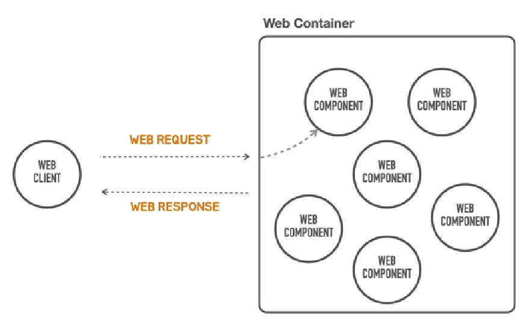
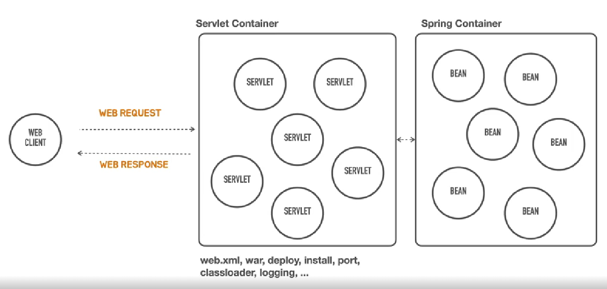

## [섹션 I] 03_컨테이너리스 웹 애플리케이션 아키텍처

---

### 컨테이너리스(Containerless)
컨테이너 관리를 하지 않아도 되며 컨테이너를 신경쓰지 않아도 된다는 뜻
- 컨테이너가 필요 없다는 의미는 아니다. ('서버리스'와 비슷하다)
- 컨테이너는 '스프링 컨테이너' 즉 'IoC 컨테이너'를 의미한다.

### 웹 컨테이너 이해하기

1. 서버를 만든다는 것은 서버에서 동작하면서 기능을 제공하는 여러가지 '컴포넌트'를 만든다는 뜻이다.
    - 컴포넌트 : 서버 측에서 동작하는 재사용 가능한 소프트웨어 단위 (리액트의 컴포넌트와 같은 개념이다. Java에선 컴포넌트 대신 '서블릿'이라는 용어를 사용한다.)
2. 이러한 컴포넌트를 '웹 컴포넌트'라고 부른다.
3. 웹 컴포넌트는 스스로 일하지 않고 웹 클라이언트로부터 요청을 받아서 이를 처리하고 응답하는 역할을 수행한다.
4. 이때 웹 컴포넌트의 일은 다이나믹 콘텐츠를 만드는 것이다.
    - 다이나믹하게 바뀌는 콘텐츠가 아닌 고정된 페이지를 띄우는 일에는 웹 컴포넌트를 만들 필요 없이 그냥 같은 리소스를 응답하기만 하면 된다.
5. 이러한 웹 컴포넌트를 관리하는 주체가 '웹 컨테이너'이다.

### 웹 컨테이너의 역할

1. 하나가 아닌 여러 개의 웹 컴포넌트를 관리한다.
    - 로그인, 조회, 주문 작성 등 각각의 컴포넌트가 관리하는 서비스가 존재한다.
2. 클라이언트로부터 들어온 요청을 어느 컴포넌트가 담당해야 할지 전달한다. (라우팅, 맵핑)
3. 이러한 컴포넌트를 Java에서는 '서블릿'이라고 한다. 그렇기에 웹 컨테이너는 '서블릿 컨테이너'라고 표현할 수 있다.
    - 대표적인 서블릿 컨테이너에는 '톰켓'이 있다.

### 주의할 점.
앞서 설명한 웹 컨테이너와 컴포넌트, 서블릿 등의 개념은 'JSP/서블릿' 기반의 웹 애플리케이션을 기준으로 설명한 것이다.
- 즉, 프론트엔드와 백엔드가 나뉘고 RestAPI 등을 통해 통신하는 개념을 기준으로 하는 설명이 아니다.
- 하지만 웹 애플리케이션의 동작 원리 및 핵심 개념은 유사하다. Rest API는 컴포넌트가 아닌 컨트롤러에 라우팅 된다.
    - Rest API에서는 주로 어노테이션 기반 매핑(@RequestMapping, @GetMapping 등)을 사용하며, 톰캣은 이러한 매핑 정보를 해석하여 요청을 적절한 컨트롤러 메소드로 전달한다.

### 스프링 컨테이너

1. 서블릿 컨테이너 뒤 쪽에서 동작한다.
2. 웹으로 받은 요청을 서블릿 컨테이너를 통해 받아서 자신이 관리하는 빈에게 요청을 할당한다.
3. 왜 스프링 컨테이너가 서블릿 컨테이너의 역할까지 수행하지 않는 것일까?
   - 자바의 표준 웹 기술을 사용하기 위해서는 반드시 '서블릿 컨테이너'가 필요하다.
     - 그리고 스프링에서 '서블릿 컨테이너'를 설정하는 일은 꽤나 까다롭다. (XML 작성, WAR 패키징, 배포 등)
       - 또한 서블릿 컨테이너는 스프링과 독립적인 프로그램이다. 즉, Tomcat을 직접 설치해서 런타임 환경을 구성해야 한다.

### 정리
- 서블릿 컨테이너 : 웹 요청의 수신 및 응답 전송, 서블릿 생명주기 관리
    - HTTP 요청을 받아 처리하는 웹 서버의 역할을 수행한다.
    - 디스패처 서블릿(DispatcherServlet)을 포함한 모든 서블릿의 생명주기를 관리한다.
      - 스프링 MVC에서 재공하는 서블릿 컨테이너와 스프링 프레임워크 사이의 라우팅 매커니즘 
        - (네이티브와 자바스크립트 사이의 통신을 담당하는 RN의 브릿지와 아이디어가 비슷하다.)
    - 스프링 MVC에서는 디스패처 서블릿이 모든 요청을 받아 적절한 컨트롤러로 라우팅한다.
    - 톰캣이 대표적이다.
      - 자바에서는 서블릿 컨테이너가 어떻게 동작해야 하는지에 대한 표준으로 '서블릿 스펙(Servlet Specification)을' 정의한다.
        - 톰캣은 이러한 표준을 잘 따라서 구현되었다.
- 스프링 컨테이너 : 애플리케이션 로직(컨트롤러, 서비스, 레포지토리 등)의 관리 및 의존성 주입
    - 애플리케이션의 객체(빈)들을 생성하고 관리한다.
    - 컨트롤러, 서비스, 레포지토리 등 모든 스프링 빈을 관리한다.
    - 의존성 주입(DI)을 통해 객체 간의 관계를 관리한다.
    - ApplicationContext가 대표적이다.

위에서 설명한 웹 서블릿 컨테이너에 대한 설정을 스프링부트는 대신 해준다. 대표적으로 스프링 부트는 '톰캣'을 내장했기에 개발자가 직접 설치하고 실행하는 수고를 덜어준다.