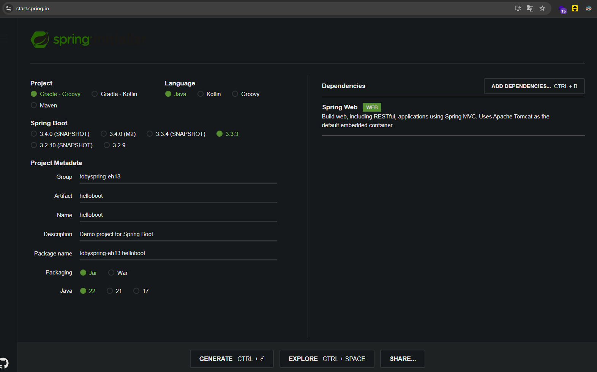
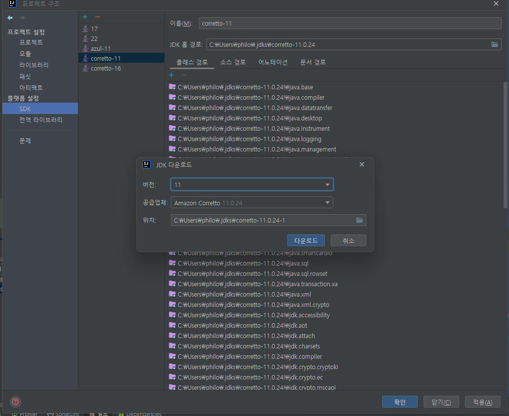
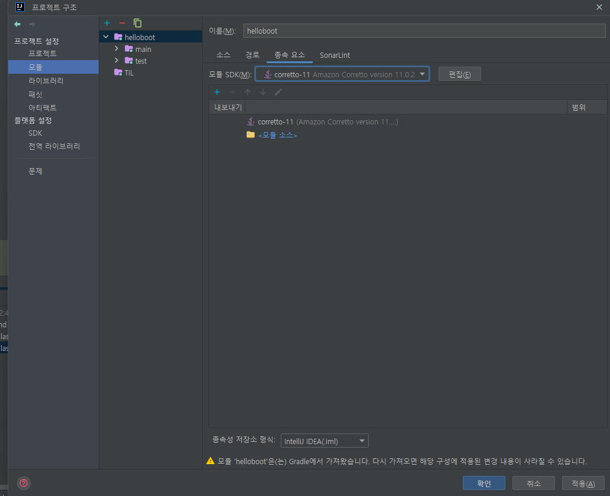
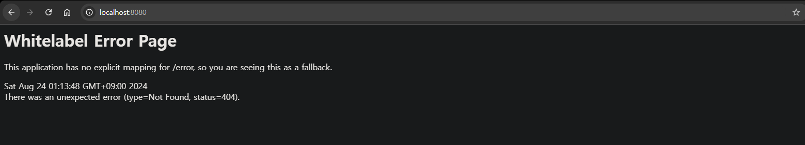

## [섹션 II] 07_프로젝트 생성

---

Hello Boot 웹 프로젝트 작성

### 스프링 부트 프로젝트 생성
- [Spring Initializr](https://start.spring.io/)
- IDE의 Spring Initializr 프로젝트 생성 메뉴
- Spring Boot CLI

### 생성 옵션
- Project : Gradle
- Language : Java
- Spring Boot Version : 2.7.6
- Group id : tobyspring (tobyspring-eh13으로 진행함)
- Name : hello
- Packaging : jar
- Java Version : 11

### [Spring Initializr](https://start.spring.io/)를 사용한 프로젝트 생성

- Spring Initializr의 경우 이전 버전을 광범위하게 지원하지 않는 것으로 보인다. (24.08.24 기준 제일 오래된 버전이 3.2.9이다.)
- 프로젝트를 제너레이트 한 후 변경이 가능하기 때문에 우선 아래 나열한 조건만 맞추어 제너레이트 한다.
  - Project : Gradle - Groovy 선택
  - Project Metadata 입력
  - Packaging : jar 선택
  - Dependencies : Spring Web 추가

### Spring Boot & Java 버전 변경하기
[build.gradle](../../../practice/섹션_2_스프링_부트_시작하기/helloboot/build.gradle) 파일에서 프로젝트 설정 정보를 확인할 수 있다.

```gradle
plugins {
	id 'java'
	id 'org.springframework.boot' version '2.7.6'
	id 'io.spring.dependency-management' version '1.0.15.RELEASE'
}

group = 'tobyspring-eh13'
version = '0.0.1-SNAPSHOT'

java {
	toolchain {
		languageVersion = JavaLanguageVersion.of(11)
	}
}

repositories {
	mavenCentral()
}

dependencies {
	implementation 'org.springframework.boot:spring-boot-starter-web'
	testImplementation 'org.springframework.boot:spring-boot-starter-test'
	testRuntimeOnly 'org.junit.platform:junit-platform-launcher'
}

tasks.named('test') {
	useJUnitPlatform()
}
```
- 'plugins'의 `id 'org.springframework.boot' version`을 **'2.7.6'** 으로 변경한다.
- 'plugins'의 `id 'io.spring.dependency-management' version`을 **'1.0.15.RELEASE'** 으로 변경한다.
- 'java' -> 'toolchain'의 `languageVersion = JavaLanguageVersion.of()`의 파라미터를 **'11'** 로 변경한다.

#### 'javaCompiler' 관련 에러가 발생하는 경우
```
Could not resolve all dependencies for configuration ':compileClasspath'.
Failed to calculate the value of task ':compileJava' property 'javaCompiler'.
Cannot find a Java installation on your machine matching this tasks requirements: {languageVersion=11, vendor=any, implementation=vendor-specific} for WINDOWS on x86_64.
No locally installed toolchains match and toolchain download repositories have not been configured.
```
해당 오류 메시지는 Gradle이 Java 11 설치를 찾지 못해 프로젝트를 빌드할 수 없다는 것을 의미한다. 해결법은 아래와 같다.
1. '파일' -> '프로젝트 구조' -> 'SDK' 에 진입 후 추가(+) 버튼을 클릭해서 JDK 11을 설치한다.
   - 
2. 프로잭트 설정에서 프로젝트를 선택 후 종속 요소에 SDK를 설정한다.
   - 

### 프로젝트 애플리케이션 실행
1. [HellobootApplication.java](../../../practice/섹션_2_스프링_부트_시작하기/helloboot/src/main/java/tobyspring_eh13/helloboot/HellobootApplication.java) 파일을 실행한다.
2. http://localhost:8080/ 페이지에 접근한다.
3. 'Whitelabel Error Page'를 확인한다.
   - 