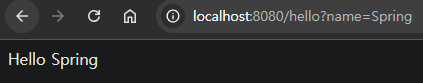

## [섹션 II] 08_Hello 컨트롤러

---

### hello 컨트롤러 생성
타겟 파일 : [HelloController.java](../../../practice/섹션_2_스프링_부트_시작하기/helloboot/src/main/java/tobyspring_eh13/helloboot/HelloController.java)

```java
package tobyspring_eh13.helloboot;

import org.springframework.web.bind.annotation.GetMapping;
import org.springframework.web.bind.annotation.RestController;

@RestController
public class HelloController {

	@GetMapping("/hello")
	public String hello(String name) {
		return "Hello " + name;
	}
}
```
- 간단한 hello 컨트롤러를 구현했다.
- `String name` 파라미터에 `@RequestParam`이 생략되었다. 생략 가능 조건은 아래와 같다.
  - 메소드 파라미터의 이름이 요청 파라미터의 이름과 일치할 때
  - 파라미터가 단순 타입(String, int, long 등)일 때
  - 파라미터가 필수가 아닐 때 (required=false와 동일)

### @RequestParam 생략 동작 원리
- Spring MVC는 핸들러 메소드의 파라미터를 분석하고, 적절한 값을 바인딩하는 과정을 자동으로 수행한다.
  - 프로젝트 생성시 추가한 'Spring Web' 라이브러리(디펜더시) 내부에 'Spring MVC'가 포함되어 있다.
- 메소드 파라미터의 이름이 요청 파라미터의 이름과 일치하면, Spring은 자동으로 값을 바인딩한다.
- 다만, 명시적으로 @RequestParam을 사용하면 코드의 의도가 더 명확해질 수 있다.

### API 확인
http://localhost:8080/hello?name=Spring 경로에서 확인 가능하다.

