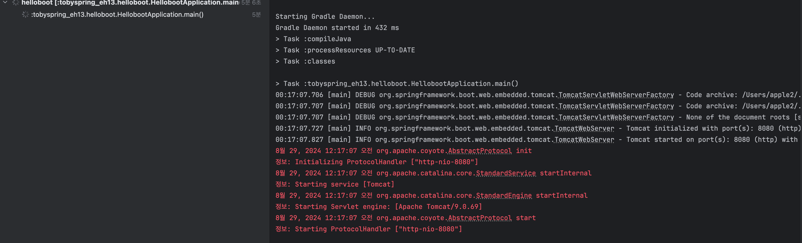
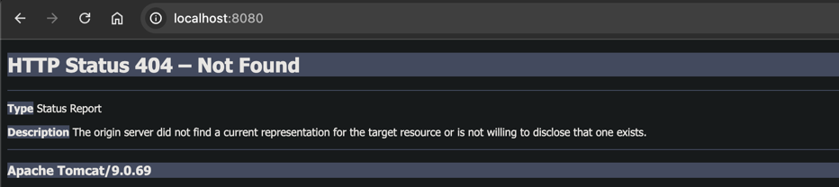

## [섹션 III] 12_서블릿 컨테이너 띄우기

---

현 시점의 관심사는 '서블릿 컨테이너를 직접 설치하지 않고 어떻게 동작하게 만들 것인가'이다.
- 서블릿 컨테이너를 설치하는 대신 '스탠드 얼론' 프로그램을 만들 것이다.
  - 스탠드 얼론'(Stand-alone) : 프로그램은 다른 시스템이나 프로그램의 도움 없이 독립적으로 실행될 수 있는 소프트웨어
- 해당 '스탠드 얼론' 프로그램 서블릿 컨테이너를 알아서 대신 띄워주는 역할을 수행해야 한다.

서블릿 컨테이너 안에는 여러 가지 서블릿이 들어 있지만 현재는 하나의 서블릿을 만드는 것에 집중하려고 한다.

### 빈 서블릿 컨테이너를 띄워보기
서블릿(Serviet)은 자바의 표준 기술이며, 해당 서블릿을 구현한 컨테이너 제품들이 많이 있다.
- 대표적인 것이 '톰캣(Tomcat)'이다.
  - 톰캣은 자바로 만들어진 프로그램이다. 즉, 특정한 자바 클래스와 메서드를 통해 톰캣을 실행할 수 있다.

#### 자바 애플리케이션 메인 메소드에서 톰캣 시작하기
- 인베디드 톰캣 : 톰캣 프로그램을 설치하지 않고 사용 가능한 Java 라이브러리로 제공하는 내장형 톰캣
  - 스프링부트 스타터에 임베디드 톰캣이 포함되어 있다.

인베디드 톰캣을 사용해서 애플리케이션에서 바로 톰캣을 실행시켜보자.
```java
import org.apache.catalina.startup.Tomcat;

public class HellobootApplication {
    public static void main(String[] args) {
        Tomcat tomcat = new Tomcat();
    }
}
```
- Tomcat 클래스를 바로 사용 가능하다는 것을 확인했다.

그러나 톰캣을 실행하기 위해서는 생각보다 복잡한 설정을 해야 한다. 때문에 Spring Boot 개발팀이 만든 톰캣 팩토리 클래스를 사용할 것이다.
```java
import org.springframework.boot.web.embedded.tomcat.TomcatServletWebServerFactory;
import org.springframework.boot.web.server.WebServer;
import org.springframework.boot.web.servlet.server.ServletWebServerFactory;

public class HellobootApplication {
    public static void main(String[] args) {
        ServletWebServerFactory serverFactory = new TomcatServletWebServerFactory();
        WebServer webServer = serverFactory.getWebServer();
        webServer.start();
    }
}

```
- TomcatServletWebServerFactory : 톰캣 서블릿 컨테이너를 만들기 위한 팩토리 클래스
- ServletWebServerFactory : 서블릿 컨테이너 팩토리 인터페이스, 다른 서블릿 컨테이너를 사용할 수 있기에 추상화한 것이다.
- getWebServer() : ServletWebServerFactory 에서 정의하는 웹 서버 생성 메서드.
- WebServer : 웹 서버 인터페이스
- start() : WebServer 에서 정의하는 웹 서버 실행 메서드

#### 애플리케이션 실행

- 애플리케이션 터미널에서 톰캣 관련 로그를 확인할 수 있다.


- localhost:8080에 접근해서 톰켓 서버를 확인할 수 있다.