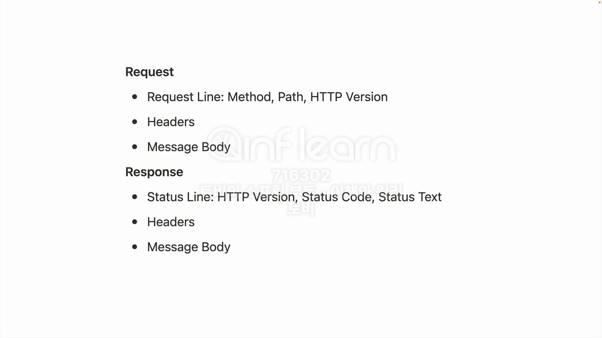
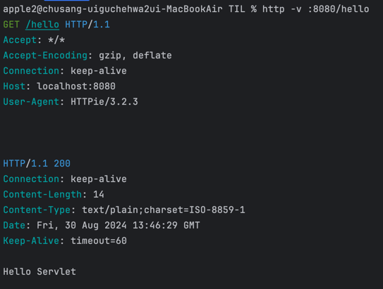

## [섹션 III] 13_서블릿_등록

---

사실 웹 서블릿 컨테이너를 띄우기 위해 어떠한 팩토리 클래스를 사용해야 하는지에 대한 내용은 굳이 기억할 필요가 없다. 사용할 때마다 다시 찾아보는게 더 효율적이다.

그러나 웹 기술을 이용한 개발을 할 때 절대 잊어서는 안되는 것이 있다.


> 웹 표준 프로토콜을 이용해서 요청이 어떻게 들어가고, 응답을 어떻게 받는지 그게 어떤 내용으로 구성이 되어 있는지 고려해야 한다.
> - 요청을 어떻게 들어오는지 (요청 맵핑을 어떻게 하는지)
> - 요청에 대한 응답을 어떻게 처리하는 (응답을 어떻게 만들어내는지)

그러니 서블릿이 자체에 대해 깊이 이해하기 보다는 '서블릿 코드에서 요청과 응답을 처리하는 부분'에 집중하는 것이 좋다.
- 결국 서블릿은 '웹 요청을 받아서 응답을 처리하는 기술'이다. HTTP, JSP, Json 등 어떠한 것을 응답하던지 상관 없이 추상적인 개념으로서 이해해야 한다.

### 서블릿 컨테이너에 서블릿 추가하기
[12_서블릿_컨테이너_띄우기](../12_서블릿_컨테이너_띄우기/README.md)에서 Tomcat 서버(서블릿 컨테이너)를 띄웠다. 이제는 여기에 서블릿을 추가해야 한다.

```java
public class HellobootApplication {
    public static void main(String[] args) {
        ServletWebServerFactory serverFactory = new TomcatServletWebServerFactory();
        WebServer webServer = serverFactory.getWebServer(servletContext -> {
            servletContext.addServlet("hello", new HttpServlet() {
                @Override
                protected void service(HttpServletRequest request, HttpServletResponse response) throws IOException {
                    response.setStatus(200);
                    response.setHeader("Content-Type", "text/plain");
                    response.getWriter().println("Hello Servlet");
                }
            }).addMapping("/hello");
        });
        webServer.start();
    }
}
```
- `ServletWebServerFactory`의 `getWebServer()`는 `ServletContextInitializer` 인터페이스를 파라미터로 받는다.
  - `ServletContextInitializer` : 간단하게 말하자면 서블릿, 필터, 리스너 등을 프로그래밍 방식으로 초기화(등록)하는 인터페이스이다.
- 예시 코드에서는 `servletContext`라는 이름으로 `servletContext` 인터페이스를 구현했다.
  - 그리고 `servletContext` 안에 'hello'라는 이름으로 서블릿을 추가했다.
    - 추가한 'hello' 서블릿은 "/hello" Url 엔드포인트로 맵핑했다.
    - 해당 서블릿은 `HttpServlet` 객체이며, 해당 객체의 `service()` 메서드를 오버라이딩 했다.
      - 내부에서 응답 Status, 헤더, 본문을 재정의했다.
        - 사실 `HttpServlet`의 `service()` 메서드는 '디스패처 서블릿' 처럼 요청을 받아서 적절한 메서드로 분배하는 역할을 수행한다.
        - 예시코드에서는 중간 다리에서 바로 요청에 대한 응답을 하는 방식으로 구현을 단순화 시켰다.

### 람다와 익명클래스
```java

package org.springframework.boot.web.servlet;

import javax.servlet.ServletContext;
import javax.servlet.ServletException;

@FunctionalInterface
public interface ServletContextInitializer {
    void onStartup(ServletContext servletContext) throws ServletException;
}

```
1. `ServletWebServerFactory`의 `getWebServer()`메서드의 파라미터 `ServletContextInitializer`이다.
2. 내부에 단 하나의 메서드인 `onStartup()`만 존재하며 파라미터로 `ServletContext` 타입을 받는다.
3. `servletContext -> {}` 라인은 `ServletContextInitializer`의 `onStartup()` 메서드를 람다식으로 사용하는 것이다.
4. 그러나 인터페이스의 메서드를 직접 사용할 수 없기에 익명 클래스로 구현하여 사용하였다.
5. 또한 정확히 말하자면 `ServletWebServerFactory`의 `getWebServer()`메서드가 아닌 `TomcatServletWebServerFactory`의 `getWebServer()`메서드를 사용하고 있음을 인지해야 한다.
   - 즉, `TomcatServletWebServerFactory` 클래스에서 구현한 `getWebServer()`메서드를 사용한 것이다.
6. servletContext.addServlet()은 `ServletContextInitializer`의 `onStartup()` 메서드의 파라미터인 `ServletContext`의 메서드이다.

### 서블릿 테스트하기
