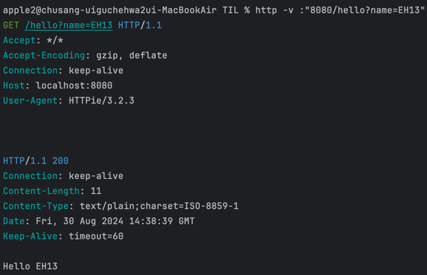

## [섹션 III] 14_서블릿 요청 처리

---

### 서블릿 요청 처리
```java
public class HellobootApplication {
    public static void main(String[] args) {
        ServletWebServerFactory serverFactory = new TomcatServletWebServerFactory();
        WebServer webServer = serverFactory.getWebServer(servletContext -> {
            servletContext.addServlet("hello", new HttpServlet() {
                @Override
                protected void service(HttpServletRequest request, HttpServletResponse response) throws IOException {
                    String name = request.getParameter("name");

                    response.setStatus(HttpStatus.OK.value());
                    response.setHeader(HttpHeaders.CONTENT_TYPE, MediaType.TEXT_PLAIN_VALUE);
                    response.getWriter().println(String.format("Hello %s", name));
                }
            }).addMapping("/hello");
        });
        webServer.start();
    }
}
```
- request.getParameter("name") : name 이라는 이름으로 파라미터를 받았다.
- 물론 요청 헤더, 쿠키, 바디 등의 요청에 관련된 것을 모두 캐치할 수 있다. [참고](https://docs.oracle.com/javaee/6/api/javax/servlet/http/HttpServletRequest.html)

### 서블릿 테스트
