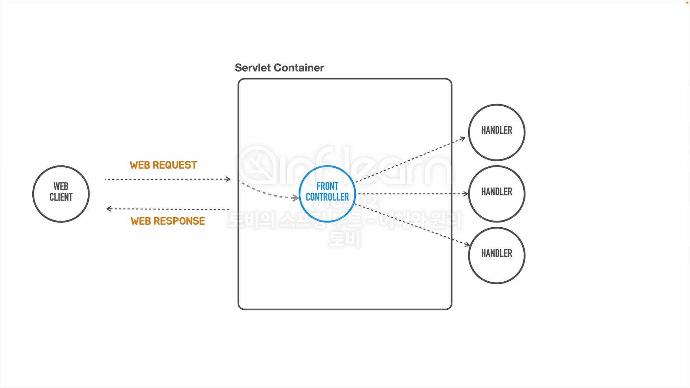

## [섹션 III] 15_프론트 컨트롤러

---

이전 시간에 hello 서블릿을 직접 서블릿 컨테이너에 추가해보았다. hello 서블릿은 '/hello' url 엔드포인트와 매핑된다.

이와 마찬가지로 '/user', 'content' 등 각각의 도메인과 매핑되는 서블릿을 만들어서 서블릿만 가지고 개발을 할 수 있다.

그러나 이러한 서블릿의 접근 방식을 개선할 필요가 있다.

### 공통적인 작업
보안, 로깅 등의 공통 작업은 각 서블릿 마다 중복해서 작성될 수 밖에 없었다. 요청이 100가지 정도 있다고 한다면 비슷한 코드가 100군데 있었던 것이다.

### FrontController 

- 모든 서블릿에 공통적으로 등장하는 작업을 처리하는 코드를 중앙화된 컨트롤러에서 모두 담당한 후 각 서블릿에 특화된 작업을 위임하는 방식
- 디스패처 서블릿이 대표적인 프론트 컨트롤러이다.