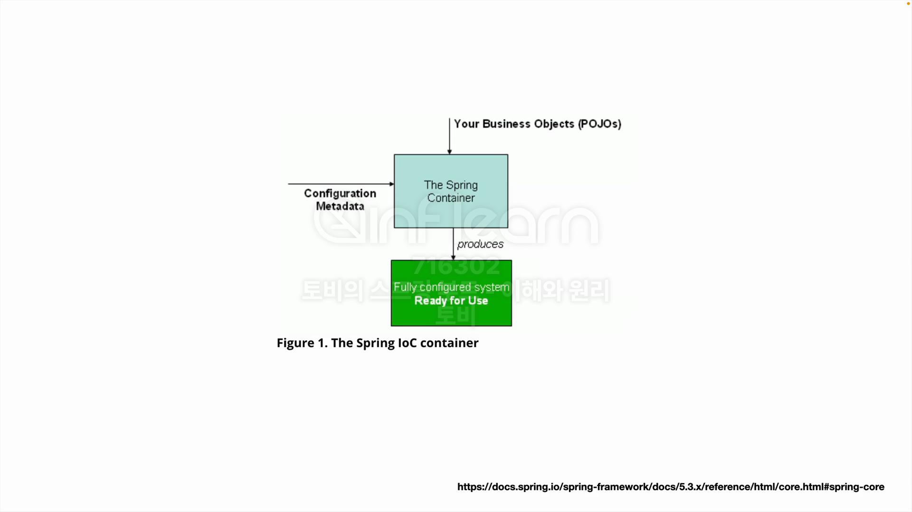

## [섹션 IV] 18_스프링 컨테이너 사용

---

### 지난 시간까지 했던 작업

- 서블릿 컨테이너 생성
- 프론트 컨트롤러 패턴 적용
- 서블릿 추가

### 이번에 해볼 작업

- 앞서 제작한 서블릿 컨테이너를 스프링 컨테이너 안으로 넣기

### 스프링 컨테이너의 동작

- 스프링 컨테이너에는 두 가지가 필요하다.
  1. POJO : 해당 그림에서는 비즈니스 오브젝트, 즉 우리가 작성하는 JAVA 코드라고 설명한다.
  2. Configuration Metadata : 스프링이 제공하는 설정 정보 (애플리케이션 구성 정보를 담고 있다.)
  - 스프링 컨테이너가 내부에서 우리가 만든 비즈니스 오브젝트 코드와 구성 메타데이터를 조합해서 내부에 빈을 생성하고 애플리케이션을 구성한다.

### 스프링 컨테이너 사용
프론트 컨트롤러의 'Hello' 서블릿에서 사용하는 `HelloController`의 인스턴스를 직접 선언하고 사용하는 것이 아닌 스프링 컨테이너에 Bean으로 등록해서 사용할 것이다.

1. HelloController 선언부 삭제
    ```java
    public class HellobootApplication {
        public static void main(String[] args) {
            ServletWebServerFactory serverFactory = new TomcatServletWebServerFactory();
            WebServer webServer = serverFactory.getWebServer(servletContext -> {
                servletContext.addServlet("frontController", new HttpServlet() {
                    @Override
                    protected void service(HttpServletRequest request, HttpServletResponse response) throws IOException {
                        //인증, 보안, 다국어 등 공통 기능
                        if(request.getRequestURI().equals("/hello") && request.getMethod().equals(HttpMethod.GET.name())){
                            String name = request.getParameter("name");
    
                            String returnHello = helloController.hello(name);
    
                            response.setContentType(MediaType.TEXT_PLAIN_VALUE);
                            response.getWriter().println(returnHello);
                        } else {
                            response.setStatus(HttpStatus.NOT_FOUND.value());
                        }
    
    
                    }
                }).addMapping("/*");
            });
            webServer.start();
        }
    }
    ```
   - 기존 HelloController를 호출하던 부분을 삭제했다. 
   - HelloController 가 없기 때문에 `String returnHello = helloController.hello(name);` 라인은 에러가 발생한다.
2. 스프링 컨테이너 생성
    ```java
    public class HellobootApplication {
        public static void main(String[] args) {
            GenericApplicationContext applicationContext = new GenericApplicationContext();
            applicationContext.registerBean(HelloController.class);
            applicationContext.refresh();
            
            //서블릿 컨테이너 관련 코드
        }
    }
    ```
   - ApplicationContext는 대표적인 스프링 컨테이너 구현체이다. (스프링 레퍼런스의 예시 코드에 자주 등장한다.)
   - `GenericApplicationContext` : ApplicationContext를 생성하는 가장 일반적인 클래스이다.
   - `registerBean(HelloController.class)` : HelloController를 스프링 컨테이너가 관리하도록 Bean으로 등록하였다.
   - `refresh()` : 애플리케이션 컨텍스트를 초기화하거나 갱신한다. 
     - 등록한 Bean을 실제로 생성하기 위해서 필수적이다.
3. 서블릿 내에서 HelloController의 Bean 사용
    ```java
    public class HellobootApplication {
        public static void main(String[] args) {
            GenericApplicationContext applicationContext = new GenericApplicationContext();
            applicationContext.registerBean(HelloController.class);
            applicationContext.refresh();
    
            ServletWebServerFactory serverFactory = new TomcatServletWebServerFactory();
            WebServer webServer = serverFactory.getWebServer(servletContext -> {
                servletContext.addServlet("frontController", new HttpServlet() {
                    @Override
                    protected void service(HttpServletRequest request, HttpServletResponse response) throws IOException {
                        //인증, 보안, 다국어 등 공통 기능
                        if(request.getRequestURI().equals("/hello") && request.getMethod().equals(HttpMethod.GET.name())){
                            String name = request.getParameter("name");
    
                            HelloController helloController = applicationContext.getBean(HelloController.class);
                            String returnHello = helloController.hello(name);
    
                            response.setContentType(MediaType.TEXT_PLAIN_VALUE);
                            response.getWriter().println(returnHello);
                        } else {
                            response.setStatus(HttpStatus.NOT_FOUND.value());
                        }
    
    
                    }
                }).addMapping("/*");
            });
            webServer.start();
        }
    }
    ```
   - `HelloController helloController = applicationContext.getBean(HelloController.class);`
     - applicationContext로 부터 HelloController의 Bean을 가져와서 사용한다.

이로 인해 프론트 컨트롤러는 외부에서 생성한 HelloController를 사용하게 된다. 
프론트 컨트롤러 입장에서는 HelloController가 어떻게 구현되어 있으며 어떻게 주입되는지 조차 신경 쓸 필요가 없다. 
스프링 컨테이너를 믿고 그냥 사용하기만 하면 된다.