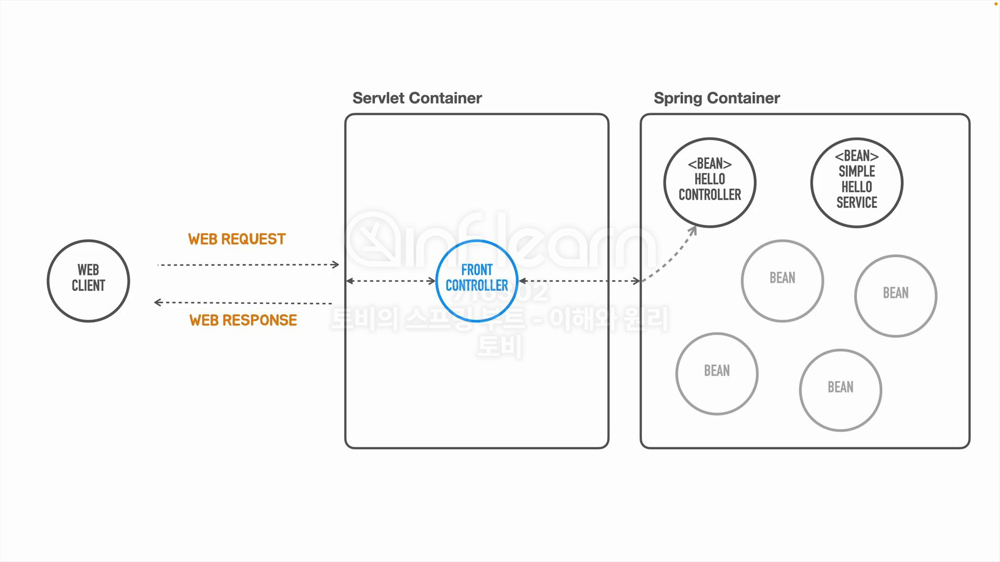

## [섹션 IV] 19_의존 오브젝트 추가

---

지난 시간에는 스프링 컨테이너를 사용해서 오브젝트를 Bean으로 등록하고, Bean을 요청해서 사용해보았다. 

이 경우 프론트 컨트롤러에서 new 를 통해 인스턴스를 직접 생성하는 것과 어떤 차이가 있는 것일까?

### 싱글턴 패턴
특정 클래스의 인스턴스를 하나만 생성하고 해당 인스턴스를 계속 사용하는 방식을 싱글턴 패턴이라고 한다.

스프링 컨테이너의 Bean은 싱글턴 패턴과 유사하게 동작하는데, 말 그대로 Bean은 클래스마다 단 하나만 생성되고, 요청 시 같은 Bean 객체를 전달하게 된다.

그래서 스프링 컨테이너를 '싱글턴 레지스트리'라고 부르기도 한다.

### 의존 오브젝트
헬로 컨트롤러 내에서 하나의 요청에 관련한 작업을 모두 다 처리하면 좋겠지만 그렇지 못할 수 있다.

역할에 따라서 오브젝트를 분리하고, 하나의 오브젝트가 어떤 기능이 필요한 경우 다른 오브젝트한테 기능 수행을 요청하는 방식으로 책임을 분리할 수 있다.


- `SimpleHelloService` 클래스를 생성해서 `HelloController` 와 역할을 분리한다.
  - `HelloController` : 클라이언트로부터 요청을 받아 요청을 검증하고, 비즈니스 로직을 제공하는 `SimpleHelloService`에 요청을 전달해서 응답 값을 받아오는 역할을 수행한다.
  - `SimpleHelloService` : `HelloController` 로 부터 전달 받은 요청에 대한 비즈니스 로직을 수행한다.
- 현재 `HelloController` 에서 `name`을 받아서 `"Hello" + name` 을 리턴하는 로직을 수행하고 있는데, 이 부분을 `SimpleHelloService`에게 위임할 수 있다.

### 의존 오브젝트 추가
```java
public class SimpleHelloService {
    String sayHello(String name) {
        return "Hello " + name;
    }
}
```

```java
public class HelloController {

	public String hello(String name) {
		SimpleHelloService simpleHelloService = new SimpleHelloService();

		return simpleHelloService.sayHello(Objects.requireNonNull(name));
	}
}
``` 
- `Objects.requireNonNull()` : 오브젝트를 파라미터로 받아서 해당 오브젝트가 null 인지 체크하는 자바 메서드