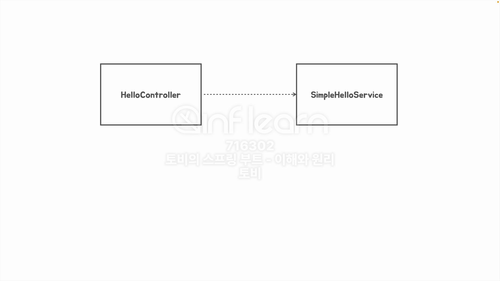
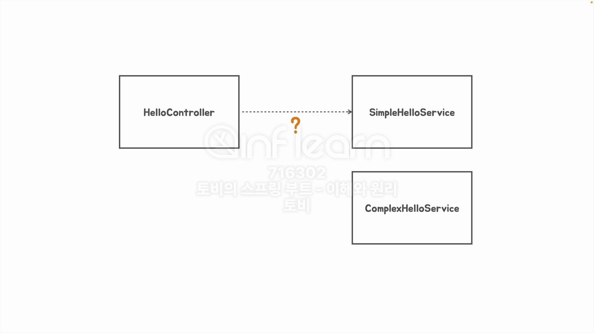
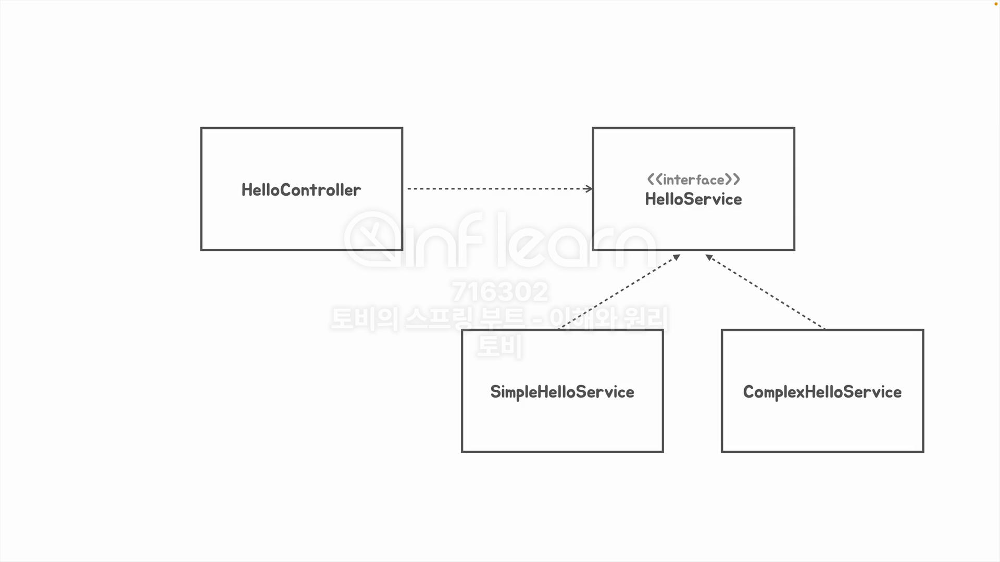
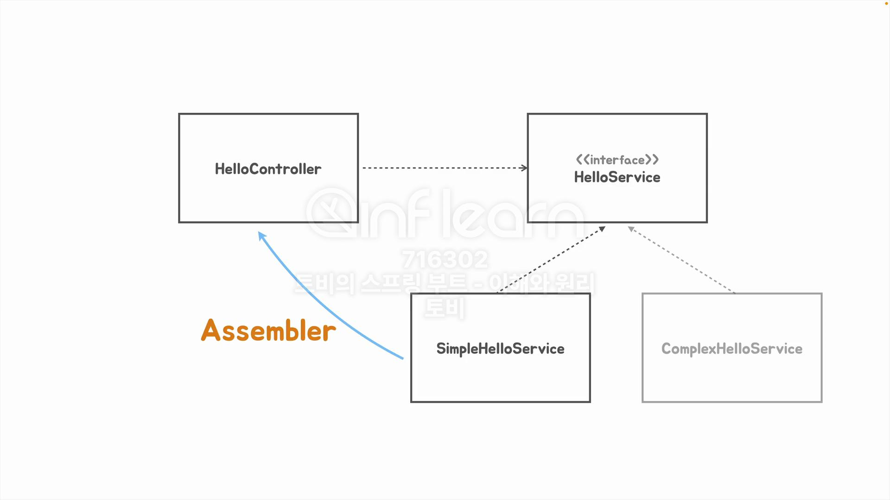

## [섹션 IV] 20_Dependency Injection

---

### Dependency Injection (의존성 주입)

- `HelloController`는 `SimpleHelloService`에 의존적이다.
  - 간단하게 `SimpleHelloService`의 변경이 `HelloController`에 영향을 주게된다면, 그것이 의존이라고 할 수 있다.


- 여기 `SimpleHelloService`를 대체하는 새로운 서비스 `ComplexHelloService`가 있다. 만약 `HelloController`에서 `SimpleHelloService` 대신 `ComplexHelloService`를 사용하려면 아떻게 해야 할까?
  ```java
  public String hello(String name) {
      SimpleHelloService simpleHelloService = new SimpleHelloService();
  
      return simpleHelloService.sayHello(Objects.requireNonNull(name));
  }
  ```
  - 소스코드의 변경이 불가피하다 `SimpleHelloService simpleHelloService = new SimpleHelloService();` 코드 라인을 변경해야 하기 때문이다.

Java 개발에서 이 문제를 해결하기 위한 전통적인 방법이 있다.


- 처음부터 `HelloController`가 `SimpleHelloService`가 아닌 `HelloService` 인터페이스에 의존을 한다.
- 그리고 `SimpleHelloService`와 `ComplexHelloService`가 `HelloService` 인터페이스를 상속하도록 한다.
- 이 경우 `HelloController`의 소스 코드 변경 없이 `SimpleHelloService`와 `ComplexHelloService`를 교체할 수 있다.


- 만약 `HelloController`가 `HelloService` 인터페이스에 의존을 한다면 어쨌든 런타임 시에는 인터페이스가 아닌 실제 구현체 클래스 중 어떤 것을 사용해야 하는지 결정 해주어야 한다.
- 이 과정을 소스 코드 단에서는 하지 않는다고 하더라도, 런타임 시에는 필요한 과정이다.
- 이렇게 실제 구현체를 `HelloController`에 주입하는 일을 수행하는 것을 어셈블러(Assembler) 라고 부른다.
  - 즉, 어셈블러는 의존성 주입을 수행하는 주체이다. 그리고 Spring 프레임워크의 어셈블러가 바로 '스프링 컨테이너'이다.

스프링 컨테이너는
1. 우리가 전달한 객체의 메타 정보를 기반으로 객체의 인스턴스를 싱글턴으로 만들어서 관리한다. 이 싱글턴 인스턴스를 Bean이라고 부른다.
2. 또한 Bean을 관리하면서 Bean 과 Bean 사이에 의존성이 필요한 경우 의존성 주입을 대신 수행하기도 한다.

스프링 프레임워크의 가장 중요한 역할은 '의존 관계 자동화'이다. 애플리케이션 규모가 커질 수록 객체간의 의존성은 복잡해지고, 이는 확장성에 제한으로 이어진다.
스프링의 도움을 받아 많은 의존 관계를 인터페이스로 구현하고, 의존성 관리를 스프링에게 맡기면 굉장히 재밌는 작업들을 많이 수행할 수 있다.