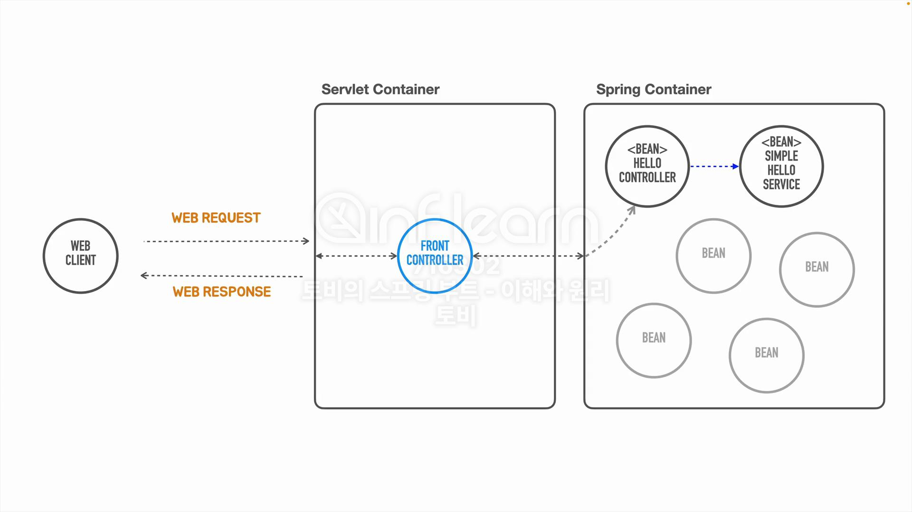
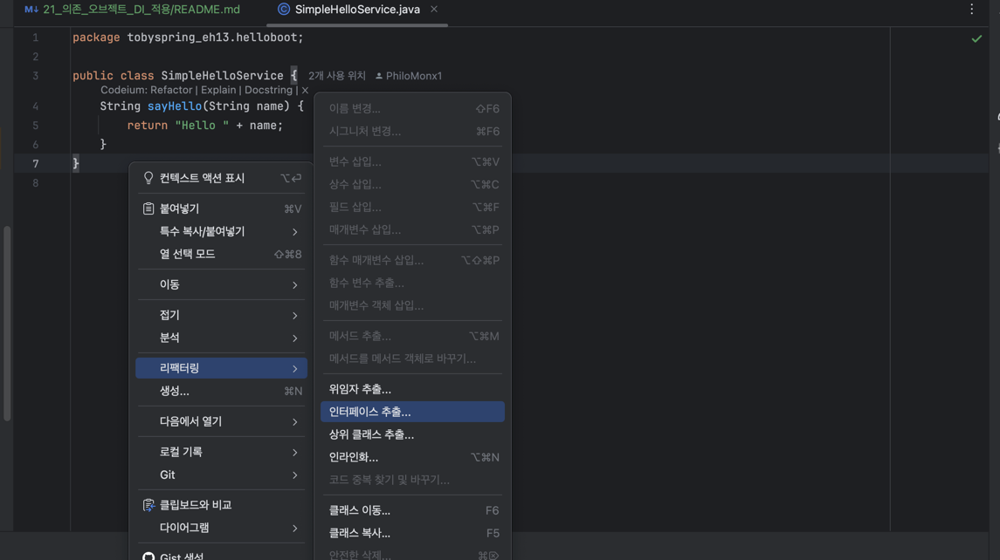
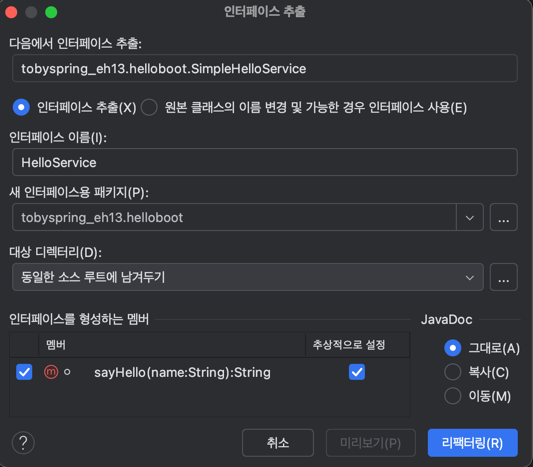

## [섹션 IV] 21_의존 오브젝트 DI 적용

---


- 이와 같이 DI를 사용하는 구조를 구현해보도록 하겠다.

### 1. 인터페이스 추가 & 기존 클래스 인터페이스 상속 구조로 개선



```java
package tobyspring_eh13.helloboot;

public interface HelloService {
    String sayHello(String name);
}

```

```java
package tobyspring_eh13.helloboot;

public class SimpleHelloService implements HelloService {
    @Override
    public String sayHello(String name) {
        return "Hello " + name;
    }
}
```

인텔리제이의 리팩토링 메뉴를 사용해서 쉽게 진행할 수 있다.

### 2. HelloController 의존성 주입 패턴 적용

```java
public class HelloController {
    private final HelloService helloService;

    public HelloController(HelloService helloService) {
        this.helloService = helloService;
    }

    public String hello(String name) {
        return helloService.sayHello(Objects.requireNonNull(name));
    }
}
```

### 3. SimpleHelloService 클래스 Bean 등록

```java
public class HellobootApplication {
    public static void main(String[] args) {
        GenericApplicationContext applicationContext = new GenericApplicationContext();
        applicationContext.registerBean(HelloController.class);
        applicationContext.registerBean(SimpleHelloService.class);
        applicationContext.refresh();

        ServletWebServerFactory serverFactory = new TomcatServletWebServerFactory();
        WebServer webServer = serverFactory.getWebServer(servletContext -> {
            servletContext.addServlet("frontController", new HttpServlet() {
                @Override
                protected void service(HttpServletRequest request, HttpServletResponse response) throws IOException {
                    //인증, 보안, 다국어 등 공통 기능
                    if(request.getRequestURI().equals("/hello") && request.getMethod().equals(HttpMethod.GET.name())){
                        String name = request.getParameter("name");

                        HelloController helloController = applicationContext.getBean(HelloController.class);
                        String returnHello = helloController.hello(name);

                        response.setContentType(MediaType.TEXT_PLAIN_VALUE);
                        response.getWriter().println(returnHello);
                    } else {
                        response.setStatus(HttpStatus.NOT_FOUND.value());
                    }


                }
            }).addMapping("/*");
        });
        webServer.start();
    }
}
```

과거 스프링에는 빈을 등록하고나서 의존성 주입에 대한 정보까지 연결을 시켜주어야 했다.

그러나 스프링 부트에서는 빈을 등록하면 `HelloController` 빈을 처리할 때 해당 빈의 생성자에 `HelloService` 타입이 필요하다는 것을 스프링 컨테이너가 먼저 인식한다.

이후 `HelloService` 인터페이스를 구체화 한 클래스가 빈으로 등록되어 았는지를 자동으로 찾아서 연결한다.

이 과정은 애플리케이션 실행 시 이루어지며, `applicationContext.registerBean()` 코드 라인의 순서가 반드시 절차적으로 작성될 필요는 없다. (스프링이 알아서 판단한다.)