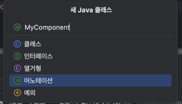

## [섹션 IV] 26_@Component 스캔

---

지난 시간에는 스프링 구성 정보를 사용하기 위해서 클래스 정보를 애플리케이션 컨텍스트에 `register()`를 사용해서 넘겨주거나 팩토리 메서드를 사용해서 Bean을 등록하는 것으로 객체간의 의존성을 스프링에게 알려주었다.

그러나 이 방법보다 더 쉬운 방법으로 스프링에게 정보를 주는 것이 가능하다.

### @Component 어노테이션
```java
package tobyspring_eh13.helloboot;
//...생략
@Component
public class HelloController {
    //... 생략
}
```

```java
package tobyspring_eh13.helloboot;
//...생략
@Component
public class SimpleHelloService {
    //... 생략
}
```

Bean으로 등록하길 원하는 클래스에 `@Component` 어노테이션을 부여했다.

### @ComponentScan
```java
package tobyspring_eh13.helloboot;

//... 생략
@ComponentScan
public class HellobootApplication {
    //... 생략
}
```
애플리케이션 클래스에 `@ComponentScan`을 부여했다.

이 때 스프링은 `@ComponentScan`가 붙은 클래스부터 시작해서 패키지를 기반으로 하위 패키지까지 `@Component` 어노테이션이 붙은 클래스를 찾아서 모두 Bean으로 등록한다.

즉, `tobyspring_eh13.helloboot`의 패키지 경로를 포함하는 모든 클래스를 조회하고 `@Component` 있으면 Bean으로 관리하는 것이다.

이로 인해서 새로 추가된 클래스가 Bean으로 관리되기 원할 때 `HellobootApplication`의 변경 없이 새로운 클래스에 `@Component`를 붙이는 것으로 구성 정보를 설정할 수 있다는 장점이 있다.

### 메타어노테이션 
어노테이션을 정의할 때 사용하는 어노테이션. 즉 어노테이션 자체에 적용되는 어노테이션이다.
`@Retention`, `@Target` 등이 있다.

### 커스텀 어노테이션 작성

```java
@Retention(RetentionPolicy.RUNTIME)
@Target(ElementType.TYPE)
@Component
public @interface MyComponent {
}
```
- `@Retention` : 어노테이션이 유효하게 살아있을 수 있는 시점을 정의한다.
- `@Target` : 어노테이션이 부여될 수 있는 대상을 정의한다.
- `@Component` : 원래 @Component는 메타어노테이션이 아니지만 다른 어노테이션에 부여해서 @Component의 동작을 수행하도록 할 수 있다.
  - `@Controller`, `@Service`, `@Repository` 도 내부적으로 @Component를 메타어노테이션으로 가지고 있다.

```java
package tobyspring_eh13.helloboot;
//...생략
@MyComponent
public class SimpleHelloService {
    //... 생략
}
```
이제 코드를 이렇게 바꿔도 이상 없이 동작한다.

`@Controller`, `@Service`, `@Repository` 처럼 Bean의 계층적 구조를 명시하고 태깅하기 위해 사용할 수도 있고,

`@RestController` 처럼 특수한 동작을 실행하도록 만들어서 ex) 메서드레벨에 `@ResponseBody` 어노테이션을 생략하도록 해줄 수도 있다.
- `@RestController`는 내부적으로 `@Controller` 어노테이션이 붙어있다. 