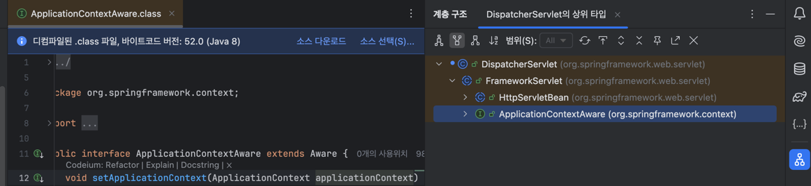
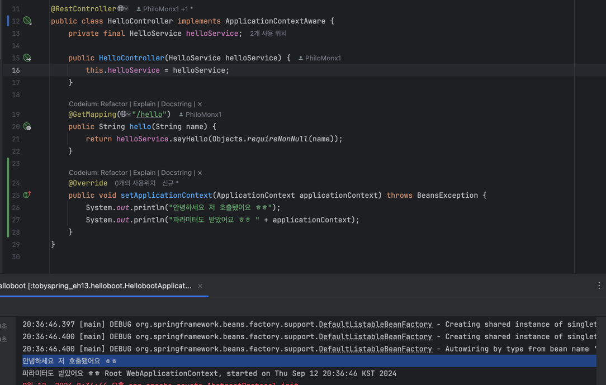

## [섹션 IV] 27_Bean의 생명주기 메소드

---

우리가 지금까지 작성한 코드 중에서 톰켓 서블릿 컨테이너와 디스패처 서블릿을 작성하는 부분은 현재 스프링의 도움을 받지 않고 있다.

이번에는 이 두개의 오브젝트도 팩토리 메서드를 사용해서 스프링의 Bean으로 등록을 해볼 것이다. 

### Bean 선언하기
```java
@Bean
public ServletWebServerFactory servletWebServerFactory() {
    return new TomcatServletWebServerFactory();
}

@Bean
public DispatcherServlet dispatcherServlet() {
    return new DispatcherServlet();
}
```
두 가지 오브젝트를 스프링 빈으로 선언했다. 그런데 문제가 하나 있다.

DispatcherServlet 의 역할은 컨트롤러의 앞단에서 검문소 역할을 하는 것이기 때문에, 컨트롤러들이 포함되어 있는 스프링 컨테이너를 주입 받아서 생성이 된다.
- 검문소 역할을 하기 위해서는 지역이 존재해야 하듯이, 스프링 컨테이너 내에서 역할을 수행하기 위해서 스프링 컨테이너를 알려줘야 하는 것이다.

```java
public static void main(String[] args) {
    AnnotationConfigWebApplicationContext applicationContext = new AnnotationConfigWebApplicationContext(){
        @Override
        protected void onRefresh() {
            super.onRefresh();

            ServletWebServerFactory serverFactory = getBean(ServletWebServerFactory.class);
            DispatcherServlet dispatcherServlet = getBean(DispatcherServlet.class);

            WebServer webServer = serverFactory.getWebServer(servletContext -> {
                servletContext.addServlet("dispatcherServlet", dispatcherServlet)
                        .addMapping("/*");
            });
            webServer.start();
        }
    };
    applicationContext.register(HelloController.class);
    applicationContext.refresh();
}
```
이렇게 Bean 을 꺼내서 사용을 해도 dispatcherServlet은 현재 빈 생성자로 호출되어 있다.


### setApplicationContext()
```java
public static void main(String[] args) {
    AnnotationConfigWebApplicationContext applicationContext = new AnnotationConfigWebApplicationContext(){
        @Override
        protected void onRefresh() {
            super.onRefresh();

            ServletWebServerFactory serverFactory = getBean(ServletWebServerFactory.class);
            DispatcherServlet dispatcherServlet = getBean(DispatcherServlet.class);
            dispatcherServlet.setApplicationContext(this);

            WebServer webServer = serverFactory.getWebServer(servletContext -> {
                servletContext.addServlet("dispatcherServlet", dispatcherServlet)
                        .addMapping("/*");
            });
            webServer.start();
        }
    };
    applicationContext.register(HelloController.class);
    applicationContext.refresh();
}
```
- 다행히 DispatcherServlet 안에는 `setApplicationContext()` Setter 메서드가 존재한다. 그러니 디스패처 서블릿이 servletContext 주입되는 시점에는 Setter를 통해 스프링 컨테이너가 주입된 시점일 것이다.

### Bean의 라이프사이클 메서드
사실은 `setApplicationContext()`를 직접 호출해서 스프링 컨테이너를 설정하지 않아도 문제 없이 코드가 동작한다. 스프링 컨테이너가 디스패처 서블릿이 애플리케이션 컨텍스트가 필요하다는 것을 알고 자동으로 주입 해주기 때문이다.



- 인텔리제이의 'type hierarchy' 기능으로 DispatcherServlet의 상위 타입을 살펴보면 `ApplicationContextAware` 인터페이스에서 `setApplicationContext()` 추상 메서드를 선언하고 있음을 알 수 있다.
- 스프링은 Bean의 생명주기 동안 특정 시점에 자동으로 호출되는 메서드들을 제공하는데, `setApplicationContext()`가 그 중 하나이다.
  - 스프링 컨테이너는 빈을 초기화할 때 해당 빈이 `ApplicationContextAware` 인터페이스를 구현했는지 확인한다.
  - 구현했다면, 컨테이너는 빈의 속성 설정 후 `setApplicationContext()` 메서드를 자동으로 호출한다.

즉, 어떠한 클래스가 `ApplicationContextAware` 인터페이스를 구현했다면, 스프링은 해당 클래스의 빈을 초기화할 때 `setApplicationContext()` 메서드를 자동으로 호출한다.

