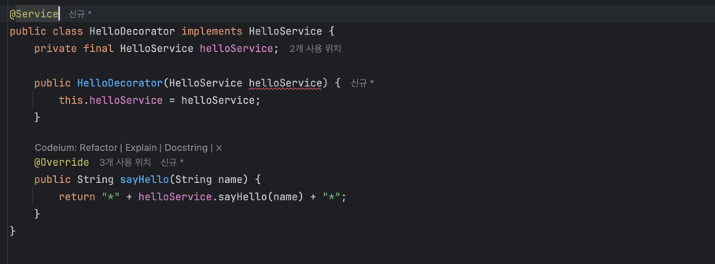

## [섹션 V] 31_DI를 이용한 Decorator, Proxy 패턴


- 초기 코드에서 `HelloController`는 `SimpleHelloService`를 직접 의존했다.
  - `SimpleHelloService`의 변경이 `HelloController`에 직접 영향을 줬다.


- DI 패턴을 적용하면서 `HelloService` 인터페이스를 구현하고 `HelloController`는 `HelloService`를 의존하게 만들었다.
  - `HelloController`를 전혀 변경하지 않고, `HelloService`의 구현체를 변경해가면서 확장된 동작을 수행할 수 있다.

이런 작업을 가능하게 해주는 것이 Dependency Injection 이다. (이 과정을 스프링 컨테이너가 대신 수행한다.)

`HelloService` 인터페이스를 구현하는 클래스는 원한다면 계속해서 추가할 수 있다. Test 케이스를 작성할 때 `new HelloController(name -> name);` 처럼 람다식으로 작성한 것도 사실은 `HelloService`를 구현하는 익명 클래스를 구현한 것이었다.

그중에서 오늘은 Decorator 에 대해 알아볼 것이다.

### Decorator 패턴 적용


```java
@Service
public class HelloDecorator implements HelloService {
    private final HelloService helloService;

    public HelloDecorator(HelloService helloService) {
        this.helloService = helloService;
    }

    @Override
    public String sayHello(String name) {
        return "*" + helloService.sayHello(name) + "*";
    }
}
```
- 상속 대신 '컴포지션(Composition)'을 사용하는 방법론이다.
- 필드로 상속 대상을 선언하고, 생성자나 Setter를 통해 주입 받는 방식이다.
- 컴파일 시점에 관계가 결정되는 상속과 달리, 런타임에 관계를 동적으로 설정할 수 있다.


- 만약 `HelloDecorator`가 `SimpleHelloService`를 주입 받는다면, `SimpleHelloService`의 동작을 보장 받으면서 유연한 확장이 가능한다.
- `Decorator`는 여러 개를 연속으로 사용할 수 있다.

### 서버 에러


```
2024-09-16 02:40:26.901 ERROR 52959 --- [           main] o.s.b.d.LoggingFailureAnalysisReporter   : 

***************************
APPLICATION FAILED TO START
***************************

Description:

Parameter 0 of constructor in tobyspring_eh13.helloboot.HelloController required a single bean, but 2 were found:
	- helloDecorator: defined in file [/Users/apple2/IdeaProjects/EH13/TIL/Lecture/Inflearn/tobyilee/spring boot - principles and understanding/practice/섹션_2_스프링_부트_시작하기/helloboot/build/classes/java/main/tobyspring_eh13/helloboot/HelloDecorator.class]
	- simpleHelloService: defined in file [/Users/apple2/IdeaProjects/EH13/TIL/Lecture/Inflearn/tobyilee/spring boot - principles and understanding/practice/섹션_2_스프링_부트_시작하기/helloboot/build/classes/java/main/tobyspring_eh13/helloboot/SimpleHelloService.class]


Action:

Consider marking one of the beans as @Primary, updating the consumer to accept multiple beans, or using @Qualifier to identify the bean that should be consumed
```

스프링이 Bean 등록 후보 중에서 어떤 것을 결정해야 할지 알지 못해서 애플리케이션 실행 시 컴파일 오류가 발생한다.

해결 방법은 여러 가지가 있다.
1. XML로 설정 직접 선언
2. 팩토리 메서드를 사용해서 Bean 등록
3. `@Primary` 어노테이션 부여

### @Primary
```java
@Service
@Primary
public class HelloDecorator implements HelloService {
    private final HelloService helloService;

    public HelloDecorator(HelloService helloService) {
        this.helloService = helloService;
    }

    @Override
    public String sayHello(String name) {
        return "*" + helloService.sayHello(name) + "*";
    }
}
```
- `@Primary` : 해당 어노테이션을 부여하면 다양한 Bean 후보 중에서 부여된 클래스를 최우선으로 선택한다.

#### 테스트
```java
class HelloApiTest {

    @Test
    void helloApi() {
        TestRestTemplate rest = new TestRestTemplate();

        ResponseEntity<String> response =
                rest.getForEntity("http://localhost:8080/hello?name={name}", String.class, "Spring");

        // status code : 200
        assertThat(response.getStatusCode()).isEqualTo(HttpStatus.OK);
        // header content-type: text/plain
        assertThat(response.getHeaders().getFirst("Content-Type")).startsWith(MediaType.TEXT_PLAIN_VALUE);
        // body: Hello Spring
        assertThat(response.getBody()).isEqualTo("*Hello Spring*");
        // body: Hello Spring
    }
}
```
- `assertThat(response.getBody()).isEqualTo("*Hello Spring*");` 으로 API 테스트를 수행하도록 바꾸었다.

```java
public class HelloServiceTest {

    @Test
    void simpleHelloService() {
        SimpleHelloService simpleHelloService = new SimpleHelloService();
        String result = simpleHelloService.sayHello("Test");

        Assertions.assertThat(result).isEqualTo("Hello Test");
    }

    @Test
    void helloDecorator() {
        HelloDecorator helloDecorator = new HelloDecorator(name -> name);
        String result = helloDecorator.sayHello("Test");

        Assertions.assertThat(result).isEqualTo("*Test*");
    }
}
```
- `simpleHelloService()` : `SimpleHelloService`를 직접 사용하기 때문에 기존 테스트에서 변경할 필요가 없다.
- `helloDecorator()` : `HelloDecorator` 테스트 케이스도 추가하였다.

### Proxy 패턴

- 실제 객체를 대신하는 대리자(프록시) 객체를 제공하여 중간에서 동작을 처리하는 것
- 사용 목적
  - 지연 초기화 (Lazy Initialization) : 생성 비용이 큰 객체의 초기화를 실제로 필요한 시점까지 미룰 때 사용
  - 접근 제어 (Access Control) : 특정 클라이언트만 서비스 객체에 접근할 수 있도록 권한을 제어할 때 사용
  - 로깅 (Logging) : 서비스 객체에 대한 요청을 기록하고 싶을 때 사용
  - 캐싱 (Caching) : 반복적인 요청의 결과를 캐시하여 시스템 리소스를 절약하고자 할 때 사용
  - 원격 객체에 대한 로컬 대표자 (Remote Proxy) : 원격 서버에 있는 객체를 로컬에서 표현하고 네트워크 작업을 처리할 때 사용
  - 보안 (Security) : 중요한 객체에 대한 접근을 보호하고 보안 검사를 수행할 때 사용

Mock 과 유사점이 있지만 테스트를 위해 사용하는 Mock 과 달리 Proxy 는 실제 시스템에서 사용되며, 실제 객체의 기능을 수행한다.
- 프록시는 "가짜"라기보다는 "대리자" 역할을 하며, 실제 객체의 기능을 수행하면서 추가적인 제어나 기능을 제공한다.

### Decorator 와 Proxy 패턴의 차이 
- Decorator 패턴의 주요 목적 : 객체에 동적으로 새로운 책임(기능)을 추가하는 것
- Proxy 패턴의 주요 목적 : 대상 객체에 대한 접근을 제어하는 것