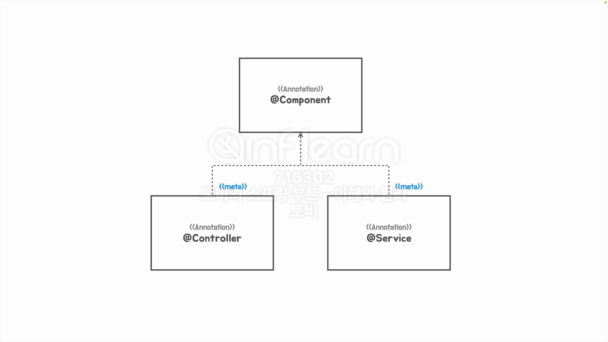
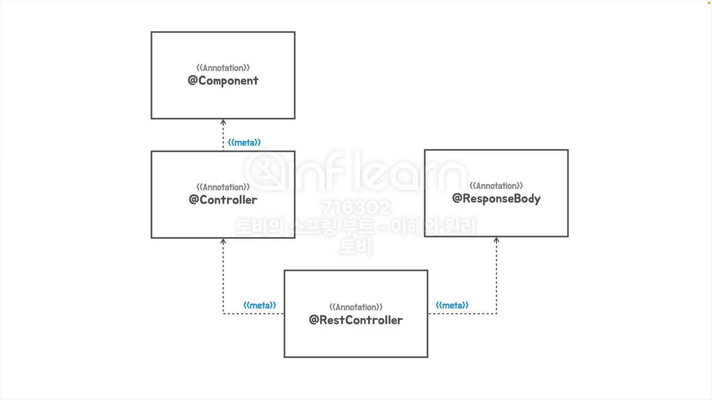

## [섹션 VI] 32_메타 애노테이션과 합성 애노테이션

### 메타 어노테이션


테스트 케이스 메서드에 부여하는 `@Test` 어노테이션 또한 다른 어노테이션에 부여할 수 있다.

```java
@Retention(RetentionPolicy.RUNTIME)
@Target(ElementType.METHOD)
@Test
@interface UnitTest {
    
}
```

이는 `@Test` 어노테이션의 `@Target`이 `ElementType.METHOD` 뿐만 아니라 `ElementType.ANNOTATION_TYPE`을 포함하기 때문이다.

```java
@Retention(RetentionPolicy.RUNTIME)
@Target({ElementType.METHOD, ElementType.ANNOTATION_TYPE})
@Test
@interface UnitTest {

}

@Retention(RetentionPolicy.RUNTIME)
@Target(ElementType.METHOD)
@UnitTest
@interface FestUnitTest {
    
}
```
이와 같이 `UnitTest` 어노테이션의 `@Target`에 어노테이션을 포함해서 다른 어노테이션에 부여가 가능하도록 할 수 있다.

### 합성 어노테이션

- 메타 어노테이션을 하나 이상 적용해서 만드는 경우 '합성 어노테이션(Composed Annotation)'이라고 말한다.
- 만약 특정 어노테이션의 조합을 패턴적으로 사용하는 경우 이 어노테이션의 조합을 합성하여 사용할 수 있다. ex) `@Controller` + `@ResponeseBody` = `@RestController` 