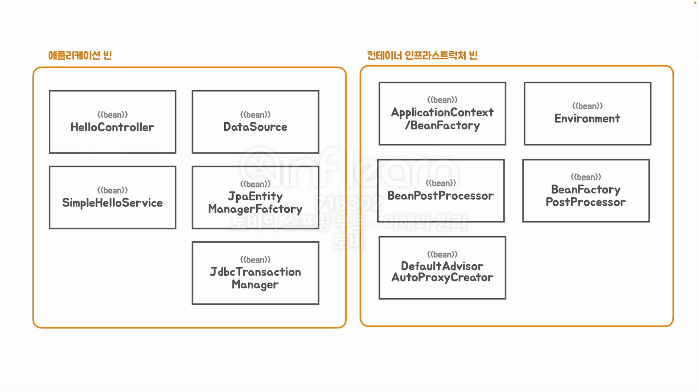
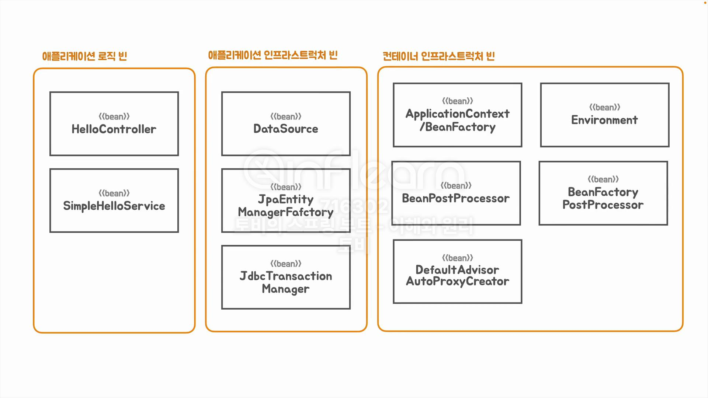
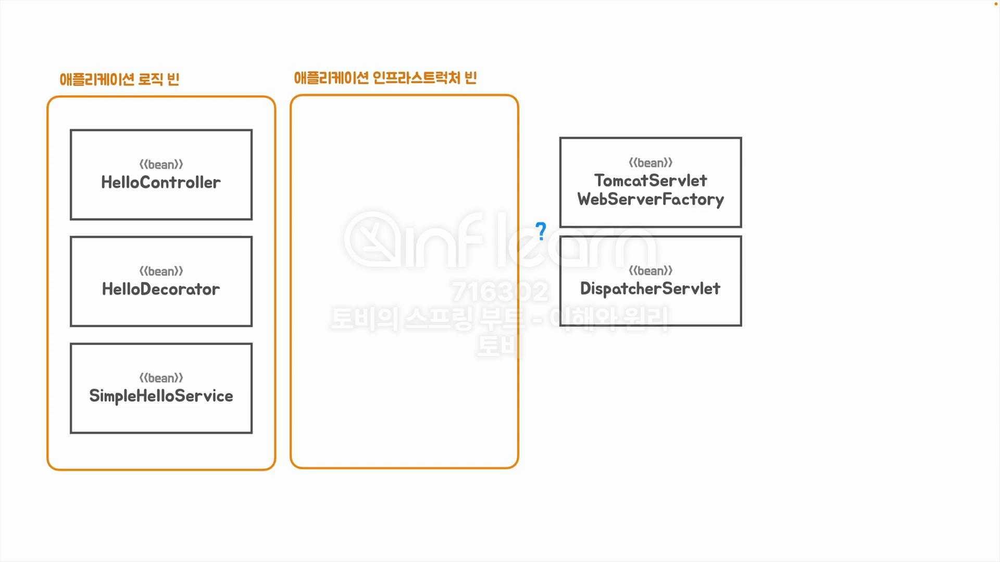
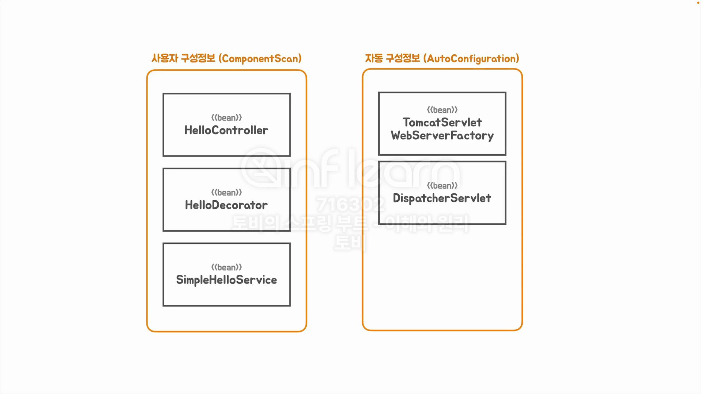
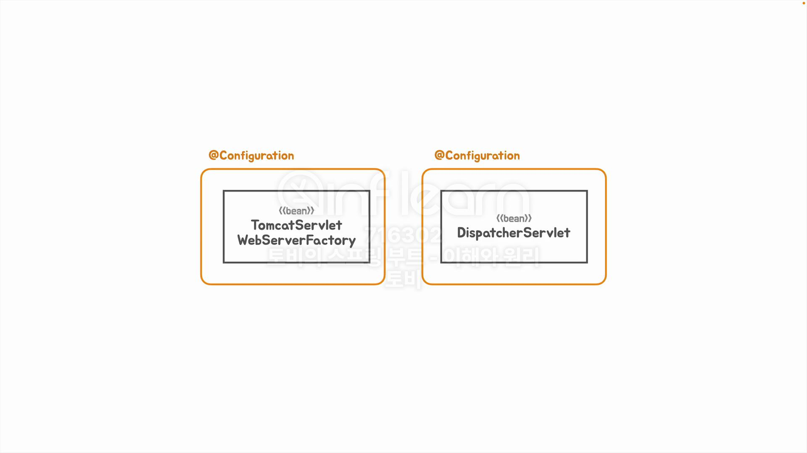

## [섹션 VI] 34_빈 오브젝트의 역할과 구분

### 애플리케이션 빈과 컨테이너 인프라스트럭쳐 빈

스프링 빈은 크게 두 가지로 나눌 수 있다.

1. 애플리케이션 빈 : 개발자가 명시적으로 구성 정보를 제공한 빈을 의미한다.
2. 컨테이너 인프라스트럭쳐 빈 : 스프링 컨테이너 자신 혹은 스프링 컨테이너가 기능을 확장하면서 추가해온 빈으로 개발자가 요청하지 않아도 스프링 프레임워크에 의해 관리되는 빈이다.
   - 일반적으로 비즈니스 관심사가 아니다. (물론 원한다면 DI로 주입을 받아서 활용하거나 커스텀할 수 있다.)

### 애플리케이션 로직 빈과 애플리케이션 인프라스트럭쳐 빈

사실 개발자가 구성 정보를 제공해야 하는 애플리케이션 빈 또한 크게 두 가지로 나뉜다.

1. 애플리케이션 로직 빈 : 비즈니스 로직, 도메인 로직 등 애플리케이션의 기능을 담당하는 빈을 의미한다.
2. 애플리케이션 인프라스트럭쳐 빈 : 대부분 기술과 관련된 것으로 직접 작성하기 보다는 이미 스프링에서 제공하는 것을 사용하겠다고 명시적으로 구성 정보를 작성해 주는 것으로 사용하는 빈을 의미한다. 
   - 컨테이너 인프라스트럭쳐 빈과의 차이점은 어쨌든 애플리케이션 인프라스트럭쳐 빈은 개발자가 직접 사용을 의도하고 구성 정보를 명시 한다는 점이다.

### 우리가 작성한 빈은 어디에 속할까?

`HelloController`, `HelloDecorator`, `SimpleHelloService`는 애플리케이션 로직 빈에 속한다는 것을 쉽게 알 수 있다.

그렇다면 `ServletWebServerFactory`, `DispatcherServlet`은 어디에 속할까?
- 분명 이 두개의 Bean이 없으면 애플리케이션이 동작조차 하지 않는다. 즉, 애플리케이션 구성에 필수적인 빈이다.

우리가 명시적으로 선언을 해줘야 하기 때문에 '애플리케이션 인프라스트럭쳐 빈'에 속한다고 보는 것이 적합하다.

### 자동 구성 방식

스프링 부트가 자동으로 구성 정보를 필요한 방식으로 구성해서 적용한다.