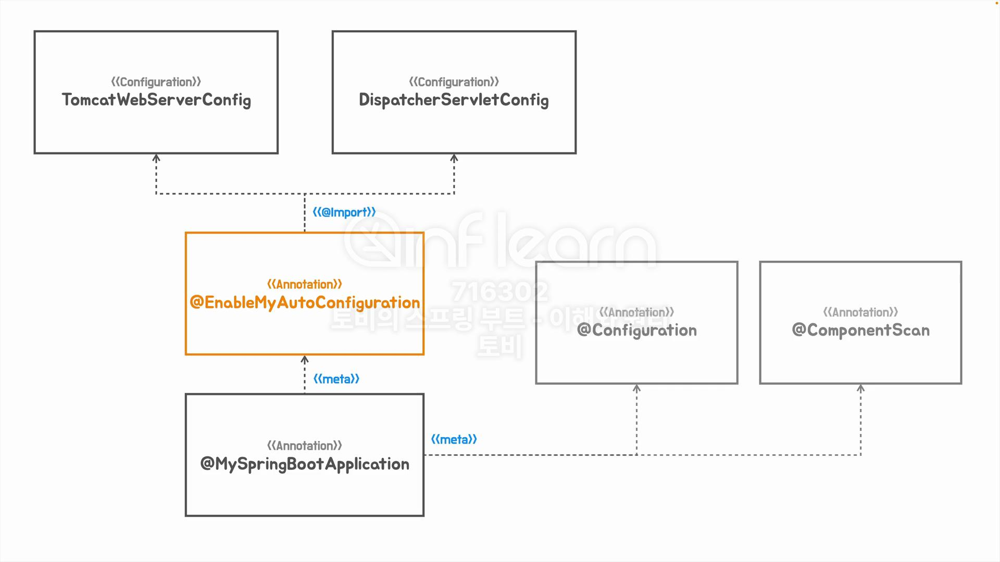

## [섹션 VI] 35_인프라 빈 구성 정보의 분리

'Auto Configuration' 이란 미리 준비해둔 'Configuration' 들을 Spring Boot 가 자동으로 필요성을 판단하고 선택해서 사용하게 해주는 기술이다.

지금까지 작업한 코드에서 이제는 스프링 부트의 자동 구성(Auto Configuration)이 어떤 원리로 적용되는지 살펴볼 것이다.

### Config 클래스 패키지 분리
```java
package tobyspring_eh13.config;

import org.springframework.boot.web.embedded.tomcat.TomcatServletWebServerFactory;
import org.springframework.boot.web.servlet.server.ServletWebServerFactory;
import org.springframework.context.annotation.Bean;
import org.springframework.context.annotation.Configuration;
import org.springframework.web.servlet.DispatcherServlet;

@Configuration
public class Config {
    @Bean
    public ServletWebServerFactory servletWebServerFactory() {
        return new TomcatServletWebServerFactory();
    }

    @Bean
    public DispatcherServlet dispatcherServlet() {
        return new DispatcherServlet();
    }
}

```
- `tobyspring_eh13` 경로애 `helloboot`와 분리되도록 `config` 패키지를 만든 후 `Config` 클래스를 이동시켰다.
  - `HellobootApplication`에 부여된 `@MySpringBootApplication` 어노테이션의 `@ComponentScan` 어노테이션은 같은 패키지와 하위 패키지만을 스캔 대상으로 삼기 때문에 더 이상 `Config`은 스캔 대상이 아니다. 

애플리케이션을 실행하면 오류가 발생한다. 이 문제를 먼저 해결해보자.

### `@Import` 사용해서 해결
```java
@Retention(RetentionPolicy.RUNTIME)
@Target(ElementType.TYPE)
@Configuration
@ComponentScan
@Import(Config.class)
public @interface MySpringBootApplication {
}
```
- `@Import(Config.class)`를 통해 다른 패키지의 클래스 파일 또한 컴포넌트 스캔의 대상이 되도록 설정했다.

이제는 애플리케이션이 정상적으로 실행되고, 테스트도 문제 없이 성공한다.

그런데 이렇게 작성하는 것이 기존의 컴포넌트 스캔을 사용해서 내부에서 동작하도록 하는 것과 무엇이 다를까?

우선은 `Config` 클래스의 빈 두개를 분리하는 작업을 해볼 것이다.

### 인프라 구성 빈 분리
```java
package tobyspring_eh13.config;

import org.springframework.boot.web.embedded.tomcat.TomcatServletWebServerFactory;
import org.springframework.boot.web.servlet.server.ServletWebServerFactory;
import org.springframework.context.annotation.Bean;
import org.springframework.context.annotation.Configuration;

@Configuration
public class TomcatWebServerConfig {
    @Bean
    public ServletWebServerFactory servletWebServerFactory() {
        return new TomcatServletWebServerFactory();
    }
}

```

```java
package tobyspring_eh13.config;

import org.springframework.context.annotation.Bean;
import org.springframework.context.annotation.Configuration;
import org.springframework.web.servlet.DispatcherServlet;

@Configuration
public class DispatcherServletConfig {
    @Bean
    public DispatcherServlet dispatcherServlet() {
        return new DispatcherServlet();
    }
}
```

기존 컨픽 빈을 두 개의 클래스로 분리하였다.
- 두 클래스는 `config` 패키지 내부에 `autoconfig` 패키지를 하나 더 만들어서 내부에 선언했다.

```java
@Retention(RetentionPolicy.RUNTIME)
@Target(ElementType.TYPE)
@Configuration
@ComponentScan
@Import({DispatcherServletConfig.class, TomcatWebServerConfig.class})
public @interface MySpringBootApplication {
}
```

`@Import` 대상 또한 두 개의 클래스로 변경해야 한다.

### 어노테이션 분리
그런데 문제는 `autoconfig` 패키지 내의 자동 구성 대상 클래스가 많아질 수록 `@MySpringBootApplication` 어노테이션의 `@Import` 라인 또한 길어진다는 것이다.

이 문제는 어노테이션을 분리해서 해결해 볼 것이다.

```java
package tobyspring_eh13.config;

import org.springframework.context.annotation.Import;
import tobyspring_eh13.config.autoconfig.DispatcherServletConfig;
import tobyspring_eh13.config.autoconfig.TomcatWebServerConfig;

import java.lang.annotation.ElementType;
import java.lang.annotation.Retention;
import java.lang.annotation.RetentionPolicy;
import java.lang.annotation.Target;

@Retention(RetentionPolicy.RUNTIME)
@Target(ElementType.TYPE)
@Import({DispatcherServletConfig.class, TomcatWebServerConfig.class})
public @interface EnableMyAutoConfiguration {
}
```
- 새로운 어노테이션(`@EnableMyAutoConfiguration`)을 만든 후 `@Import({DispatcherServletConfig.class, TomcatWebServerConfig.class})` 라인을 옮겨 주었다.

```java
package tobyspring_eh13.config;

import org.springframework.context.annotation.ComponentScan;
import org.springframework.context.annotation.Configuration;

import java.lang.annotation.ElementType;
import java.lang.annotation.Retention;
import java.lang.annotation.RetentionPolicy;
import java.lang.annotation.Target;

@Retention(RetentionPolicy.RUNTIME)
@Target(ElementType.TYPE)
@Configuration
@ComponentScan
@EnableMyAutoConfiguration
public @interface MySpringBootApplication {
}
```
- 기존 `@MySpringBootApplication` 에서는 위에서 만든 `@EnableMyAutoConfiguration`를 부여했다.

두 어노테이션 모두 `tobyspring_eh13.config` 패키지에 선언하여 서비스 로직과 패키지를 분리하였다.

