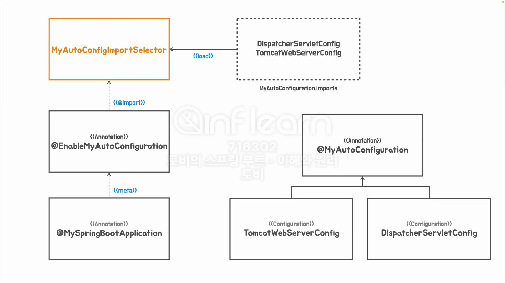

## [섹션 VI] 38_자동 구성 애노테이션 적용


지금까지 작성한 코드의 구조이다.


### 자동 구성 어노테이션 적용
```java
@MyAutoConfiguration
public class DispatcherServletConfig {
    @Bean
    public DispatcherServlet dispatcherServlet() {
        return new DispatcherServlet();
    }
}
```
```java
@MyAutoConfiguration
public class TomcatWebServerConfig {
    @Bean
    public ServletWebServerFactory servletWebServerFactory() {
        return new TomcatServletWebServerFactory();
    }
}
```

위와 같이 명시해주지 않는다고 해서 로딩이 안되는 것은 아니지만, AutoConfiguration 적용 대상이라는 것을 명시해주는 것이 원칙이다.

### Proxy Bean Methods 
```java
@Retention(RetentionPolicy.RUNTIME)
@Target(ElementType.TYPE)
@Configuration(proxyBeanMethods = false)
public @interface MyAutoConfiguration {
}
```
- `MyAutoConfiguration`에 부여된 `@ComponentScan` 어노테이션의 `proxyBeanMethods` 옵션을 `false`로 변경했다. (디폴트 값은 true 이다.)

`proxyBeanMethods` 모드는 간단하게 설명하자면 싱글톤 모드라고 할 수 있다. 더 자세한 설명은 다음 챕터에서 알아볼 것이다.