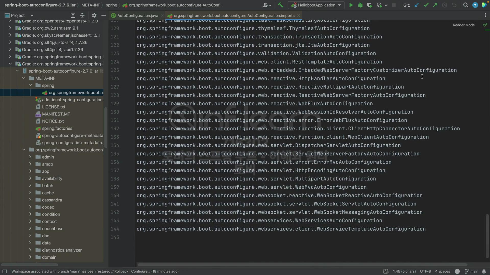

## [섹션 VII] 40_스타터와 Jetty 서버 구성 추가

지금까지 구현해본 스프링 부트의 자동 구성은 프로젝트 `resources/META-INF/spring` 경로 내의 `tobyspring_eh13.config.MyAutoConfiguration.imports` 파일을 기준으로 Bean을 등록한다.

스프링부트 역시 이와 같은 방법을 사용한다.

### `spring-boot-autoconfigure` 의 imports 파일

- `spring-boot-autoconfigure-2.7.6.jar` 내의 `org.springframework.boot.autoconfigure.AutoConfiguration.imports` 파일을 기준으로 한다.
- 총 144개의 라인이 보인다. 각 라인 당 평균 3개씩의 Bean 만 등록해도 400개가 넘는 Bean 이 애플리케이션 실행시 생성된다.

비즈니스 로직을 작성하지 않고 스프링 부트를 사용하기만 하는데 400개 이상의 Bean이 자동으로 생성된다면 비용을 고민해야 한다. 다행히 스프링부트는 imports 파일내의 모든 라인을 Bean으로 등록하는 것이 아니다.

### 조건부 자동 구성 실습 초기화 : Jetty 서버 구성 추가
실제로는 사용하는 것만 등록되는 매커니즘을 가지고 있다. 이것을 '조건부 자동 구성'이라고 부르며 지금부터 이를 실습하기 위해 Tomcat 이 아닌 Jetty 서버를 서블릿 컨테이너로 사용해 볼 것이다.

1. jetty 라이브러리 추가
    ```groovy
    implementation 'org.springframework.boot:spring-boot-starter-jetty'
    ```
   - Tomcat 과 달리 jetty 는 `spring-boot-starter-web`에 내장되어 있지 않기에 별도 추가해주어야 한다.

2. 자동 구성 클래스 추가
   ```java
   package tobyspring_eh13.config.autoconfig;
   
   import org.springframework.boot.web.embedded.jetty.JettyServletWebServerFactory;
   import org.springframework.boot.web.servlet.server.ServletWebServerFactory;
   import org.springframework.context.annotation.Bean;
   import tobyspring_eh13.config.MyAutoConfiguration;
   
   @MyAutoConfiguration
   public class JettyWebServerConfig {
       @Bean("JettyWebServerConfig")
       public ServletWebServerFactory servletWebServerFactory() {
           return new JettyServletWebServerFactory();
       }
   }
   ```
   - `JettyServletWebServerFactory`을 리턴하는 `JettyWebServerConfig` 클래스를 생성했다.
   - `@Bean("JettyWebServerConfig")` : Bean의 이름은 명시하지 않을 경우 메서드의 이름으로 지정되는데, `TomcatWebServerConfig` 과 겹치기 때문에 명시해주었다.
3. imports 파일에 `JettyWebServerConfig` 추가
   ```
   tobyspring_eh13.config.autoconfig.DispatcherServletConfig
   tobyspring_eh13.config.autoconfig.TomcatWebServerConfig
   tobyspring_eh13.config.autoconfig.JettyWebServerConfig
   ```
4. 애플리케이션 실행
   ```
   2024-09-25 04:24:50.472 ERROR 96635 --- [           main] o.s.boot.SpringApplication               : Application run failed
   
   org.springframework.context.ApplicationContextException: Unable to start web server; nested exception is org.springframework.context.ApplicationContextException: Unable to start ServletWebServerApplicationContext due to multiple ServletWebServerFactory beans : TomcatWebServerConfig,JettyWebServerConfig
       at org.springframework.boot.web.servlet.context.ServletWebServerApplicationContext.onRefresh(ServletWebServerApplicationContext.java:165) ~[spring-boot-2.7.6.jar:2.7.6]
       at org.springframework.context.support.AbstractApplicationContext.refresh(AbstractApplicationContext.java:577) ~[spring-context-5.3.24.jar:5.3.24]
       at org.springframework.boot.web.servlet.context.ServletWebServerApplicationContext.refresh(ServletWebServerApplicationContext.java:147) ~[spring-boot-2.7.6.jar:2.7.6]
       at org.springframework.boot.SpringApplication.refresh(SpringApplication.java:731) ~[spring-boot-2.7.6.jar:2.7.6]
       at org.springframework.boot.SpringApplication.refreshContext(SpringApplication.java:408) ~[spring-boot-2.7.6.jar:2.7.6]
       at org.springframework.boot.SpringApplication.run(SpringApplication.java:307) ~[spring-boot-2.7.6.jar:2.7.6]
       at org.springframework.boot.SpringApplication.run(SpringApplication.java:1303) ~[spring-boot-2.7.6.jar:2.7.6]
       at org.springframework.boot.SpringApplication.run(SpringApplication.java:1292) ~[spring-boot-2.7.6.jar:2.7.6]
       at tobyspring_eh13.helloboot.HellobootApplication.main(HellobootApplication.java:10) ~[main/:na]
   Caused by: org.springframework.context.ApplicationContextException: Unable to start ServletWebServerApplicationContext due to multiple ServletWebServerFactory beans : TomcatWebServerConfig,JettyWebServerConfig
       at org.springframework.boot.web.servlet.context.ServletWebServerApplicationContext.getWebServerFactory(ServletWebServerApplicationContext.java:217) ~[spring-boot-2.7.6.jar:2.7.6]
       at org.springframework.boot.web.servlet.context.ServletWebServerApplicationContext.createWebServer(ServletWebServerApplicationContext.java:182) ~[spring-boot-2.7.6.jar:2.7.6]
       at org.springframework.boot.web.servlet.context.ServletWebServerApplicationContext.onRefresh(ServletWebServerApplicationContext.java:162) ~[spring-boot-2.7.6.jar:2.7.6]
       ... 8 common frames omitted
   
   
   종료 코드 1(으)로 완료된 프로세스
   ```
   
애플리케이션을 실행하면 `ServletWebServerApplicationContext`를 어떤 것을 선택해야 할지 몰라 에러가 발생하는 것을 볼 수 있다.

다음 시간에 이 문제를 해결할 것이다.