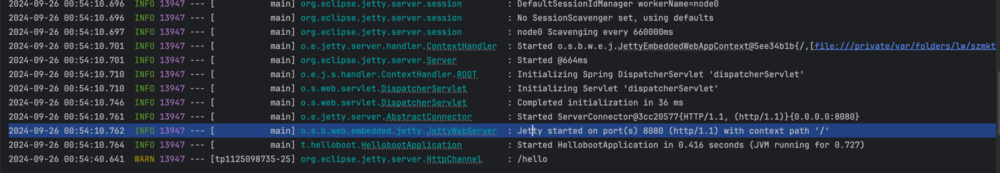
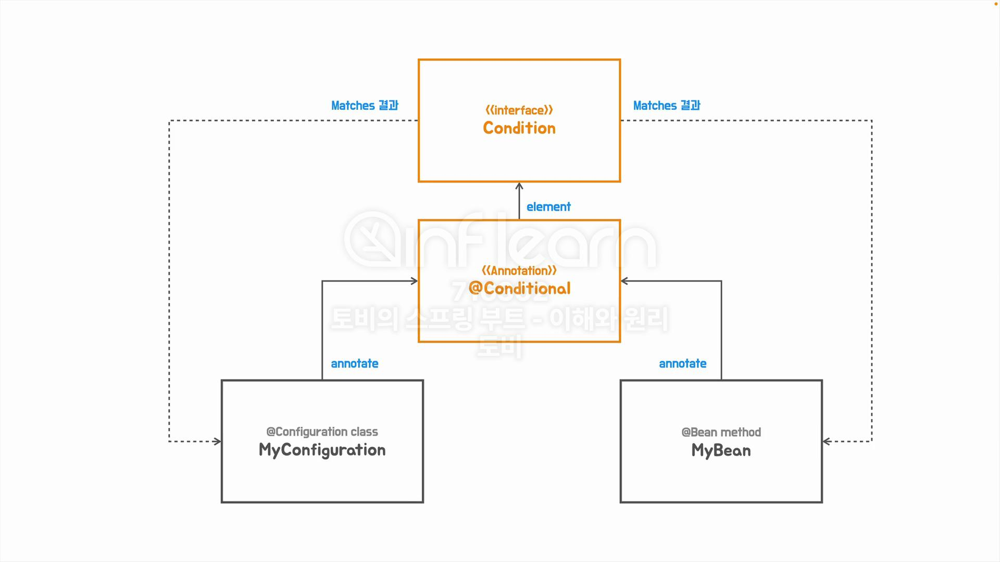

## [섹션 VII] 41_@Conditional과 Condition

### @Conditional 사용해서 Jetty 서버 띄우기
```java
@MyAutoConfiguration
@Conditional(JettyWebServerConfig.JettyCondition.class)
public class JettyWebServerConfig {
    @Bean("JettyWebServerConfig")
    public ServletWebServerFactory servletWebServerFactory() {
        return new JettyServletWebServerFactory();
    }

    static class JettyCondition implements Condition {
        @Override
        public boolean matches(ConditionContext context, AnnotatedTypeMetadata metadata) {
            return true;
        }
    }
}
```
`@Conditional` 어노테이션을 추가 부여했다.
- 조건부 자동 구성을 위해서는 `@Conditional` 어노테이션에 `Condition` 인터페이스를 구현하는 구현체를 넣어주어야 한다. (해당 코드에서는 `JettyCondition`을 내부 스태틱 클래스로 선언해서 사용했다.)
- `Condition` 인터페이스를 구현하기 위해서는 `matches()`를 오버라이딩 해야 한다.
  - `matches()`는 boolean 값을 리턴하며 값에 따라 Bean 등록 여부를 결정한다.

지금은 간단하게 구현하기 위해서 내부 클래스로 `true`를 반드시 리턴하도록 구현하였다.

```java
@MyAutoConfiguration
@Conditional(TomcatWebServerConfig.TomcatCondition.class)
public class TomcatWebServerConfig {
    @Bean("TomcatWebServerConfig")
    public ServletWebServerFactory servletWebServerFactory() {
        return new TomcatServletWebServerFactory();
    }

    static class TomcatCondition implements Condition {
        @Override
        public boolean matches(ConditionContext context, AnnotatedTypeMetadata metadata) {
            return false;
        }
    }
}
```
`TomcatWebServerConfig`에도 `TomcatCondition`을 설정해주었고, `matches()`는 false 를 리턴하도록 했다. 


이제 서버를 실행하면 `Jetty started` 라인을 볼 수 있다. 

### 구조 알아보기

- Configuration 클래스 말고 Bean 메서드에도 `@Conditional`을 부여하는 것이 가능하다. 
  - Configuration 클래스 내에 Bean 메서드가 여러 개라면 메소드 레벨에서 선택적으로 등록하도록 할 수 있는 것이다. 
    - 물론 Configuration 클래스에 `@Conditional`이 true 인 경우에만 메서드 레벨의 검증을 실시힌다. (즉, Configuration 클래스에 `@Conditional`이 false 라면 메소드 레벨이 true 라고 해도 Bean 등록이 무시된다.)
