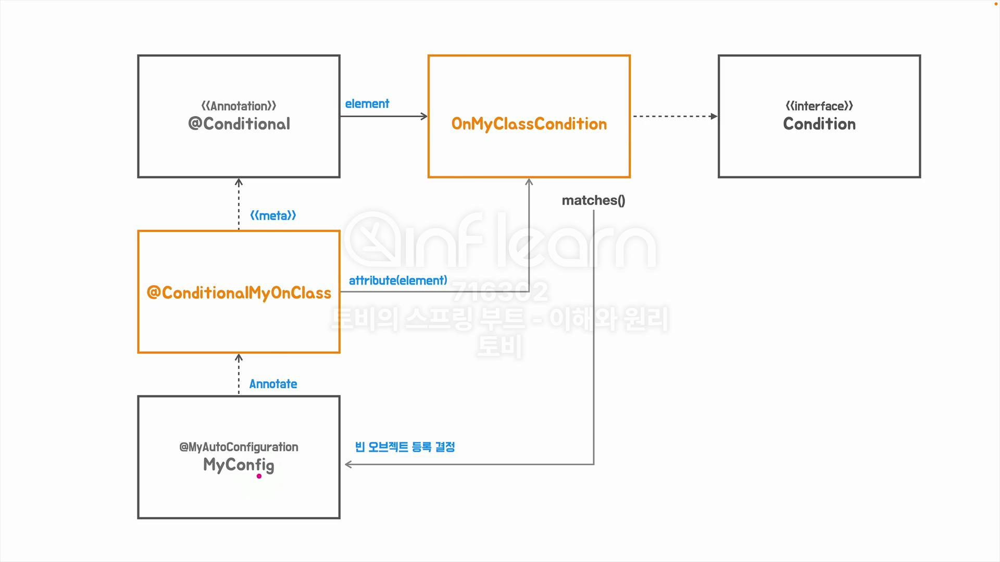

## [섹션 VII] 43_커스톰 @Conditional

스프링 부트가 자주 자용하는 조건부 자동 구성 방식은 '라이브러리'의 포함 여부를 확인 하는 것이다. 즉, Tomcat 라이브러리를 가지고 있다면, `TomcatCondition`이 true 가 되는 것이다.

### 커스텀 `@Conditional` 생성
```java
@MyAutoConfiguration
@Conditional(TomcatWebServerConfig.TomcatCondition.class)
public class TomcatWebServerConfig {
    @Bean("TomcatWebServerConfig")
    public ServletWebServerFactory servletWebServerFactory() {
        return new TomcatServletWebServerFactory();
    }

    static class TomcatCondition implements Condition {
        @Override
        public boolean matches(ConditionContext context, AnnotatedTypeMetadata metadata) {
            return ClassUtils.isPresent("org.apache.catalina.startup.Tomcat", context.getClassLoader());
        }
    }
}
```
`Condition` 인터페이스의 `matches()` 메서드를 통해 커스텀 조건부 자동 구성을 작성해보았다.
- `ClassUtils` : 스프링에서 제공하는 클래스 관련 유틸
- `isPresent()` : 특정 클래스가 존재하는지를 검증한다.
- `org.apache.catalina.startup.Tomcat` 패키지가 포함된 `Tomcat` 클래스가 존재하는지 확인한다. 즉, 톰캣 라이브러리를 가지고 있는지 확인하는 것이다,
- `context.getClassLoader()` : `matches()` 메서드 덕분에 클래스 로더를 바로 사용 할 수 있다.

```java
@MyAutoConfiguration
@Conditional(JettyWebServerConfig.JettyCondition.class)
public class JettyWebServerConfig {
    @Bean("JettyWebServerConfig")
    public ServletWebServerFactory servletWebServerFactory() {
        return new JettyServletWebServerFactory();
    }

    static class JettyCondition implements Condition {
        @Override
        public boolean matches(ConditionContext context, AnnotatedTypeMetadata metadata) {
            return ClassUtils.isPresent("org.eclipse.jetty.server.Server", context.getClassLoader());
        }
    }
}
```

이렇게 설정 후 애플리케이션을 실행하면 역시 오류가 난다. Tomcat 과 Jetty 라이브러리를 둘 다 찾을 수 있기 때문이다.
`org.springframework.context.ApplicationContextException: Unable to start web server; nested exception is org.springframework.context.ApplicationContextException: Unable to start ServletWebServerApplicationContext due to multiple ServletWebServerFactory beans : TomcatWebServerConfig,JettyWebServerConfig`

```java
dependencies {
	implementation 'org.springframework.boot:spring-boot-starter-web'
//	implementation 'org.springframework.boot:spring-boot-starter-jetty'
	testImplementation 'org.springframework.boot:spring-boot-starter-test'
	testRuntimeOnly 'org.junit.platform:junit-platform-launcher'
}
```
- 이와 같이 Jetty 라이브러리를 제거하면 Tomcat 서버가 실행된다.

```java
dependencies {
	implementation ('org.springframework.boot:spring-boot-starter-web') {
		exclude group: 'org.springframework.boot', module: 'spring-boot-starter-tomcat'
	}
	implementation 'org.springframework.boot:spring-boot-starter-jetty'
	testImplementation 'org.springframework.boot:spring-boot-starter-test'
	testRuntimeOnly 'org.junit.platform:junit-platform-launcher'
}
```
이번에는 Jetty를 실행하기 위해 Tomcat 라이브러리를 제외해보았다.
- Tomcat 라이브러리는 `spring-boot-starter-web`에 포함되어 있기 때문에 `exclude`를 사용해서 제외해주었다.


### 개선해보기
현재 `TomcatCondition` 과 `JettyCondition`에는 `isPresent()`에 주입되는 클래스 외에 중복된 코드로 이루어져 았다. 이 부분을 개선할 것이다.

```java
@Retention(RetentionPolicy.RUNTIME)
@Target({ElementType.TYPE, ElementType.METHOD})
@Conditional(MyOnClassCondition.class)
public @interface ConditionalMyOnClass {
    String value();
}
```
- `MyOnClassCondition` 컨디션 클래스를 사용하도록 했고, `value`라는 이름의 문자열 속성을 받도록 했다.

```java
public class MyOnClassCondition implements Condition {
    @Override
    public boolean matches(ConditionContext context, AnnotatedTypeMetadata metadata) {
        Map<String, Object> attributes = metadata.getAnnotationAttributes(ConditionalMyOnClass.class.getName());
        String value = (String) attributes.get("value");
        return ClassUtils.isPresent(value, context.getClassLoader());
    }
}
```
- `isPresent()`의 검증 대상이 하드 코딩으로 된 문자열이 아닌 `@ConditionalMyOnClass` 어노테이션의 `value`가 되도록 했다.

```java
@MyAutoConfiguration
@ConditionalMyOnClass("org.apache.catalina.startup.Tomcat")
public class TomcatWebServerConfig {
    @Bean("TomcatWebServerConfig")
    public ServletWebServerFactory servletWebServerFactory() {
        return new TomcatServletWebServerFactory();
    }
}
```
- 사용부에서는 이렇게 사용해서 중복 코드를 최소화 할 수 있다.

