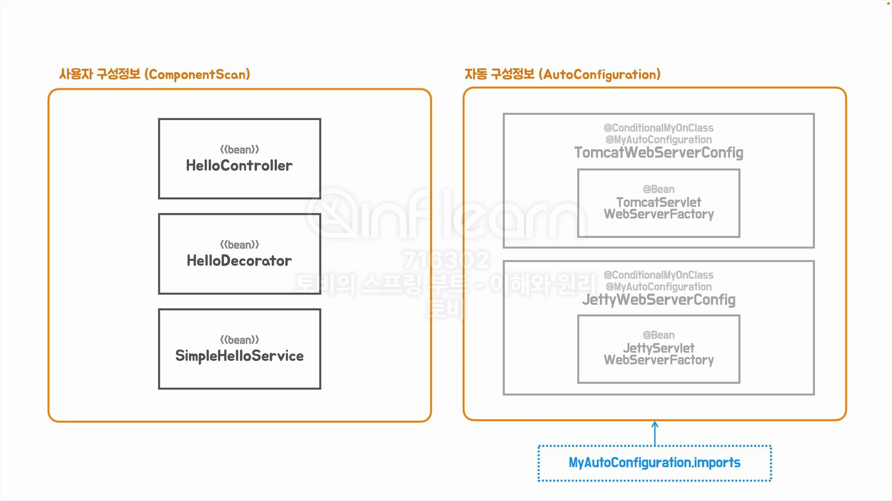

## [섹션 VII] 44_자동 구성 정보 대체하기


Spring Boot 의 애플리케이션 구성 정보를 작성하는 방법은 크게 두 가지로 나뉜다.
1. 애플리케이션(비즈니스) 로직을 담당하는 부분 : 사용자 구성 정보 방식으로 등록, 주로 컴포넌트 스캔에 의해 등록된다. ex) 'Service', 'Controller', 'Repository' 등
2. 비즈니스 관심 밖의 기술에 대한 부분 : 스프링 부트의 자동 구성 동작 방식에 의해 자동 등록. ex) 'spring-boot-starter-web' 의 'Tomcat' 등
   - `@MyAutoConfiguration` 어노테이션의 이름과 일치하는 'import' 파일에 등록 후보가 될 'configuration' 파일의 목록이 명시되어 있다.
   - 후보 `Configuration` 클래스에 부여된 `@Conditional` 어노테이션을 통해 'Bean' 등록 여부를 판단한다.


- `MyOnClassCondition`에 의해 라이브러리의 존재 여부를 파악해서 조건부로 'Bean' 등록 로직까지 구현해보았다.


만약 우리가 커스텀한 서블릿 컨테이너를 만들었다고 가정하자. 이것을 스프링 부트의 자동 구성 대신 사용하는 것이 가능할까?

Spring Boot 가 제공하는 자동 구성을 커스터마이징 오버라이딩 해서 우리가 직접 구성 정보를 생성하는 방법을 알아볼 것이다.

우리에게는 서블릿 컨테이너가 없으니 'Tomcat' 을 사용해서 진행해 볼것이다.

### 커스텀 `WebServerConfiguration`
```java
@Configuration(proxyBeanMethods = false)
public class WebServerConfiguration {
    @Bean 
    ServletWebServerFactory customServletWebServerFactory() {
        TomcatServletWebServerFactory serverFactory = new TomcatServletWebServerFactory();
        serverFactory.setPort(9090);
        return serverFactory;
    }
}
```
- `proxyBeanMethods = false` : 의존성 주입이 필요 없는 클래스이므로 `proxyBeanMethods`를 비활성화 시켰다. (근래의 권장 사항을 반영한 것)
- `TomcatServletWebServerFactory`를 사용하지만 기본 포트인 8080이 아닌, 9090 포트를 사용하도록 했다.

```
Caused by: org.springframework.context.ApplicationContextException: Unable to start ServletWebServerApplicationContext due to multiple ServletWebServerFactory beans : customServletWebServerFactory,TomcatWebServerConfig
	at org.springframework.boot.web.servlet.context.ServletWebServerApplicationContext.getWebServerFactory(ServletWebServerApplicationContext.java:217) ~[spring-boot-2.7.6.jar:2.7.6]
	at org.springframework.boot.web.servlet.context.ServletWebServerApplicationContext.createWebServer(ServletWebServerApplicationContext.java:182) ~[spring-boot-2.7.6.jar:2.7.6]
	at org.springframework.boot.web.servlet.context.ServletWebServerApplicationContext.onRefresh(ServletWebServerApplicationContext.java:162) ~[spring-boot-2.7.6.jar:2.7.6]
	... 8 common frames omitted
```
애플리케이션을 실행하면 이런 에러가 발생한다. 'multiple ServletWebServerFactory beans : customServletWebServerFactory,TomcatWebServerConfig' 톰캣과 우리가 커스텀한 자동 구성 두 개를 찾았으며, 어떤 것을 선택해야 할지 결정할 수 없다는 것이다.

### `@ConditionalOnMissingBean`
```java
@MyAutoConfiguration
@ConditionalMyOnClass("org.apache.catalina.startup.Tomcat")
public class TomcatWebServerConfig {
    @Bean("TomcatWebServerConfig")
    @ConditionalOnMissingBean
    public ServletWebServerFactory servletWebServerFactory() {
        return new TomcatServletWebServerFactory();
    }
}
```
- `@Conditional` 어노테이션은 클래스 뿐만 아니라 메서드에도 부여가 가능하다. `TomcatWebServerConfig`의 메서드에 어노테이션을 하나 더 부여했다.
- `@ConditionalOnMissingBean` : 특정 타입의 빈이 아직 등록되지 않은 경우에만 새로운 빈을 등록하도록 한다.
    ```java
    public class MyAutoConfigImportSelector implements DeferredImportSelector {
        private final ClassLoader classLoader;
    
        public MyAutoConfigImportSelector(ClassLoader classLoader) {
            this.classLoader = classLoader;
        }
    
        @Override
        public String[] selectImports(AnnotationMetadata importingClassMetadata) {
            Iterable<String> candidates = ImportCandidates.load(MyAutoConfiguration.class, classLoader);
            return StreamSupport.stream(candidates.spliterator(), false).toArray(String[]::new);
        }
    }
    ```
    - 이전에 선언한 `MyAutoConfigImportSelector` 클래스는 `DeferredImportSelector`를 상속 받고 있다.
    - `DeferredImportSelector`는 일반 `ImportSelector`와 달리, 모든 `@Configuration` 클래스가 처리된 후에 실행된다. (import 작업을 지연시키는 것)
      - 즉, `@Configuration`가 붙은 클래스가 import 파일 내에 선언되어 있지 않다면 해당 클래스를 먼저 처리하는 것이다.

```
2024-09-29 08:16:37.777  INFO 60167 --- [           main] o.s.b.w.embedded.tomcat.TomcatWebServer  : Tomcat initialized with port(s): 9090 (http)
2024-09-29 08:16:37.782  INFO 60167 --- [           main] o.apache.catalina.core.StandardService   : Starting service [Tomcat]
2024-09-29 08:16:37.783  INFO 60167 --- [           main] org.apache.catalina.core.StandardEngine  : Starting Servlet engine: [Apache Tomcat/9.0.69]
2024-09-29 08:16:37.816  INFO 60167 --- [           main] o.a.c.c.C.[Tomcat].[localhost].[/]       : Initializing Spring embedded WebApplicationContext
2024-09-29 08:16:37.816  INFO 60167 --- [           main] w.s.c.ServletWebServerApplicationContext : Root WebApplicationContext: initialization completed in 152 ms
2024-09-29 08:16:37.849  INFO 60167 --- [           main] o.s.b.w.embedded.tomcat.TomcatWebServer  : Tomcat started on port(s): 9090 (http) with context path ''
2024-09-29 08:16:37.853  INFO 60167 --- [           main] t.helloboot.HellobootApplication         : Started HellobootApplication in 0.333 seconds (JVM running for 5.612)
```
이제 애플리케이션이 정상 실행되고, 포트도 우리가 커스텀한 9090인 것을 볼 수 있다.


지금은 'Tomcat' 을 사용해서 문제가 없이 동작했지만, Spring Boot 의 자동 구성을 커스터마이징 하는 것은 꽤나 복잡한 일이다.

Spring Boot 가 설정해놓은 독단적이고 주장 강한 Bean 설정 중 하나라도 틀어지면 정상적인 동작을 기대하기 어렵기 때문이다.

그렇기에 Spring Boot 를 커스터마이징 하기 위해서는 필요 목적과 대상 기술에 대한 명확한 이해가 뒷바침 되어 있어야 한다.